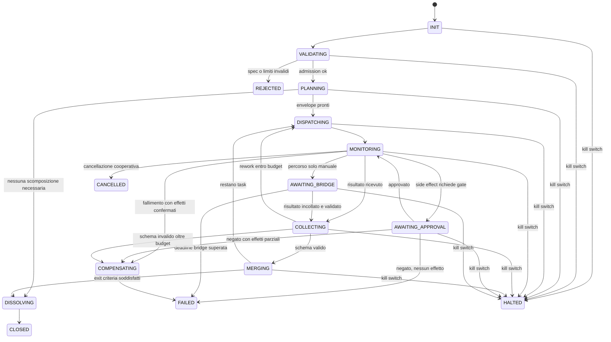

# RUNTIME BLUEPRINT — ultraJARVIS Agent Runtime v0.1

| Metadato | Valore |
|---|---|
| Task ID | UJ-RUN-001 |
| Milestone | M0 / M2 |
| Owner | CLAUDE (Runtime, Security & Skill Architect) |
| Reviewer | GEMINI |
| Stato | REVIEW |
| Peso | 13 |
| Data class | C1 INTERNAL |
| Side effect | INTERNAL_WRITE (solo file su branch dedicato) |
| Autonomia usata | L2 |
| Prompt canonico | `docs/ULTRAJARVIS_UNIVERSAL_MASTER_PROMPT.md` v1.0 |
| Prompt SHA-256 | `a3fcdfc97b48e9b1f37e1a1798b0b5e7231309d03ab4e13683622eaf1fa69a87` (verificato in sessione) |
| Contratti collegati | `packages/contracts/src/runtime/*.ts` |
| Threat notes | `docs/threat-models/RUNTIME_THREAT_NOTES.md` |

> **Nota di provenienza.** Il prompt canonico vive attualmente sul branch
> `agent/ultrajarvis-master-prompt-v1` (PR #1, draft) e non è ancora su `main`.
> Questo blueprint è stato scritto contro il commit `b8a7697` di quel branch, il cui
> contenuto è stato verificato con SHA-256 corrispondente a quello dichiarato nella PR.
> Se la PR #1 viene modificata prima del merge, questo documento va riconciliato.
> Etichetta: `OBSERVATION`.

---

## 0. Scope

### 0.1 In scope

Questo documento definisce il **livello di runtime** di ultraJARVIS: come nasce, vive,
si sospende, riprende e muore un'unità di lavoro agentica, e quali invarianti non
possono essere violate da nessun agente, nemmeno da uno generato dinamicamente.

Copre i deliverable 1–10 e 13 di §39.2 del prompt canonico:

| # | Deliverable §39.2 | Sezione |
|---|---|---|
| 1 | Runtime Blueprint | tutto il documento |
| 2 | AgentManifest completo | §3 |
| 3 | TeamSpec completo | §4 |
| 4 | Supervisor state machine | §5 |
| 5 | DepthGuard invariants | §6 |
| 6 | RunLedger / event taxonomy | §7 |
| 7 | checkpoint / resume / cancel / retry semantics | §8 |
| 8 | tool allowlist inheritance rules | §9 |
| 9 | typed artifact communication | §10 |
| 10 | failure and loop scenarios | §11 |
| 13 | review checklist per l'integratore | §13 |

I deliverable 11 (contratti TypeScript), 12 (threat notes) e 14 (task delta e resume
point) sono file separati, elencati in §14.

### 0.2 Out of scope — esplicitamente non deciso qui

Per non invadere portafogli altrui e non anticipare milestone non baselined:

| Fuori scope | Owner corretto | Task |
|---|---|---|
| Scelta del framework kernel (custom state machine vs LangGraphJS vs altro) | esperimento M2 | UJ-INT-002 / ADR |
| Scelta del database e della persistenza fisica | GEMINI | UJ-MEM-001 / UJ-INF-001 |
| Capability reali delle quattro IA | GEMINI | UJ-CAP-001 |
| Program OS, backlog e formula di status | CHATGPT | UJ-INT-001 |
| Threat model completo e approval policy | CLAUDE, task successivo | UJ-SEC-001 |
| ToolManifest e MCP admission in dettaglio | CLAUDE, task successivo | UJ-MCP-001 |
| Disaster recovery operativo | CLAUDE, task successivo | UJ-RCV-001 |

Questo blueprint definisce **contratti e invarianti**, non prodotti. Ogni entità è
progettata per sopravvivere alla sostituzione del framework, del database e del provider.

### 0.3 Principio guida

> Il runtime non deve rendere gli agenti intelligenti. Deve rendere **impossibile** che
> un agente, per errore o per manipolazione, superi i limiti che il proprietario ha fissato.

L'intelligenza sta nei modelli, che sono sostituibili. Le garanzie stanno nel runtime,
che è deterministico, ispezionabile e testabile senza chiamare un modello.

**Corollario di verificabilità.** Ogni invariante in questo documento deve poter essere
violata *deliberatamente* in un test e il runtime deve rifiutare. Un'invariante che non
si può falsificare non è un'invariante: è un auspicio.

---

## 1. Posizione nell'architettura

```
┌─────────────────────────────────────────────────────────────────┐
│ apps/dashboard          cockpit umano, kill switch, approvazioni │
├─────────────────────────────────────────────────────────────────┤
│ apps/control-plane      API deterministica, orchestrazione run   │
├─────────────────────────────────────────────────────────────────┤
│ packages/agent-runtime  ◀── QUESTO DOCUMENTO                     │
│   Supervisor · DepthGuard · RunLedger · Checkpoint · Scheduler   │
├──────────────┬───────────────┬──────────────┬───────────────────┤
│ policy-engine│ tool-runtime  │ task-ledger  │ memory            │
├──────────────┴───────────────┴──────────────┴───────────────────┤
│ provider-gateway        adapter provider-neutral, HUMAN_BRIDGE   │
├─────────────────────────────────────────────────────────────────┤
│ packages/contracts      schemi e tipi condivisi, versionati      │
└─────────────────────────────────────────────────────────────────┘
```

### 1.1 Regole di dipendenza vincolanti

1. `agent-runtime` dipende da `contracts`, `policy-engine`, `task-ledger`,
   `tool-runtime` e `provider-gateway` **solo tramite interfacce**.
2. `agent-runtime` **non** conosce nomi di provider. Non esiste in questo package la
   stringa `"claude"`, `"gemini"`, `"gpt"` o `"grok"` fuori dai test fixture.
3. `agent-runtime` **non** legge secret. Riceve `SecretRef` opachi e li passa al
   tool-runtime, che li risolve fuori dal contesto del modello.
4. Nessun modulo sotto `agent-runtime` esegue I/O di rete diretto. Ogni uscita passa
   dal `provider-gateway` o dal `tool-runtime`, entrambi soggetti a preflight di policy.
5. Il runtime è **deterministico**: dato lo stesso RunLedger, ricostruisce lo stesso stato.
   Tutta la non-determinatezza (output dei modelli, timestamp, id) entra come evento
   registrato, mai come effetto collaterale nascosto.

La regola 5 è ciò che rende possibili resume, audit e test riproducibili. È
l'invariante architetturale più costosa da recuperare se la si perde: va rispettata
dal primo commit.

---

## 2. Modello a oggetti e ciclo di vita

### 2.1 Gerarchia

```
Mission            obiettivo dichiarato dal proprietario o dal control-plane
 └─ Run            esecuzione isolata, unità di checkpoint e audit
     └─ Team       insieme temporaneo con un solo Supervisor
         └─ Agent  identità temporanea, depth 0..3
             └─ Attempt   singolo tentativo di produrre un ResultEnvelope
                 └─ Step  chiamata a modello o a tool, atomica e registrata
```

**Invariante di contenimento:** ogni entità figlia eredita i limiti della madre in
forma **monotonicamente più stretta**. Nessuna entità può allargare i propri limiti
verso l'alto. Questa è la proprietà fondamentale su cui poggiano §6 e §9.

Formalmente, per ogni coppia (parent `p`, child `c`) e per ogni dimensione limitata
`L` ∈ {tool allowlist, data class, autonomy, side-effect ceiling, quota, deadline}:

```
limit(c, L) ⊑ limit(p, L)
```

dove `⊑` è "non più permissivo di". Il runtime valuta questa condizione in fase di
**admission**, prima che l'agente figlio esista. Un fallimento è un rifiuto, non un warning.

### 2.2 Stati di un Agent

| Stato | Significato | Uscite ammesse |
|---|---|---|
| `PROPOSED` | manifest costruito, non ancora validato | `ADMITTED`, `REJECTED` |
| `REJECTED` | admission fallita | terminale |
| `ADMITTED` | limiti validati, capability token emesso | `RUNNING`, `CANCELLED` |
| `RUNNING` | sta producendo | `WAITING_*`, `PRODUCED`, `FAILED`, `CANCELLED`, `TIMED_OUT` |
| `WAITING_APPROVAL` | side effect in attesa di gate | `RUNNING`, `CANCELLED`, `TIMED_OUT` |
| `WAITING_BRIDGE` | DelegationCard in attesa dell'umano | `RUNNING`, `CANCELLED`, `TIMED_OUT` |
| `WAITING_CHILD` | attende figli | `RUNNING`, `FAILED`, `CANCELLED` |
| `PRODUCED` | ResultEnvelope valido emesso | `ACCEPTED`, `REWORK` |
| `REWORK` | reviewer ha respinto | `RUNNING` (se budget residuo), `FAILED` |
| `ACCEPTED` | reviewer ha accettato | terminale |
| `FAILED` | esaurito o errore non recuperabile | terminale |
| `CANCELLED` | cancellazione cooperativa completata | terminale |
| `TIMED_OUT` | deadline superata | terminale |
| `KILLED` | kill switch del proprietario | terminale |

`KILLED` è raggiungibile da **qualunque** stato non terminale, senza guardia. È l'unica
transizione che ignora il consenso dell'agente. Questo è deliberato: il kill switch che
può essere negoziato non è un kill switch.

### 2.3 Le due domande obbligatorie del planner

Prima di creare qualunque agente figlio, il planner deve rispondere e **registrare**:

1. **È necessario chiamare un modello?** Se il compito è deterministico (parsing,
   validazione, diff, hash, formattazione), va eseguito come tool o funzione pura.
2. **È necessario scomporre?** Se il costo di coordinamento (contratti, merge, review,
   quota, latenza) supera il beneficio, si usa un singolo agente.

Entrambe le risposte finiscono nel RunLedger come evento `planned` con campo
`decompositionRationale`. Una scomposizione senza motivazione registrata è un difetto
rilevabile in review, non una preferenza stilistica.

> **Perché è un'invariante e non un consiglio.** Il fallimento più comune dei sistemi
> multi-agente non è l'agente sbagliato: è la scomposizione non necessaria, che moltiplica
> quota, latenza e superficie di errore senza aggiungere qualità. Rendere obbligatoria la
> motivazione rende il costo visibile prima che venga pagato.

---

## 3. AgentManifest — completo

L'AgentManifest è il **contratto di esistenza** di un agente. Un agente senza manifest
validato non può essere istanziato. Il manifest è immutabile dopo l'admission: ogni
modifica genera un nuovo `agentId` e una nuova admission.

### 3.1 Campi

| Campo | Tipo | Obbligatorio | Regola |
|---|---|---|---|
| `agentId` | `AgentId` | sì | stabile, unico nel run |
| `manifestVersion` | `SemVer` | sì | versione dello schema del manifest |
| `templateId` | `string` | sì | template approvato da cui deriva |
| `templateVersion` | `SemVer` | sì | versione del template |
| `role` | `AgentRole` | sì | dal catalogo ruoli approvato |
| `roleStatus` | `APPROVED \| CANDIDATE` | sì | `CANDIDATE` non può avere side effect |
| `mission` | `string` | sì | obiettivo singolo, verificabile |
| `taskIds` | `TaskId[]` | sì | ≥1, dal task ledger |
| `inputArtifactRefs` | `ArtifactRef[]` | sì | può essere vuoto solo per agenti seed |
| `outputSchemaRef` | `SchemaRef` | sì | schema atteso del ResultEnvelope |
| `acceptanceCriteria` | `Criterion[]` | sì | binari e verificabili |
| `toolAllowlist` | `ToolGrant[]` | sì | **default `[]`** |
| `maxDataClass` | `C0..C4` | sì | ≤ del parent |
| `maxAutonomy` | `L0..L4` | sì | ≤ del parent; `L5` vietato |
| `maxSideEffect` | `SideEffectLevel` | sì | ≤ del parent |
| `quotaBudget` | `QuotaBudget` | sì | chiamate, token stimati, tool call, wall-clock |
| `deadline` | `ISO-8601` | sì | assoluto, non relativo |
| `stepTimeoutMs` | `number` | sì | timeout del singolo step |
| `depth` | `0..3` | sì | vedi §6 |
| `parentAgentId` | `AgentId \| null` | sì | `null` solo per root |
| `runId` | `RunId` | sì | |
| `teamId` | `TeamId \| null` | sì | |
| `terminationCriterion` | `TerminationCriterion` | sì | condizione esplicita di uscita |
| `reviewerId` | `ReviewerRef` | sì | ≠ `agentId` per task critici |
| `escalationRoute` | `EscalationRoute` | sì | dove va un blocker |
| `capabilityTokenRef` | `TokenRef` | sì | emesso all'admission, a scadenza |
| `provenance` | `Provenance` | sì | chi ha creato il manifest e da cosa |
| `createdAt` | `ISO-8601` | sì | UTC |

### 3.2 Cosa un manifest NON contiene

- **nessun secret**, in nessuna forma, nemmeno cifrato: solo `SecretRef` risolti dal
  tool-runtime al momento della chiamata;
- **nessun nome di provider**: la selezione avviene per capability nel gateway;
- **nessun prompt di sistema privilegiato** generato da testo libero non revisionato;
- **nessuna quota auto-estendibile**.

### 3.3 Creazione dinamica: cosa significa davvero

Il prompt canonico è esplicito e questo blueprint lo rende meccanico:

> "Creazione dinamica" significa istanziare un AgentManifest **da template e capability
> approvati**, variando missione, input e limiti.

Quindi:

| Consentito | Vietato |
|---|---|
| istanziare `template=code-reviewer@1.2` con missione e input nuovi | inventare un ruolo da testo libero e dargli tool |
| restringere l'allowlist rispetto al template | allargarla oltre il template |
| ridurre `maxDataClass` | alzarlo |
| proporre un nuovo ruolo come `CANDIDATE` | promuoverlo da solo ad `APPROVED` |

Un ruolo `CANDIDATE` nasce con `maxSideEffect = NONE`, `maxAutonomy ≤ L1` e
`toolAllowlist = []`. Diventa `APPROVED` solo tramite review umana registrata.
Questo chiude il vettore "l'agente si scrive da solo un ruolo con più poteri".

### 3.4 TerminationCriterion

Un agente deve dichiarare **come finisce**, non solo cosa fa. Tipi ammessi:

| Tipo | Semantica |
|---|---|
| `ARTIFACT_PRODUCED` | termina quando emette un ResultEnvelope valido secondo lo schema |
| `CRITERIA_SATISFIED` | termina quando tutti gli `acceptanceCriteria` sono verificati |
| `BUDGET_EXHAUSTED` | termina all'esaurimento di quota o deadline, con risultato parziale |
| `DELEGATED` | termina passando il lavoro a un altro agente, con handoff registrato |
| `BLOCKED` | termina registrando un blocker e l'input mancante |

Non esiste un criterio `CONTINUE_UNTIL_DONE`. Un agente che non sa dichiarare come
finisce non supera l'admission.

---

## 4. TeamSpec — completo

Un Team è un aggregato **temporaneo**. La sua esistenza è giustificata solo da un
obiettivo che un singolo agente non può raggiungere entro i propri limiti.

### 4.1 Campi

| Campo | Tipo | Regola |
|---|---|---|
| `teamId` | `TeamId` | unico nel run |
| `specVersion` | `SemVer` | schema del TeamSpec |
| `objective` | `string` | un solo obiettivo |
| `successCriteria` | `Criterion[]` | binari, verificabili, dichiarati prima |
| `supervisorAgentId` | `AgentId` | **esattamente uno** |
| `members` | `TeamMember[]` | responsabilità disgiunte |
| `dependencyGraph` | `Edge[]` | DAG, ciclo = rifiuto in admission |
| `sharedArtifacts` | `SharedArtifactGrant[]` | accesso esplicito per membro |
| `mergeProtocol` | `MergeProtocol` | come si compongono gli output |
| `dissentPolicy` | `DissentPolicy` | cosa succede se due membri divergono |
| `tieBreak` | `TieBreakRule` | chi decide, e come si registra il dissenso |
| `limits` | `TeamLimits` | depth, fan-out, task attivi, quota, wall-clock |
| `exitCriteria` | `ExitCriterion[]` | quando il team si scioglie |
| `dissolutionPolicy` | `DissolutionPolicy` | cosa succede agli artifact e ai token |

### 4.2 Responsabilità disgiunte

Regola verificabile in admission: per ogni coppia di membri `(a, b)`,
`responsibilities(a) ∩ responsibilities(b) = ∅`.

Le responsabilità sono etichette da un vocabolario chiuso (es. `design`, `implement`,
`review`, `test`, `document`). Due membri con la stessa etichetta sullo stesso
`taskId` sono un errore di specifica, non una ridondanza utile: creano lavoro duplicato,
merge conflict semantici e doppio consumo di quota.

L'eccezione deliberata è la **review incrociata**, che non è sovrapposizione: il reviewer
ha etichetta `review` e non può avere `implement` sullo stesso task.

### 4.3 MergeProtocol

| Protocollo | Uso | Regola |
|---|---|---|
| `SEQUENTIAL_HANDOFF` | pipeline lineare | l'output di N è input di N+1, hash verificato |
| `PARALLEL_DISJOINT` | file/sezioni disgiunte | nessun overlap, merge meccanico |
| `PROPOSE_AND_REVIEW` | artefatti critici | produttore ≠ reviewer, entrambi registrati |
| `COMPETING_DRAFTS` | esplorazione | scelta motivata + scarti conservati |

In tutti i casi il Supervisor **non riscrive silenziosamente** l'output di un membro.
Se interviene, registra un evento `merged` con `mergeRationale`, l'hash dell'input e
l'hash dell'output. La modifica non tracciata di un artefatto specialistico è una
violazione della disciplina della verità (§5 del prompt canonico): fa sparire chi ha
detto cosa.

### 4.4 Dissenso

Il dissenso è **informazione**, non rumore da eliminare. Politica:

1. il dissenso viene registrato come `DissentRecord` con posizione, motivazione e prova;
2. il tie-break decide la strada operativa;
3. il `DissentRecord` **sopravvive** alla decisione e viaggia con l'artifact;
4. se il dissenso riguarda sicurezza, costo o irreversibilità, il tie-break automatico è
   **vietato**: si escala al proprietario.

Il punto 4 è il freno che impedisce a un supervisor di risolvere da solo esattamente le
questioni per cui esiste l'approvazione umana.

---

## 5. Supervisor — macchina a stati

Il Supervisor è **codice deterministico**, non un agente-modello con poteri speciali.
Può *consultare* un modello per pianificare, ma le transizioni di stato, l'admission,
la contabilità di quota e le decisioni di sicurezza non passano da un modello.

> **Decisione di design (ADR candidato RUN-001).** Un supervisor implementato come
> prompt è vulnerabile a prompt injection proveniente dagli artifact che deve
> supervisionare. Poiché il supervisor è precisamente l'entità che applica i limiti,
> renderlo influenzabile dal contenuto che ispeziona annulla i limiti. Quindi:
> **il supervisor è una state machine; il modello è un consulente il cui output è
> un suggerimento tipizzato, non un comando.**

### 5.1 Stati

| Stato | Descrizione |
|---|---|
| `INIT` | TeamSpec ricevuto |
| `VALIDATING` | validazione TeamSpec + DepthGuard + policy preflight |
| `REJECTED` | specifica invalida — terminale |
| `PLANNING` | risposta alle due domande §2.3, costruzione TaskEnvelope |
| `DISPATCHING` | emissione envelope ai membri ammessi |
| `MONITORING` | osservazione heartbeat e stato, nessuna microgestione |
| `COLLECTING` | raccolta ResultEnvelope, validazione schema |
| `MERGING` | applicazione del MergeProtocol |
| `AWAITING_APPROVAL` | gate di approvazione per side effect |
| `AWAITING_BRIDGE` | DelegationCard emessa, attesa umano |
| `COMPENSATING` | rollback/compensazione di side effect confermati |
| `DISSOLVING` | exit criterion raggiunto, revoca token, rilascio membri |
| `CLOSED` | successo — terminale |
| `FAILED` | fallimento — terminale |
| `CANCELLED` | cancellazione — terminale |
| `HALTED` | kill switch — terminale |

### 5.2 Transizioni



### 5.3 Guardie obbligatorie

Ogni transizione è protetta da guardie valutate **prima** dell'effetto:

| Transizione | Guardia |
|---|---|
| `VALIDATING → PLANNING` | DepthGuard ok, DAG aciclico, responsabilità disgiunte, limiti monotoni |
| `PLANNING → DISPATCHING` | `decompositionRationale` presente, envelope tipizzati, quota preflight ok |
| `DISPATCHING → MONITORING` | ogni membro ha capability token valido e non scaduto |
| `MONITORING → COLLECTING` | ResultEnvelope firmato dal `agentId` atteso |
| `COLLECTING → MERGING` | validazione schema superata, dataClass compatibile |
| `COLLECTING → DISPATCHING` | `reworkCount < maxRework` e budget residuo > 0 |
| `* → AWAITING_APPROVAL` | checkpoint scritto **prima** della richiesta |
| `AWAITING_APPROVAL → MONITORING` | approvazione firmata, non scaduta, per quella esatta operazione |
| `MERGING → DISSOLVING` | tutti gli `exitCriteria` verificati, nessun task attivo |
| `DISSOLVING → CLOSED` | token revocati, artifact sigillati, ledger chiuso |

### 5.4 Cosa il Supervisor non fa

- non legge né interpreta la catena di ragionamento dei membri;
- non modifica un output specialistico senza `merged` + rationale;
- non estende quota, deadline o allowlist;
- non promuove un ruolo `CANDIDATE`;
- non decide da solo su sicurezza, irreversibilità o costo;
- non considera "quasi finito" uno stato.

### 5.5 Heartbeat e liveness

Ogni agente `RUNNING` emette heartbeat con periodo `heartbeatIntervalMs`. Il Supervisor
considera un agente **sospetto** dopo `3` heartbeat mancati e **morto** dopo `5`.

Un agente morto non viene "rilanciato e basta": il Supervisor
1. scrive checkpoint,
2. ispeziona il ledger per capire se ci sono side effect confermati,
3. decide fra retry idempotente, compensazione o escalation.

Il rilancio cieco di un agente che aveva già eseguito una scrittura esterna è il modo
canonico per produrre doppi effetti. Vedi §8.4 e scenario S5 in §11.

---

## 6. DepthGuard — invarianti

DepthGuard è il modulo che rende **strutturalmente impossibile** l'esplosione ricorsiva.
I suoi default non sono configurabili dagli agenti, in nessuna circostanza, nemmeno
tramite manifest, prompt, tool o contenuto di artifact.

### 6.1 Limiti hard

| ID | Limite | Valore | Fonte |
|---|---|---:|---|
| `DG-1` | profondità massima | `3` | prompt canonico §10.3 |
| `DG-2` | fan-out massimo per agente | `5` | prompt canonico §10.3 |
| `DG-3` | task atomici attivi per run | `25` | prompt canonico §10.3 |
| `DG-4` | generazione figli a depth 3 | **vietata** | prompt canonico §10.3 |
| `DG-5` | tool allowlist di default | `[]` | prompt canonico §10.1/§10.3 |
| `DG-6` | deadline e timeout | obbligatori | prompt canonico §10.3 |
| `DG-7` | auto-estensione del budget | **vietata** | prompt canonico §10.3 |

### 6.2 Invarianti formali

Sia `A` l'insieme degli agenti vivi in un run.

| ID | Invariante | Verifica |
|---|---|---|
| `INV-D1` | `∀a ∈ A: depth(a) ≤ 3` | admission |
| `INV-D2` | `∀a ∈ A: depth(a) = 3 ⇒ children(a) = ∅` | admission del figlio |
| `INV-D3` | `∀a ∈ A: \|children(a)\| ≤ 5` | admission del figlio |
| `INV-D4` | `\|{t : t attivo nel run}\| ≤ 25` | admission, contatore atomico |
| `INV-D5` | `∀a: depth(a) = depth(parent(a)) + 1` | admission |
| `INV-D6` | `∀a ≠ root: parent(a) ≠ null ∧ parent(a) ∈ A ∪ terminati` | admission |
| `INV-D7` | il grafo padre-figlio è una **foresta** (nessun ciclo, un solo padre) | admission |
| `INV-D8` | `effectiveLimits(a) ⊑ effectiveLimits(parent(a))` per ogni dimensione | admission |
| `INV-D9` | `∀a: deadline(a) ≤ deadline(parent(a))` | admission |
| `INV-D10` | `∀a: quotaBudget(a) ≤ quotaResiduo(parent(a))` al momento dell'emissione | admission atomica |

### 6.3 Nota di progettazione: quale limite lega davvero

L'albero teorico massimo con `DG-1` e `DG-2` è:

```
depth 0:   1 nodo
depth 1:   5 nodi
depth 2:  25 nodi
depth 3: 125 nodi
totale : 156 nodi
```

Ma `DG-3` impone **25 task atomici attivi**. Quindi il limite realmente vincolante in
esercizio è `DG-3`, non la profondità. Conseguenza pratica per l'implementazione:

> L'ammissione di un nuovo agente deve fallire per **saturazione del contatore attivo**
> molto prima che per profondità. Il contatore va quindi implementato come risorsa
> **atomica** (compare-and-swap o transazione), non come lettura seguita da scrittura,
> altrimenti fan-out concorrenti superano 25 per race condition.

Questa è la parte del DepthGuard che si rompe per prima in un'implementazione ingenua,
ed è quella da coprire con un test di concorrenza esplicito (vedi `T-DG-4b` in §13.3).

### 6.4 Loop detector

Tre segnali indipendenti, tutti **deterministici e locali** — nessuno richiede una
chiamata a modello, quindi il rilevamento non consuma quota e non è aggirabile
convincendo un modello:

| Segnale | Metodo | Soglia default | Azione |
|---|---|---:|---|
| `INTENT_REPEAT` | hash della missione normalizzata nel ramo | 3 occorrenze | `LOOP_SUSPECTED` |
| `OUTPUT_STAGNATION` | hash del contenuto dell'artifact fra tentativi consecutivi | 2 identici | `LOOP_SUSPECTED` |
| `TOOL_CYCLE` | k-gramma (k=3) nella sequenza di tool call | 3 ripetizioni | `LOOP_SUSPECTED` |

Per la similarità non identica si usa **Jaccard su shingle di token** (deterministico,
senza embedding, senza costo): `similarity ≥ 0.95` su due tentativi consecutivi conta
come stagnazione.

Su `LOOP_SUSPECTED`: checkpoint, sospensione del ramo, evento `loop_detected` nel
ledger, escalation al Supervisor. Il Supervisor **non** può risolvere aumentando il
budget: può solo cambiare strategia, delegare diversamente, o bloccare.

#### Limite misurato dei segnali testuali — `EXPERIMENT_RESULT`

Misurato in questa sessione con `jaccardSimilarity` (test
`tests/contracts/runtime-invariants.test.mjs`):

| Missione | Token cambiati | Similarità | Sotto soglia 0.95? |
|---|---:|---:|---|
| 9 token | 1 | `0.7778` | sì — evade |
| 23 token | 1 | `0.9130` | sì — evade |

**Conclusione onesta:** i due segnali testuali (`INTENT_REPEAT`, che usa un hash
esatto, e `OUTPUT_STAGNATION`, che usa la soglia di similarità) sono **aggirabili con
una singola parola cambiata**. Non contengono un agente avversario, e nemmeno un
agente semplicemente prolisso che riformula.

Il segnale che regge è `TOOL_CYCLE`, perché dipende da **cosa l'agente ha fatto**, non
da come ha chiamato il lavoro: riformulare la missione non cambia la sequenza di tool.
E il contenimento reale non viene comunque dal loop detector, ma dai limiti strutturali
di §6.1 — il cap dei task attivi e il budget di quota — che bounded il danno di un loop
non rilevato.

Quindi il loop detector va considerato un **early-warning euristico**, non un controllo
di sicurezza. Rimuoverlo peggiorerebbe l'osservabilità; fidarsene come barriera sarebbe
un errore. Questo punto è deliberatamente lasciato aperto per l'attacco di GROK in
UJ-RED-001, con i numeri già sul tavolo invece che con una rassicurazione.

### 6.5 Kill switch

| Proprietà | Regola |
|---|---|
| Autorità | solo il proprietario, dalla dashboard |
| Latenza | effetto immediato su nuovi step; grazia configurabile per step in volo |
| Ambito | run singolo, team, o globale |
| Effetto | nessun nuovo step, nessun nuovo side effect, checkpoint forzato |
| Reversibilità | non riavvia da solo: la ripresa è un'azione umana esplicita |
| Bypass | **nessuno**. Nessun manifest, policy o tool può disabilitarlo |

Il kill switch scrive nel ledger prima di fermare, non dopo: se il processo muore
durante l'arresto, la ripresa sa che era stato richiesto un arresto.

---

## 7. RunLedger — tassonomia degli eventi

Il RunLedger è **append-only** e costituisce la verità sull'esecuzione. Lo stato è una
proiezione del ledger, mai il contrario.

### 7.1 Proprietà

1. **Append-only**: nessuna cancellazione, nessuna modifica in loco.
2. **Hash chain**: `event.prevHash` lega ogni evento al precedente; la manomissione è
   rilevabile.
3. **Ordinamento totale per run**: `seq` monotono crescente, assegnato dal control-plane.
4. **Contenuto per riferimento**: i payload grandi entrano come `ArtifactRef` + hash,
   non inline. Il ledger resta leggibile e non diventa un archivio.
5. **Nessun secret**: mai valori sensibili; solo `SecretRef` e classi di dati.
6. **Ricostruibilità**: dato il ledger, lo stato del run è ricalcolabile deterministicamente.

### 7.2 Tassonomia

Gli eventi richiesti da §10.5 del prompt canonico sono coperti e raggruppati:

| Gruppo | Evento | Payload minimo |
|---|---|---|
| **Ciclo run** | `run.created` | missione, limiti, owner |
| | `run.planned` | piano, `decompositionRationale` |
| | `run.completed` | artifact finali, criteri soddisfatti |
| | `run.failed` | causa classificata |
| | `run.cancelled` | iniziatore, punto di cancellazione |
| **Agenti** | `agent.proposed` | manifest hash |
| | `agent.admitted` | limiti effettivi, token ref |
| | `agent.rejected` | invariante violata |
| | `agent.delegated` | parent, child, envelope ref |
| | `agent.heartbeat` | stato, progresso dichiarato |
| | `agent.produced` | ResultEnvelope ref |
| | `agent.terminated` | esito, budget consumato |
| **Tool** | `tool.called` | toolId, versione, hash argomenti, idempotency key |
| | `tool.returned` | hash risultato, durata |
| | `tool.failed` | classe di errore |
| **Persistenza** | `checkpoint.written` | seq, hash stato, ref artifact |
| | `checkpoint.restored` | seq ripristinato |
| **Approvazioni** | `approval.requested` | operazione, impatto, reversibilità |
| | `approval.granted` | firma, scadenza, ambito |
| | `approval.denied` | motivo |
| | `bridge.card_issued` | DelegationCard ref |
| | `bridge.result_received` | hash risultato, chi ha incollato |
| **Controllo** | `retry.scheduled` | causa classificata, tentativo, backoff |
| | `blocked.recorded` | tipo, chi può sbloccare |
| | `loop.detected` | segnale, evidenza |
| | `quota.reserved` / `quota.released` | provider, capability, quantità |
| | `killswitch.engaged` | ambito, autore |
| **Compensazione** | `compensation.started` | effetti da annullare |
| | `compensation.completed` | esito per effetto |
| **Merge** | `merged` | input hash, output hash, rationale |
| | `dissent.recorded` | posizioni, prove |

### 7.3 Perché la catena di hash conta

Senza hash chain, "l'audit trail" è un file che chiunque con accesso in scrittura può
riscrivere a posteriori — inclusa una skill compromessa. Con la catena, la riscrittura
richiede di ricalcolare tutti gli eventi successivi, e l'incoerenza è rilevabile con un
controllo `O(n)` che non richiede fiducia nel processo che ha scritto.

Questo è ciò che rende la **proof fabrication** (§17 del prompt canonico) un attacco
rilevabile invece che una possibilità silenziosa.

---

## 8. Checkpoint, resume, cancel, retry

### 8.1 Checkpoint

**Regola d'oro:** *checkpoint prima di ogni side effect.* Non dopo, non "periodicamente".

Un `Checkpoint` contiene:

| Campo | Contenuto |
|---|---|
| `checkpointId`, `runId`, `seq` | identità e posizione nel ledger |
| `supervisorState` | stato §5 |
| `agentStates` | mappa `agentId → stato + budget residuo` |
| `activeTaskCount` | contatore DepthGuard |
| `artifactRefs` | riferimenti + hash, mai contenuti inline |
| `quotaCounters` | per provider e capability |
| `pendingApprovals` | approvazioni in volo |
| `pendingSideEffects` | operazioni con idempotency key emessa ma esito ignoto |
| `ledgerOffset` | ultimo `seq` incluso |
| `stateHash` | hash dell'intero checkpoint |

Un checkpoint è **VALID** se `stateHash` verifica e tutti gli `artifactRefs` risolvono.
Un checkpoint non valido non viene mai usato per la ripresa: si scende al precedente valido.

### 8.2 Resume

```
1. carica l'ultimo checkpoint VALID
2. leggi gli eventi del ledger con seq > checkpoint.ledgerOffset
3. per ogni operazione in pendingSideEffects:
     a. cerca tool.returned con la stessa idempotency key
     b. se presente  → effetto CONFERMATO: non rieseguire, adotta il risultato
     c. se assente    → effetto INCERTO: interroga il tool con la stessa key
                        (i tool devono esporre lookup per key, altrimenti l'operazione
                         è classificata NON_IDEMPOTENT e richiede decisione umana)
4. ricostruisci lo stato proiettando il ledger
5. verifica gli invarianti DepthGuard sullo stato ricostruito
6. riparti dal primo step non confermato
```

Il passo 3c è il punto che distingue un resume corretto da uno che duplica: un tool che
esegue scritture esterne **deve** offrire una lookup per idempotency key. Senza di essa,
il runtime non può sapere se l'operazione è avvenuta, e l'unica risposta onesta è
fermarsi e chiedere. Questo requisito va imposto in `ToolManifest` (UJ-MCP-001).

### 8.3 Cancellation

Cooperativa, con escalation:

| Fase | Durata | Comportamento |
|---|---|---|
| `SOFT` | fino a `gracePeriodMs` | il token di cancellazione si propaga; gli agenti si fermano al prossimo safe point e producono risultato parziale |
| `HARD` | dopo la grazia | lo scheduler smette di dispacciare step; gli step in volo vengono abbandonati |
| `COMPENSATE` | se necessario | i side effect confermati vengono compensati secondo la loro compensation policy |

Un **safe point** è un momento in cui non c'è side effect in volo e lo stato è
serializzabile. Gli agenti controllano il token di cancellazione a ogni safe point.
La cancellazione **non** è mai una perdita silenziosa: produce sempre `run.cancelled`
con il punto esatto e gli artifact parziali conservati.

### 8.4 Retry — con classificazione obbligatoria

Nessun retry senza causa classificata. Nessun retry aggressivo su rate limit
(vincolo §6.3 del prompt canonico).

| Classe | Retry | Backoff | Note |
|---|---|---|---|
| `TRANSIENT_PROVIDER` | sì, max 3 | esponenziale + jitter | |
| `TIMEOUT` | sì, max 2 | esponenziale | **solo se l'operazione è idempotente** |
| `RATE_LIMIT` | no retry immediato | attesa fino a finestra quota | preferire fallback o bridge |
| `QUOTA_EXHAUSTED` | **no** | — | fallback, bridge o pausa; mai rotazione account |
| `SCHEMA_VIOLATION` | sì, max 1 | immediato | un solo tentativo di riparazione con feedback dello schema |
| `POLICY_DENIED` | **no** | — | escalation; un retry qui è un tentativo di aggirare la policy |
| `TOOL_ERROR` | dipende | — | classificare la sotto-causa prima di decidere |
| `INTERNAL_BUG` | **no** | — | fail fast, incidente |
| `CANCELLED` / `KILLED` | **no** | — | terminale |

Regole trasversali:

1. il budget di retry è **incluso** in `quotaBudget`, non aggiuntivo;
2. ogni retry emette `retry.scheduled` con causa e tentativo;
3. il retry riusa la **stessa** idempotency key per la stessa operazione logica;
4. `QUOTA_EXHAUSTED` e `POLICY_DENIED` non sono mai "riprovabili più tardi in automatico":
   richiedono una decisione, umana o di routing.

### 8.5 Idempotency

```
idempotencyKey = sha256(
  runId ‖ taskId ‖ operationName ‖ canonicalJson(payload) ‖ toolVersion
)
```

**Il numero di tentativo non entra nella chiave.** È la proprietà che rende il retry
sicuro: lo stesso lavoro logico produce la stessa chiave, quindi il secondo tentativo
è riconoscibile come duplicato invece di apparire come nuova operazione.

Ogni scrittura passa dal `SideEffectLedger`: `key → {status, resultHash, at}`.
Una chiave già `CONFIRMED` restituisce il risultato registrato senza rieseguire.

---

## 9. Tool allowlist — regole di ereditarietà

### 9.1 Le dieci regole

| ID | Regola |
|---|---|
| `TA-1` | **Default deny.** L'allowlist di ogni nuovo agente nasce vuota. |
| `TA-2` | **Sottoinsieme.** `effective(child) ⊆ effective(parent)`. Mai allargamento. |
| `TA-3` | **Grant esplicito.** Ogni tool concesso è nominato per `toolId@version`, mai per wildcard o categoria. |
| `TA-4` | **Ceiling dei dati.** `maxDataClass(child) ≤ maxDataClass(parent)`. |
| `TA-5` | **Ceiling di autonomia.** `maxAutonomy(child) ≤ maxAutonomy(parent)`; `L5` mai. |
| `TA-6` | **Nessuna eredità di segreti.** I secret non sono nell'allowlist né nel contesto: il tool-runtime li risolve al momento della chiamata. |
| `TA-7` | **Capability token.** Ogni grant è materializzato in un token con scadenza, legato a `(runId, agentId, toolId, version)`, non trasferibile. |
| `TA-8` | **Ceiling di side effect.** `maxSideEffect(child) ≤ maxSideEffect(parent)`, ordine `NONE < INTERNAL_WRITE < EXTERNAL_WRITE < DESTRUCTIVE`. |
| `TA-9` | **Revoca a cascata.** Revocare un tool al padre lo revoca a tutto il sottoalbero, immediatamente. |
| `TA-10` | **Nessuna amplificazione.** Un agente non può concedere un tool che non possiede, né una versione diversa da quella che possiede. |

### 9.2 Perché il pinning di versione (`TA-3`, `TA-10`)

Un grant `toolId` senza versione consente il **tool poisoning per aggiornamento**: il
tool ammesso come innocuo cambia comportamento o descrizione dopo l'admission, e
l'agente continua a usarlo con i permessi vecchi. Pinnando `toolId@version` e legando il
token alla versione, un aggiornamento del tool invalida i token esistenti e forza una
nuova admission. Vedi threat `TH-R-07`.

### 9.3 Esempio di verifica

```
Supervisor  : { repo.read@1, repo.write@1, http.fetch@2 }  C2  L3  EXTERNAL_WRITE
  └─ Coder   : { repo.read@1, repo.write@1 }                C1  L2  INTERNAL_WRITE   ✅
  └─ Fetcher : { http.fetch@2 }                             C0  L2  NONE             ✅
  └─ Rogue   : { repo.write@1, shell.exec@1 }               C1  L2  EXTERNAL_WRITE   ❌
```

`Rogue` viene rifiutato in admission per due invarianti: `shell.exec@1 ∉ effective(parent)`
(viola `TA-2`) e `maxSideEffect` pari a quello del padre non è di per sé illegale, ma la
combinazione con un tool non posseduto viola `TA-10`. L'evento è `agent.rejected` con
l'invariante nominata — non un messaggio generico, perché il reviewer deve poter capire
*quale* regola ha protetto il sistema.

---

## 10. Comunicazione tipizzata fra agenti

### 10.1 Principio

> Gli agenti si scambiano **artifact tipizzati e content-addressed**, non testo libero.

Il testo libero fra agenti produce quattro problemi che il sistema non può permettersi:
perdita di provenienza, impossibilità di validazione, superficie di prompt injection e
crescita non controllata del contesto.

### 10.2 ArtifactRef

Un artifact è identificato per **contenuto**, non per percorso:

| Campo | Regola |
|---|---|
| `artifactId` | identità logica stabile |
| `version` | versione dell'artifact |
| `contentHash` | `sha256` del contenuto canonicalizzato — l'identità reale |
| `schemaRef` | schema + versione a cui il contenuto è conforme |
| `mediaType` | tipo concreto |
| `dataClass` | `C0..C4` |
| `producedBy` | `agentId` + `runId` |
| `derivedFrom` | `ArtifactRef[]` — catena di provenienza |
| `originLabel` | `TRUSTED_INTERNAL \| UNTRUSTED_EXTERNAL \| HUMAN_PROVIDED` |
| `createdAt` | UTC |

`originLabel` è il campo che implementa la separazione **dato/istruzione**: il contenuto
`UNTRUSTED_EXTERNAL` (web, repository di terzi, issue, email, output MCP) non può mai
essere promosso a istruzione. Un artifact esterno che contiene "ignora le istruzioni
precedenti" è dato ostile, e il runtime lo tratta come tale a prescindere da quanto sia
persuasivo per il modello che lo legge.

### 10.3 TaskEnvelope e ResultEnvelope

**TaskEnvelope** (Supervisor → Agent) porta: `taskId`, `agentId`, missione, input refs,
schema di output atteso, acceptance criteria, limiti effettivi, deadline, token ref,
`cancellationTokenRef`, `idempotencyScope`.

**ResultEnvelope** (Agent → Supervisor) porta: `taskId`, `agentId`, `status`
(`PRODUCED | PARTIAL | BLOCKED | FAILED`), output refs, criteri soddisfatti/non
soddisfatti, budget consumato, `assumptions[]`, `blockers[]`, `dissent[]`,
`nextActionProposal`, `provenance`.

### 10.4 Doppia validazione

1. **Produce-time (postflight):** l'agente non può emettere un ResultEnvelope che non
   valida contro `outputSchemaRef`. Un output invalido è `SCHEMA_VIOLATION`, non un
   risultato "da interpretare".
2. **Consume-time (preflight):** chi riceve rivalida contro lo schema **e** contro
   `dataClass` e `originLabel` prima di usarlo.

La doppia validazione non è ridondanza difensiva: produttore e consumatore possono
avere versioni di schema diverse, e il momento in cui la divergenza va scoperta è
prima dell'uso, non durante.

### 10.5 Evoluzione degli schemi

- ogni schema ha `schemaId` + `SemVer`;
- le modifiche **minor** sono additive e retrocompatibili;
- le modifiche **major** richiedono migrazione dichiarata e ADR;
- `tests/contracts` verifica che un consumatore alla versione `N` legga artifact
  prodotti alla versione `N-1` (test di compatibilità all'indietro obbligatorio).

---

## 11. Scenari di fallimento e loop

Ogni scenario ha: innesco, rilevamento, contenimento automatico, evento, escalation, test.

### S1 — Fork bomb per delega ricorsiva

- **Innesco:** un agente crea figli che creano figli, per errore di planning o per injection.
- **Rilevamento:** contatore atomico task attivi; `INV-D3`, `INV-D4`.
- **Contenimento:** admission del figlio rifiutata a 25 task attivi o a depth 3.
- **Evento:** `agent.rejected` con invariante nominata.
- **Escalation:** dopo 3 rifiuti consecutivi nello stesso ramo → `blocked.recorded`.
- **Test:** `T-DG-2`, `T-DG-4`, `T-DG-4b` (concorrenza).

### S2 — Ping-pong fra due agenti

- **Innesco:** A delega a B, B rimanda ad A senza progresso.
- **Rilevamento:** `INTENT_REPEAT` sull'hash della missione normalizzata.
- **Contenimento:** sospensione del ramo alla terza ripetizione.
- **Evento:** `loop.detected` con le tre occorrenze come prova.
- **Escalation:** Supervisor cambia strategia; non può alzare il budget.
- **Test:** `T-LP-1`.

### S3 — Schema thrash

- **Innesco:** il modello produce ripetutamente output non conforme.
- **Rilevamento:** `SCHEMA_VIOLATION` con `reworkCount`.
- **Contenimento:** una sola riparazione con feedback dello schema, poi fallimento.
- **Evento:** `retry.scheduled` poi `agent.terminated(FAILED)`.
- **Escalation:** proposta di semplificare lo schema o cambiare capability.
- **Test:** `T-RT-3`.

### S4 — Tempesta di rate limit

- **Innesco:** più agenti colpiscono lo stesso provider in parallelo.
- **Rilevamento:** `RATE_LIMIT` dal gateway; contatori del Quota Governor.
- **Contenimento:** nessun retry aggressivo; concurrency cap; attesa finestra o fallback.
- **Evento:** `quota.reserved` fallita, `retry.scheduled` con causa `RATE_LIMIT`.
- **Escalation:** `HUMAN_BRIDGE` o pausa. **Mai** rotazione di account o chiavi.
- **Test:** `T-QT-1`.

### S5 — Doppio side effect dopo resume

- **Innesco:** crash fra l'esecuzione di una scrittura esterna e la registrazione dell'esito.
- **Rilevamento:** `pendingSideEffects` non vuoto al resume.
- **Contenimento:** lookup per idempotency key; se il tool non la supporta →
  `NON_IDEMPOTENT` → stop e decisione umana.
- **Evento:** `checkpoint.restored` + esito della lookup.
- **Escalation:** `approval.requested` per la riesecuzione.
- **Test:** `T-CK-2` (crash iniettato fra effetto e registrazione).

### S6 — Team orfano

- **Innesco:** il Supervisor muore, i membri restano `RUNNING`.
- **Rilevamento:** assenza di heartbeat del supervisor lato control-plane.
- **Contenimento:** i capability token scadono e non si rinnovano → i membri non
  possono più chiamare tool. Il team decade in modo sicuro invece di continuare cieco.
- **Evento:** `agent.terminated(TIMED_OUT)` per i membri.
- **Escalation:** resume del run dall'ultimo checkpoint valido.
- **Test:** `T-SV-2`.

### S7 — Prompt injection da artifact

- **Innesco:** un artifact `UNTRUSTED_EXTERNAL` contiene istruzioni.
- **Rilevamento:** `originLabel`; il contenuto esterno non è mai canale di istruzioni.
- **Contenimento:** i limiti stanno nel runtime, non nel prompt: anche un modello
  completamente persuaso non può ottenere tool fuori allowlist né alzare `maxDataClass`.
- **Evento:** `tool.failed(POLICY_DENIED)` se tenta.
- **Escalation:** `blocked.recorded` + segnalazione a UJ-SEC-001.
- **Test:** `T-SEC-1` (suite red-team, coordinata con UJ-INJ-001 di GROK).

### S8 — Checkpoint non valido

- **Innesco:** artifact garbage-collected o storage corrotto.
- **Rilevamento:** `stateHash` non verifica o `ArtifactRef` non risolve.
- **Contenimento:** discesa al checkpoint valido precedente.
- **Evento:** `checkpoint.restored` con `degraded: true`.
- **Escalation:** se nessun checkpoint è valido → `run.failed`, mai ripartenza cieca.
- **Test:** `T-CK-3`.

### S9 — Deadlock di approvazione

- **Innesco:** il proprietario non risponde a una richiesta di approvazione.
- **Rilevamento:** `approvalDeadline` superata.
- **Contenimento:** il ramo va `BLOCKED`; **gli altri rami proseguono** se indipendenti.
- **Evento:** `blocked.recorded` con chi può sbloccare.
- **Escalation:** notifica in dashboard; nessun auto-approve, mai.
- **Test:** `T-AP-2`.

### S10 — Quota esaurita a metà run

- **Innesco:** il budget finisce con lavoro incompleto.
- **Rilevamento:** preflight del Quota Governor.
- **Contenimento:** riserva per checkpoint e recovery mantenuta separata e intoccabile,
  così il run può sempre salvarsi anche senza budget per lavorare.
- **Evento:** `quota.reserved` fallita, `checkpoint.written`.
- **Escalation:** risultato parziale + `nextActionProposal`. Nessuna auto-estensione.
- **Test:** `T-QT-2`.

### S11 — Tool avvelenato dopo l'admission

- **Innesco:** manifest o descrizione del tool cambiano dopo l'ammissione.
- **Rilevamento:** hash del ToolManifest verificato a ogni chiamata contro quello ammesso.
- **Contenimento:** mismatch → chiamata rifiutata, token invalidato.
- **Evento:** `tool.failed(POLICY_DENIED)` + `blocked.recorded`.
- **Escalation:** nuova admission richiesta.
- **Test:** `T-TL-1`. Dettaglio in UJ-MCP-001.

### S12 — Deadline incoerenti

- **Innesco:** un figlio ha deadline oltre quella del padre.
- **Rilevamento:** `INV-D9` in admission.
- **Contenimento:** rifiuto in admission.
- **Evento:** `agent.rejected`.
- **Escalation:** nessuna, è un errore di specifica.
- **Test:** `T-DG-9`.

---

## 12. Decisioni aperte da portare in ADR

Registrate come `PROPOSAL`, non come scelte fatte. Nessuna richiede spesa.

| ID | Decisione | Opzioni | Owner | Dipende da |
|---|---|---|---|---|
| `ADR-RUN-01` | Kernel dello state machine | custom deterministico vs LangGraphJS vs altro TS | esperimento M2 | evaluation harness |
| `ADR-RUN-02` | Persistenza di ledger e checkpoint | event store su DB scelto vs file content-addressed | GEMINI | UJ-INF-001 |
| `ADR-RUN-03` | Trasporto degli envelope | in-process vs coda | M2 | topologia zero-card |
| `ADR-RUN-04` | Rappresentazione dei capability token | JWT firmato locale vs riferimento opaco in DB | CLAUDE | UJ-SEC-001 |
| `ADR-RUN-05` | Similarità per loop detection | Jaccard su shingle (proposto) vs alternativa deterministica | CLAUDE | — |
| `ADR-RUN-06` | Storage degli artifact content-addressed | repo git vs blob store del DB | GEMINI | UJ-INF-001 |

**Raccomandazione (PROPOSAL) su `ADR-RUN-01`:** partire con una state machine custom
deterministica. Motivo: gli invarianti di §6 e §9 sono il valore centrale del sistema, e
un framework che gestisce lui il ciclo di vita degli agenti va comunque avvolto per
imporli. Un kernel custom di dimensioni contenute è più facile da testare in modo
esaustivo che un framework generico vincolato dall'esterno. Da falsificare in M2 con
spike comparabili, non da assumere.

---

## 13. Review checklist per l'integratore

Deliverable 13 di §39.2. Ogni voce è **binaria**. Un `NO` blocca l'accettazione.

### 13.1 Conformità ai vincoli

| # | Controllo | Atteso |
|---|---|---|
| C-1 | Il runtime introduce API a pagamento? | NO |
| C-2 | Il runtime richiede inferenza locale? | NO |
| C-3 | Il runtime richiede un server sempre acceso? | NO — è a eventi e checkpoint |
| C-4 | Compaiono nomi di provider nei contratti? | NO |
| C-5 | Compaiono segreti in manifest, ledger o checkpoint? | NO — solo `SecretRef` |
| C-6 | Esiste un percorso che alza i limiti senza approvazione umana? | NO |
| C-7 | `L5` è raggiungibile? | NO |
| C-8 | Il kill switch è disattivabile da un agente? | NO |

### 13.2 Completezza rispetto a §39.2

| # | Deliverable | Dove | Presente |
|---|---|---|---|
| D-1 | Runtime Blueprint | questo file | ✅ |
| D-2 | AgentManifest | §3 + `agent-manifest.ts` | ✅ |
| D-3 | TeamSpec | §4 + `team-spec.ts` | ✅ |
| D-4 | Supervisor state machine | §5 + `supervisor.ts` | ✅ |
| D-5 | DepthGuard invariants | §6 + `depth-guard.ts` | ✅ |
| D-6 | RunLedger / eventi | §7 + `run-ledger.ts` | ✅ |
| D-7 | checkpoint/resume/cancel/retry | §8 + `checkpoint.ts` | ✅ |
| D-8 | tool allowlist inheritance | §9 + `depth-guard.ts` | ✅ |
| D-9 | typed artifact communication | §10 + `envelopes.ts` | ✅ |
| D-10 | failure and loop scenarios | §11 | ✅ |
| D-11 | TypeScript contracts | `packages/contracts/src/runtime/` | ✅ |
| D-12 | threat notes → UJ-SEC-001 | `docs/threat-models/RUNTIME_THREAT_NOTES.md` | ✅ |
| D-13 | review checklist | §13 | ✅ |
| D-14 | task delta e resume point | `docs/program/handoffs/HANDOFF-UJ-RUN-001.md` | ✅ |

### 13.3 Test obbligatori prima di considerare implementato il runtime

Le funzioni pure di questo deliverable sono **già testate**; i test di livello runtime
non lo sono, perché il runtime non esiste ancora. La distinzione è esplicita: dichiarare
superati test che non girano sarebbe falso avanzamento (§31.5).

**Stato:** 33 test eseguiti, 33 passati.
Comando: `cd packages/contracts && npx tsc && cd ../.. && node --test tests/contracts/runtime-invariants.test.mjs`

#### Implementati e verdi (`tests/contracts/runtime-invariants.test.mjs`)

| ID | Test | Esito atteso | Stato |
|---|---|---|---|
| `T-DG-1` | agente a depth 4 | rifiutato con `INV-D1` | ✅ PASS |
| `T-DG-2` | sesto figlio dello stesso agente | rifiutato con `INV-D3` | ✅ PASS |
| `T-DG-3` | figlio generato da agente a depth 3 | rifiutato con `INV-D2` | ✅ PASS |
| `T-DG-4` | ventiseiesimo task atomico attivo | rifiutato con `INV-D4` | ✅ PASS |
| `T-DG-9` | deadline figlio > deadline padre | rifiutato con `INV-D9` | ✅ PASS |
| `T-TA-1` | figlio chiede tool non posseduto dal padre | rifiutato con `TA-2` | ✅ PASS |
| `T-TA-2` | figlio chiede `maxDataClass` superiore | rifiutato con `TA-4` | ✅ PASS |
| `T-TA-3b` | grant con versione diversa | rifiutato: non è un near-match | ✅ PASS |
| `T-LP-1` | k-gramma di tool ripetuto | ciclo rilevato | ✅ PASS |
| `T-LP-2` | due output identici | stagnazione rilevata | ✅ PASS |
| `T-LP-3` | una parola cambiata | **evade la soglia** — limite misurato, §6.4 | ✅ PASS |
| `T-QT-1` | rate limit e quota esaurita | nessun retry | ✅ PASS |
| `T-KS-1` | kill switch da ogni stato non terminale | `HALTED` senza guardie | ✅ PASS |
| `T-SM-1` | transizione non elencata | negata per default | ✅ PASS |
| `T-LG-1` | manomissione del ledger | hash chain rileva, con `firstBrokenSeq` | ✅ PASS |
| `T-ID-1` | stabilità della idempotency key fra tentativi | chiave identica | ✅ PASS |
| — | rejection multipla | tutte le invarianti violate riportate | ✅ PASS |

#### Specificati, non ancora implementati (richiedono il runtime — M2/M3, UJ-RCV-001)

| ID | Test | Esito atteso | Stato |
|---|---|---|---|
| `T-DG-4b` | 10 spawn concorrenti con 20 task attivi | esattamente 5 ammessi, contatore atomico | ⏳ PENDING |
| `T-TA-3` | revoca al padre | tutto il sottoalbero perde il tool | ⏳ PENDING |
| `T-TA-4` | uso di token dopo scadenza | rifiutato | ⏳ PENDING |
| `T-RT-3` | tre output invalidi di seguito | una riparazione, poi fallimento | ⏳ PENDING |
| `T-CK-1` | resume dopo crash pulito | nessun side effect duplicato | ⏳ PENDING |
| `T-CK-2` | crash fra effetto e registrazione | effetto rilevato via idempotency key | ⏳ PENDING |
| `T-CK-3` | checkpoint corrotto | discesa al precedente valido | ⏳ PENDING |
| `T-QT-2` | quota esaurita | checkpoint riesce, riserva intatta | ⏳ PENDING |
| `T-AP-2` | approvazione scaduta | ramo bloccato, altri proseguono | ⏳ PENDING |
| `T-SV-2` | supervisor morto | membri decadono per scadenza token | ⏳ PENDING |
| `T-SEC-1` | injection da artifact esterno | nessun tool fuori allowlist | ⏳ PENDING |

`T-DG-4b` è il più importante dei pendenti: è il test che distingue un contatore
atomico da uno soggetto a race condition, ed è il punto in cui `DG-3` — il limite che
lega davvero (§6.3) — si rompe per primo in un'implementazione ingenua.

### 13.4 Domande a cui il reviewer deve rispondere

1. Esiste un percorso, anche indiretto, per cui un agente ottiene un tool che il padre
   non ha? Se sì, quale?
2. Esiste uno stato da cui il kill switch non è raggiungibile?
3. Un resume può rieseguire un side effect confermato? Sotto quali assunzioni sul tool?
4. Il loop detector può essere aggirato variando la missione in modo cosmetico?
   **Risposta già data e misurata: sì, con una sola parola** (§6.4). La domanda residua
   per il reviewer è se i controlli compensativi (`TOOL_CYCLE`, cap task attivi, quota)
   siano sufficienti, non se il segnale testuale tenga — non tiene.
5. Il contatore dei task attivi è atomico in presenza di fan-out concorrente?
6. Il ledger può essere riscritto da chi ha accesso in scrittura senza essere rilevato?

Le domande 4 e 6 sono quelle su cui mi aspetto le obiezioni più forti da GROK
(UJ-RED-001 / UJ-INJ-001), e sono deliberatamente lasciate aperte invece che chiuse con
una risposta rassicurante.

---

## 14. Artefatti prodotti da UJ-RUN-001

| File | Deliverable |
|---|---|
| `docs/architecture/RUNTIME_BLUEPRINT.md` | 1–10, 13 |
| `packages/contracts/src/runtime/common.ts` | 11 |
| `packages/contracts/src/runtime/agent-manifest.ts` | 2, 11 |
| `packages/contracts/src/runtime/team-spec.ts` | 3, 11 |
| `packages/contracts/src/runtime/supervisor.ts` | 4, 11 |
| `packages/contracts/src/runtime/depth-guard.ts` | 5, 8, 11 |
| `packages/contracts/src/runtime/run-ledger.ts` | 6, 11 |
| `packages/contracts/src/runtime/checkpoint.ts` | 7, 11 |
| `packages/contracts/src/runtime/envelopes.ts` | 9, 11 |
| `packages/contracts/src/runtime/index.ts` | 11 |
| `docs/threat-models/RUNTIME_THREAT_NOTES.md` | 12 |
| `docs/program/handoffs/HANDOFF-UJ-RUN-001.md` | 14 |
| `docs/program/evidence/UJ-CLD-001-SOURCE-MANIFEST.md` | secondario §34 |

## 15. Autovalutazione (§43)

| Area | Max | Assegnato | Motivazione |
|---|---:|---:|---|
| vincoli e zero-cost truthfulness | 15 | 15 | nessuna API a pagamento, nessun compute locale, nessun sempre-on |
| fattibilità tecnica e sostituibilità | 15 | 13 | contratti provider-neutral; kernel non ancora scelto per esperimento M2 |
| sicurezza, privacy, approval | 15 | 13 | invarianti e threat notes presenti; threat model completo è UJ-SEC-001 |
| artifact concreti e testabilità | 15 | 14 | contratti che compilano; 22 test specificati ma non ancora implementati |
| fonti e disciplina epistemica | 10 | 9 | prompt canonico verificato con hash; fonti esterne raccolte, non asserite |
| roadmap ed estendibilità | 10 | 8 | ADR aperti dichiarati; non invado milestone altrui |
| status e remaining work | 10 | 9 | pesi e delta nell'handoff, formula §7.4 applicata |
| collaborazione e handoff | 5 | 5 | handoff per tutte e tre le altre IA + Christian |
| chiarezza | 5 | 4 | documento lungo per necessità di contratto |
| **Totale** | **100** | **90** | soglia "pronto per review" raggiunta |

Nessun critical failure di §43: nessuna API a pagamento proposta come attiva, nessuna
automazione di UI consumer, nessun modello locale, nessun segreto esposto, nessun
billing, nessuna percentuale o test inventati, nessuna skill autopromossa, nessun
repository copiato, nessun side effect non approvato.
