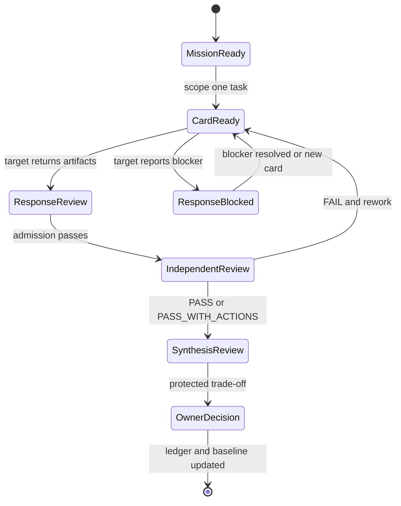

# Four-AI Council packet contracts v1

Status: submitted by UJ-INT-006. Independent Claude review is required before
accepted weight changes.

## Purpose

The Council packet family lets ChatGPT, Claude, Gemini, and Grok collaborate
through typed, versioned artifacts even when every provider is available only by
human bridge. A packet transfers facts and artifacts; it never transfers hidden
reasoning, consumer credentials, cookies, or authority.

## Packet family

| Packet | Schema | Producer | Consumer | Authority |
|---|---|---|---|---|
| MissionPacket | `schemas/mission-packet.schema.json` | Christian or ChatGPT integrator | council members | defines one bounded mission; does not authorize protected side effects |
| DelegationCard | `schemas/delegation-card.schema.json` | authorized integrator | exactly one target AI | grants one task, scope, limits, output contract, and expiry |
| ResponsePacket | `schemas/response-packet.schema.json` | delegated AI | importer/integrator | proposes REVIEW/BLOCKED/FAILED; cannot self-award DONE |
| ReviewResult | `schemas/review-result.schema.json` | named independent reviewer | ledger/integrator | may propose accepted weight with criterion evidence |
| SynthesisPacket | `schemas/synthesis-packet.schema.json` | ChatGPT integrator | reviewers and Christian | preserves accepted, rejected, deferred, and contradictory material |
| HandoffPacket | `schemas/handoff-packet.schema.json` | any active task owner | next session/owner | session continuity; it does not replace council packets |

All schemas use JSON Schema 2020-12, `additionalProperties: false` at packet
boundaries, explicit version constants, and stable ID patterns.

## Lifecycle

Packet status is not task status. For example, a ResponsePacket with status
`REVIEW` only proposes a task transition; the importer validates it and the
independent reviewer determines accepted weight.

## Identity and correlation invariants

1. `mission_id` is shared across all packets in one mission.
2. One DelegationCard has one `target_ai` and one `task_id`.
3. A ResponsePacket must match its card's mission, task, target AI, source ref,
   data class, and side-effect ceiling.
4. `response_id`, `review_id`, `synthesis_id`, and `idempotency_key` are unique;
   replay with different bytes is rejected as tampering.
5. Every artifact reference includes a SHA-256 content hash. A branch name alone
   is navigation, not proof.
6. ReviewResult reviewer identity must differ from the task owner for critical
   tasks and must match `BACKLOG.json`.
7. Synthesis cites source response/artifact for every accepted or rejected part.

## Authority model

| Field or action | Who may propose | Who may accept |
|---|---|---|
| task output and REVIEW transition | delegated owner | named reviewer/import policy |
| accepted weight | reviewer | ledger importer after proof checks |
| architecture ADR | specialist/integrator | required reviewers + Christian when protected |
| Constitution, budget, billing, data class, autonomy ceiling | any party may propose | Christian only |
| production, external message, account, destructive action | authorized task may draft | Christian action-specific approval |

A MissionPacket or DelegationCard never overrides the Constitution or action
approval matrix. The lower ceiling always wins when packet fields conflict.

## Human bridge procedure

1. Christian or ChatGPT chooses the exact card file; do not paste several cards
   into one session.
2. Attach or paste the card and only its listed input artifacts.
3. The target AI declares actual capabilities before work. Unavailable tools do
   not invalidate the task if a no-side-effect artifact can still be returned.
4. The target produces repository files or complete file contents plus one
   ResponsePacket JSON.
5. Return artifacts through the card's `return_channel`; do not send secrets.
6. The importer runs the admission stages in
   `COUNCIL_IMPORT_AND_MERGE.md` before any ledger change.

## Versioning

- Compatible optional expansion requires a new schema version; v1 packet
  boundaries remain closed to unknown fields.
- Breaking changes create `/v2`, a migration function, contract tests, and an
  ADR. Never reinterpret old fields in place.
- Importers support an explicit allowlist of schema versions. Unsupported
  versions are quarantined, not guessed.
- Schema files and ready cards are pinned to commits and hashed by the validator.

## Safety defaults

- allowed provider mode for the first mission: HUMAN_BRIDGE;
- incremental cost: zero;
- billing and paid APIs: forbidden;
- maximum autonomy: L2;
- direct write to `main`: false;
- consumer UI/session automation: forbidden;
- secret values: forbidden;
- default tool allowlist: only capabilities explicitly named in a card and
  actually observed by the target session;
- ResponsePacket cannot propose DONE;
- absent response, timeout, or invalid packet means BLOCKED, never approval.

