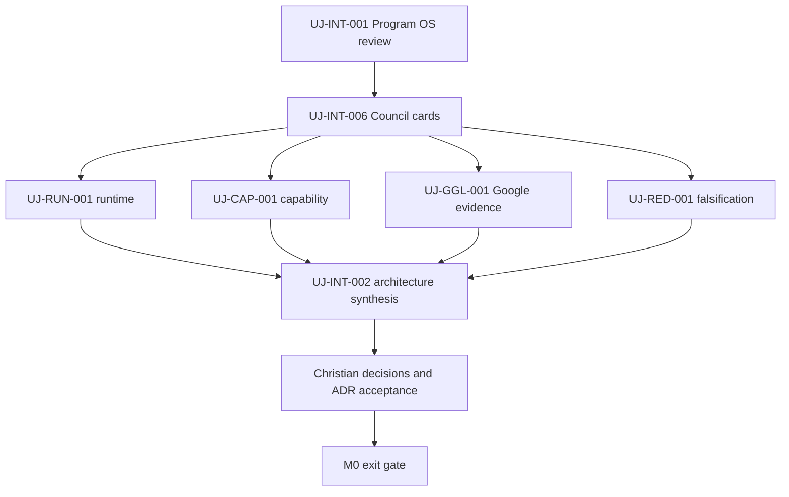

# STATUS v0.1

Snapshot date: 2026-08-21. Numeric source: `BACKLOG.json` on the same ref.

## Executive status

| Scope | Accepted / total weight | Progress | Remaining | Confidence |
|---|---:|---:|---:|---|
| Initial four-AI portfolio | 26 / 311 | 8.36% | 285 | HIGH: accepted weight is derived from task records |
| M0 bootstrap snapshot | 52 / 94 | 55.32% | 42 | MEDIUM: owner acceptance may amend the draft baseline |
| Meta bootstrap only | 26 / 29 | 89.66% | 3 | HIGH: derived from task records |
| Lifetime ultraJARVIS program | UNKNOWN | N/A | UNKNOWN | Correctly unbaselined and extensible |

`UJ-INT-001`, `UJ-INT-006`, and `UJ-RED-001` are submitted for review with 34 units of produced
scope, but they contribute zero accepted weight until their named independent
reviews pass.

## Core portfolio by status

| Status | Tasks | Weight | Meaning |
|---|---:|---:|---|
| IN_PROGRESS | 0 | 0 | Authorized work is underway; no acceptance implied |
| REVIEW | 5 | 55 | Artifacts submitted; acceptance pending |
| READY | 4 | 37 | Inputs sufficient to begin, subject to WIP and card gates |
| TRIAGED | 1 | 13 | Scoped but not selected as current primary work |
| BLOCKED | 15 | 136 | Explicit dependency/evidence blocker exists |
| DEFERRED | 5 | 44 | Future milestone or insufficient operational evidence |
| DONE | 2 | 26 | Full weight accepted with admissible independent proof |
| **Total** | **32** | **311** | Four-AI initial portfolio |

Meta-bootstrap and zero-weight auxiliary candidates are intentionally excluded
from this table.

## Immediate task snapshot

| Task | Owner | State | Accepted / total | Proof | Blocker | Next |
|---|---|---|---:|---|---|---|
| UJ-META-001 | ChatGPT | DONE | 21/21 | 2 ledger proof ref(s) | none | Preserve the prompt hash and route amendments through change control. |
| UJ-META-002 | Christian | REVIEW | 5/8 | 2 ledger proof ref(s) | PR #1 is draft and requires owner decisions on Constitution, strict zero-card mode, and M0 baseline. | Review the named decisions in PR #1; amend or approve before merge. |
| UJ-INT-001 | ChatGPT | REVIEW | 0/13 | 18 ledger proof ref(s) | Artifacts are submitted but accepted weight requires independent Grok review. | Ask Grok to review progress gaming and Program OS consistency; record PASS, PASS_WITH_ACTIONS, or FAIL. |
| UJ-INT-006 | ChatGPT | REVIEW | 0/8 | 19 ledger proof ref(s) | Artifacts are submitted but accepted weight requires independent Claude review. | Claude validates the packet contracts and import rules; keep accepted weight at 0/8 until review proof exists. |
| UJ-RUN-001 | Claude | REVIEW | 0/13 | 16 ledger proof ref(s) | ResponsePacket UJ-RESPONSE-RUN-001-CLAUDE-20260819-REVIEW-R6 is submitted; accepted weight remains 0/13 pending independent GEMINI review. | Begin the review of UJ-RUN-001. The task is admissible: all six clauses verified. Reproduce the proofs from the repository root with typecheck, then build, then the test suite; expect 140 of 140 and 36 in runtime-invariants. Read section 4 of the handoff first: it declares what is NOT proven. |
| UJ-CAP-001 | Gemini | READY | 0/13 | 0 ledger proof ref(s) | none | Produce a coordinated evidence pack with UJ-GGL-001. |
| UJ-GGL-001 | Gemini | DONE | 13/13 | 4 ledger proof ref(s) | none | Accepted. Follow-up (non-blocking): date each of the 14 sources in the official source register; keep the surfaces named in GROK finding F-002 out of ACTIVE routing until human-bridge live checks exist. |
| UJ-RED-001 | Grok | DONE | 13/13 | 4 ledger proof ref(s) | none | Accepted. Follow-up (non-blocking): make the canonical packet validator reachable from the delivery checkout so the command cited in the packet is reproducible (CHATGPT finding F-001, severity INFO). |

## Critical path

This diagram is dependency order, not an ETA. Claude, Gemini, and Grok work may
run in parallel; synthesis waits for schema-valid artifacts at least in REVIEW.

## Owner decisions currently required

1. Accept or amend the Constitution and autonomy ceiling in PR #1.
2. Confirm `STRICT_ZERO_CARD` as the active default or propose a safer wording.
3. Keep automatic Claude access BLOCKED until UJ-CLD-001 proves the precise
   allowed case (recommended safe default).
4. Accept or amend the M0 ownership and accepted-weight baseline before merge.

No billing, deployment, account creation, email, destructive operation, or
production write is requested.

## Remaining M0 work

- 42 accepted-weight units remain in the current M0 bootstrap snapshot.
- Four immutable HUMAN_BRIDGE cards are ready for UJ-RUN-001,
  UJ-CAP-001/UJ-GGL-001, and UJ-RED-001.
- UJ-INT-002 is the current integration bottleneck and cannot start until those
  specialist artifacts exist.
- ETA is UNKNOWN until multiple reviewed tasks establish an accepted velocity
  range. Report critical path and units, not a date.
