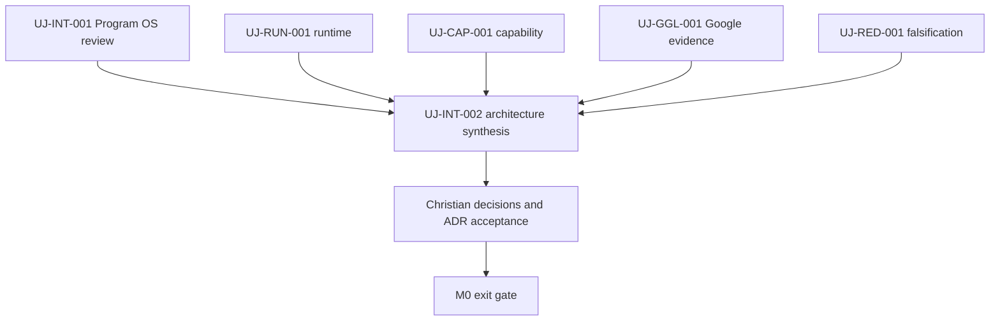

# STATUS v0.1

Snapshot date: 2026-08-17. Numeric source: `BACKLOG.json` on the same ref.

## Executive status

| Scope | Accepted / total weight | Progress | Remaining | Confidence |
|---|---:|---:|---:|---|
| Initial four-AI portfolio | 0 / 311 | 0.00% | 311 | HIGH: portfolio weights are declared; no specialist work is independently accepted |
| M0 bootstrap snapshot | 26 / 94 | 27.66% | 68 | MEDIUM: owner acceptance may amend the draft baseline |
| Meta bootstrap only | 26 / 29 | 89.66% | 3 | HIGH: PR #1 and its remaining gate are observable |
| Lifetime ultraJARVIS program | UNKNOWN | N/A | UNKNOWN | Correctly unbaselined and extensible |

`UJ-INT-001` is submitted for review with 13 units of produced scope, but it
contributes zero accepted weight until the named independent review passes.

## Core portfolio by status

| Status | Tasks | Weight | Meaning |
|---|---:|---:|---|
| REVIEW | 1 | 13 | Artifact submitted; acceptance pending |
| READY | 6 | 73 | Inputs sufficient to begin, subject to one-primary-task WIP rule |
| TRIAGED | 1 | 13 | Scoped but not selected as current primary work |
| BLOCKED | 19 | 168 | Explicit dependency/evidence blocker exists |
| DEFERRED | 5 | 44 | Future milestone or insufficient operational evidence |
| DONE | 0 | 0 | No core portfolio weight independently accepted yet |
| **Total** | **32** | **311** | Four-AI initial portfolio |

Meta-bootstrap and zero-weight auxiliary candidates are intentionally excluded
from this table.

## Immediate task snapshot

| Task | Owner | State | Accepted / total | Proof | Blocker | Next |
|---|---|---|---:|---|---|---|
| UJ-META-001 | ChatGPT | DONE | 21/21 | canonical prompt + PR #1 | none | preserve hash/change control |
| UJ-META-002 | Christian | REVIEW | 5/8 | draft PR #1 | owner decisions and merge | accept/amend named decisions |
| UJ-INT-001 | ChatGPT | REVIEW | 0/13 | Program OS artifact set on PR #1 branch | independent review | Grok reviews progress/system; Claude reviews Program OS |
| UJ-RUN-001 | Claude | READY | 0/13 | none yet | none | produce provider-neutral runtime blueprint |
| UJ-CAP-001 | Gemini | READY | 0/13 | none yet | none | produce four-AI Capability Registry |
| UJ-GGL-001 | Gemini | READY | 0/13 | none yet | none | produce coordinated Google evidence pack |
| UJ-RED-001 | Grok | READY | 0/13 | none yet | none | produce falsification report with remediation |

## Critical path

This diagram is dependency order, not an ETA. Claude, Gemini, and Grok work may
run in parallel; synthesis waits for schema-valid artifacts at least in REVIEW.

## Owner decisions currently required

1. Accept or amend the Constitution and autonomy ceiling in PR #1.
2. Confirm `STRICT_ZERO_CARD` as the active default or propose a safer wording.
3. Keep automatic Claude access BLOCKED until UJ-CLD-001 proves the precise
   allowed case (recommended safe default).
4. Accept or amend the M0 ownership and accepted-weight baseline before merge.

No billing, deployment, account creation, email, destructive operation, or
production write is requested.

## Remaining M0 work

- 68 accepted-weight units remain in the current M0 bootstrap snapshot.
- The immediate independent branches are UJ-RUN-001, UJ-CAP-001/UJ-GGL-001,
  and UJ-RED-001.
- UJ-INT-002 is the current integration bottleneck and cannot start until those
  specialist artifacts exist.
- ETA is UNKNOWN until multiple reviewed tasks establish an accepted velocity
  range. Report critical path and units, not a date.

