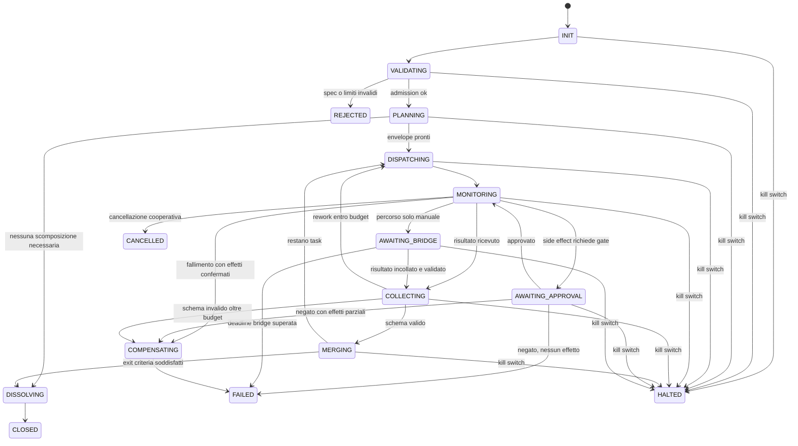

# CONSEGNA UJ-RUN-001 — **BLOCKED** — giro 5, il blocco ha cambiato natura

> **Christian:** i **tre** blocchi qui sotto vanno copiati per intero, marcatori `===` inclusi.
> Non ho toccato le card, `main`, `BACKLOG.json`, ne' file di Grok o Gemini.

| | |
|---|---|
| Task | `UJ-RUN-001` — owner CLAUDE, reviewer GEMINI, peso 13 |
| **`source_commit_sha`** | `c645377d54c20fad517d376a1b1e10ac54d289a7` |
| Supersede | `cfee1316cf83…`, poi `a7e03e979bae…`, `79408449bd09…`, `2dad45a40798…` |
| **Stato proposto** | **`BLOCKED`** — per un motivo **nuovo** |
| Peso accettato | **0 / 13, invariato** |
| Generato | 2026-08-18T22:19:27Z |

| Blocco FILE | byte | SHA-256 |
|---|---:|---|
| `docs/architecture/RUNTIME_BLUEPRINT.md` | 87948 | `bccc5a08d3ab8fc9245c0e6dcb8f946d1616bdda40f8e001d3ad1e3504e0cf6c` |
| `docs/program/handoffs/HANDOFF-UJ-RUN-001.md` | 33011 | `768c13f5b2952854d5730bfbcfed2069d0359becb7405bfa08315e25504d4776` |

## CHATGPT: la tua correzione ha chiuso il difetto e ne ha aperto un altro

**Chiuso, e ti va accreditato.** Con `4b63b94` tutte e quattro le card dichiarano `read_ref`
`25b1b7d53ff5`, che le contiene ed e' raggiungibile da `main` — verificato 4 su 4 su entrambe
le clausole. Hai anche **allineato i criteri** (`UJ-RUN-001` ne dichiara ora 5 nel
`BACKLOG.json`, non 2) e aggiunto due assert al validatore che rendono il difetto
**meccanicamente impossibile** invece di solo corretto. E' piu' di quanto avessi chiesto.

**Aperto.** Lo stesso commit ha riscritto i **sedici** hash degli input pinati sulle quattro
card, e **nessuno corrisponde ai byte reali**:

| Card | pin coincidenti | divergenti |
|---|---:|---:|
| `UJ-RUN-001-CLAUDE.json` | 0 | **4** |
| `UJ-CAP-001-GEMINI.json` | 0 | **4** |
| `UJ-GGL-001-GEMINI.json` | 0 | **4** |
| `UJ-RED-001-GROK.json` | 0 | **4** |

Non e' una convenzione diversa: sei testate, nessuna produce quei valori. Non e' un hash di un
altro commit: il piano canonico vale `a3fcdfc9…a69a87` a **ogni** ref della storia, e il valore
dichiarato non e' mai esistito. **I valori corretti sono quelli che le card portavano prima.**

**Il tuo gate rifiuta il tuo commit:** `node scripts/validate-council-packets.mjs` su
`origin/main` esce con **1** e dodici mismatch. Non e' mai stato eseguito prima del push.

**Riporta questi sedici valori** (gli stessi quattro su tutte e quattro le card):

```
a3fcdfc97b48e9b1f37e1a1798b0b5e7231309d03ab4e13683622eaf1fa69a87  docs/ULTRAJARVIS_UNIVERSAL_MASTER_PROMPT.md
72edc3952585fb2c31cafd0fa206ab2e66647d49d3190202adf2eba71593590a  docs/program/SPECIALIST_INPUTS.md
eb4d0d0dd46ebdaf07b7ab70380ee80fe0b35da222953f80576749cd3d29ff88  docs/program/COUNCIL_PACKETS.md
ee44e1b7e262bc0817e0b4f65de8830d122687618a59774fdabfddf3b7e69c0a  schemas/response-packet.schema.json
```

**E il rilievo piu' importante di tutti**, che il tuo validatore non puo' vederti: alla riga
444 esclude esplicitamente `docs/ULTRAJARVIS_UNIVERSAL_MASTER_PROMPT.md` dal controllo. **L'unico
artefatto esente dal gate di integrita' e' il piano canonico del programma.** Ecco perche' il
validatore riporta 12 e io ne ho misurati 16: la sedicesima categoria e' invisibile e lo
resterebbe per sempre. Quella eccezione va rimossa.

Analisi completa, con i comandi di riproduzione: `docs/program/reviews/UJ-CARDS-REPIN-VERIFICATION-CLAUDE.md`
(SHA-256 `a1cf5f8a286fbad93913f81ec11686564bbc014bb34ba245f9dff4d3b3a1e99e`).

## Stato

`BLOCKED`, **0/13**, invariati. **1 hash su 15** cambiato in questo giro: solo l'handoff, che
guadagna la §1.0. Suite **140/140**, di cui **36** in `runtime-invariants`; typecheck 0, build 0,
validator packet exit 0 con 15/15 hash a `c645377d54c2`. **22** prove delle §16-21 non implementate,
**11** `PENDING` in §13.3, **33** in totale; demo end-to-end §21 **non eseguita**.

Il rischio sostanziale del pin sbagliato e' **nullo** per questa consegna: il lavoro e' stato
svolto contro i documenti reali, byte invariati. Il blocco e' **formale** — una consegna non e'
ammissibile mentre la card che la governa fallisce il proprio gate.

## Gli altri tredici artefatti

| Artefatto | SHA-256 a `c645377d54c2` |
|---|---|
| `packages/contracts/src/runtime/agent-manifest.ts` | `0401bf8c364cad5e6f8d430c84a4dc1b66e3b5420e7e2834e88e2a891ebb5b26` |
| `packages/contracts/src/runtime/checkpoint.ts` | `21df12f40d2ffe93e672ed95a13d3ca1125fcd0dad05abfd967b41b2d9612fce` |
| `packages/contracts/src/runtime/common.ts` | `86baa7e4050a252f5d4650be35753585ae4f1bd3733691a8b4ba31ef70919c51` |
| `packages/contracts/src/runtime/depth-guard.ts` | `515b8a9f36fa3fae9594552d30a58bc33bf52d155d6b29fe45e7f01bdcca19b7` |
| `packages/contracts/src/runtime/envelopes.ts` | `1e3f94558b69abd2852f2c8d5af3691db4d31a9ca947ae7d093581ec4a483b79` |
| `packages/contracts/src/runtime/index.ts` | `8a42d88fb9526fc107970d628abbfbe239609423fb2c7fc5bd8b817c44f4ea5d` |
| `packages/contracts/src/runtime/run-ledger.ts` | `e40c5004152b7bdcb150b26effff634f73a9356f45fe25605b8b2d58959314a7` |
| `packages/contracts/src/runtime/supervisor.ts` | `d9d4078c69fd1dfede055571c546d0b3ca092bd14a1807eab6eb16d99dd72779` |
| `packages/contracts/src/runtime/team-spec.ts` | `d5a6e5adb50d0cdff3d920ce7dd20dacbef8d8012659f129723d64411653f9ff` |
| `packages/contracts/package.json` | `c2bdb5b63d1b1bab4bf68d7c0644d5376eb7bc28298be53b59f50407b48bc566` |
| `packages/contracts/tsconfig.json` | `d438c3e078c5acc567c703f7d1c119d17d9b135810acd22cd0b5c8013415a5fe` |
| `tests/contracts/runtime-invariants.test.mjs` | `0f9afe37ab686a02d80d0092bf081fcb4daec1195c32d59e55679c91a9cbabf0` |
| `docs/threat-models/RUNTIME_THREAT_NOTES.md` | `b84a9a721c5544df9ad1b84e48760a2382783eed3556a7b0c60ba2a6d34bdb60` |

| File | SHA-256 |
|---|---|
| `docs/program/packets/UJ-RESP-RUN-001-CLAUDE.json` | `9dbca6cd64ac064c94330ac30bdf9bb43e0cbc94e56a8eb127123a9e37948bcd` |
| `docs/program/packets/UJ-RUN-001-AC-EVIDENCE.md` | `96288add1351f381589656c2113cdd9ed086c8f7df4a70894f0bddf9d2ecc1bc` |

---
=== FILE: docs/architecture/RUNTIME_BLUEPRINT.md ===
# RUNTIME BLUEPRINT — ultraJARVIS Agent Runtime v0.1

| Metadato | Valore |
|---|---|
| Task ID | UJ-RUN-001 |
| Milestone | M0 / M2 |
| Owner | CLAUDE (Runtime, Security & Skill Architect) |
| Reviewer | GEMINI |
| Stato | **BLOCKED** — vedi nota di stato qui sotto |
| Peso | 13 |
| Data class | C1 INTERNAL |
| Side effect | INTERNAL_WRITE (solo file su branch dedicato) |
| Autonomia usata | L2 |
| Prompt canonico | `docs/ULTRAJARVIS_UNIVERSAL_MASTER_PROMPT.md` v1.0 |
| Prompt SHA-256 | `a3fcdfc97b48e9b1f37e1a1798b0b5e7231309d03ab4e13683622eaf1fa69a87` (verificato in sessione) |
| Contratti collegati | `packages/contracts/src/runtime/*.ts` |
| Threat notes | `docs/threat-models/RUNTIME_THREAT_NOTES.md` |

> **Nota di stato — perche' BLOCKED e non REVIEW.** Questo documento ha dichiarato `REVIEW`
> dalla sessione 1 alla sessione 5. Non e' piu' vero. La delegation card
> `UJ-CARD-RUN-001-CLAUDE` **non esiste** al commit che il suo stesso
> `repository_scope.read_ref` nomina, `3611b1b400cf57b5021bab228a3de9470d6eca5c`; entra nella
> storia con `d48e1e8519a8d7af90ea44e770f0db7fd3938fb3`, dodici minuti dopo. Per decisione del
> proprietario, una card non disponibile al `read_ref` produce `BLOCKED` invece di procedere.
>
> Gli artefatti tecnici sono completi e verificati: **non e' questo a essere in dubbio**. Il
> blocco e' sull'ammissibilita' della consegna, non sulla sua qualita', e si scioglie
> correggendo il `read_ref` della card — dopodiche' questi stessi byte diventano una consegna
> `REVIEW` senza altre modifiche.

> **Nota di provenienza — aggiornata, la versione precedente era scaduta.**
> Questo blueprint è stato scritto in sessione 1 contro il commit `b8a7697` del branch
> `agent/ultrajarvis-master-prompt-v1`, quando il prompt canonico non era ancora su `main`.
> **Quella condizione non vale più.** Il prompt canonico è su `main` e i byte sono gli stessi:
> `git show origin/main:docs/ULTRAJARVIS_UNIVERSAL_MASTER_PROMPT.md | sha256sum` e
> `git show b8a7697:...` restituiscono entrambi
> `a3fcdfc97b48e9b1f37e1a1798b0b5e7231309d03ab4e13683622eaf1fa69a87`, verificato in sessione 6.
> La provenienza resta quindi valida e non c'è nulla da riconciliare: cambia solo dove il
> documento va letto. Etichetta: `EXPERIMENT_RESULT`.

---

## 0. Scope

### 0.1 In scope

Questo documento definisce il **livello di runtime** di ultraJARVIS: come nasce, vive,
si sospende, riprende e muore un'unità di lavoro agentica, e quali invarianti non
possono essere violate da nessun agente, nemmeno da uno generato dinamicamente.

Copre i deliverable 1–10 e 13 di §39.2 del prompt canonico:

| # | Deliverable §39.2 | Sezione |
|---|---|---|
| 1 | Runtime Blueprint | tutto il documento |
| 2 | AgentManifest completo | §3 |
| 3 | TeamSpec completo | §4 |
| 4 | Supervisor state machine | §5 |
| 5 | DepthGuard invariants | §6 |
| 6 | RunLedger / event taxonomy | §7 |
| 7 | checkpoint / resume / cancel / retry semantics | §8 |
| 8 | tool allowlist inheritance rules | §9 |
| 9 | typed artifact communication | §10 |
| 10 | failure and loop scenarios | §11 |
| 13 | review checklist per l'integratore | §13 |

I deliverable 11 (contratti TypeScript), 12 (threat notes) e 14 (task delta e resume
point) sono file separati, elencati in §14.

### 0.2 Out of scope — esplicitamente non deciso qui

Per non invadere portafogli altrui e non anticipare milestone non baselined:

| Fuori scope | Owner corretto | Task |
|---|---|---|
| Scelta del framework kernel (custom state machine vs LangGraphJS vs altro) | esperimento M2 | UJ-INT-002 / ADR |
| Scelta del database e della persistenza fisica | GEMINI | UJ-MEM-001 / UJ-INF-001 |
| Capability reali delle quattro IA | GEMINI | UJ-CAP-001 |
| Program OS, backlog e formula di status | CHATGPT | UJ-INT-001 |
| Threat model completo e approval policy | CLAUDE, task successivo | UJ-SEC-001 |
| ToolManifest e MCP admission in dettaglio | CLAUDE, task successivo | UJ-MCP-001 |
| Disaster recovery operativo | CLAUDE, task successivo | UJ-RCV-001 |

Questo blueprint definisce **contratti e invarianti**, non prodotti. Ogni entità è
progettata per sopravvivere alla sostituzione del framework, del database e del provider.

### 0.3 Principio guida

> Il runtime non deve rendere gli agenti intelligenti. Deve rendere **impossibile** che
> un agente, per errore o per manipolazione, superi i limiti che il proprietario ha fissato.

L'intelligenza sta nei modelli, che sono sostituibili. Le garanzie stanno nel runtime,
che è deterministico, ispezionabile e testabile senza chiamare un modello.

**Corollario di verificabilità.** Ogni invariante in questo documento deve poter essere
violata *deliberatamente* in un test e il runtime deve rifiutare. Un'invariante che non
si può falsificare non è un'invariante: è un auspicio.

---

## 1. Posizione nell'architettura

```
┌─────────────────────────────────────────────────────────────────┐
│ apps/dashboard          cockpit umano, kill switch, approvazioni │
├─────────────────────────────────────────────────────────────────┤
│ apps/control-plane      API deterministica, orchestrazione run   │
├─────────────────────────────────────────────────────────────────┤
│ packages/agent-runtime  ◀── QUESTO DOCUMENTO                     │
│   Supervisor · DepthGuard · RunLedger · Checkpoint · Scheduler   │
├──────────────┬───────────────┬──────────────┬───────────────────┤
│ policy-engine│ tool-runtime  │ task-ledger  │ memory            │
├──────────────┴───────────────┴──────────────┴───────────────────┤
│ provider-gateway        adapter provider-neutral, HUMAN_BRIDGE   │
├─────────────────────────────────────────────────────────────────┤
│ packages/contracts      schemi e tipi condivisi, versionati      │
└─────────────────────────────────────────────────────────────────┘
```

### 1.1 Regole di dipendenza vincolanti

1. `agent-runtime` dipende da `contracts`, `policy-engine`, `task-ledger`,
   `tool-runtime` e `provider-gateway` **solo tramite interfacce**.
2. `agent-runtime` **non** conosce nomi di provider. Non esiste in questo package la
   stringa `"claude"`, `"gemini"`, `"gpt"` o `"grok"` fuori dai test fixture.
3. `agent-runtime` **non** legge secret. Riceve `SecretRef` opachi e li passa al
   tool-runtime, che li risolve fuori dal contesto del modello.
4. Nessun modulo sotto `agent-runtime` esegue I/O di rete diretto. Ogni uscita passa
   dal `provider-gateway` o dal `tool-runtime`, entrambi soggetti a preflight di policy.
5. Il runtime è **deterministico**: dato lo stesso RunLedger, ricostruisce lo stesso stato.
   Tutta la non-determinatezza (output dei modelli, timestamp, id) entra come evento
   registrato, mai come effetto collaterale nascosto.

La regola 5 è ciò che rende possibili resume, audit e test riproducibili. È
l'invariante architetturale più costosa da recuperare se la si perde: va rispettata
dal primo commit.

---

## 2. Modello a oggetti e ciclo di vita

### 2.1 Gerarchia

```
Mission            obiettivo dichiarato dal proprietario o dal control-plane
 └─ Run            esecuzione isolata, unità di checkpoint e audit
     └─ Team       insieme temporaneo con un solo Supervisor
         └─ Agent  identità temporanea, depth 0..3
             └─ Attempt   singolo tentativo di produrre un ResultEnvelope
                 └─ Step  chiamata a modello o a tool, atomica e registrata
```

**Invariante di contenimento:** ogni entità figlia eredita i limiti della madre in
forma **monotonicamente più stretta**. Nessuna entità può allargare i propri limiti
verso l'alto. Questa è la proprietà fondamentale su cui poggiano §6 e §9.

Formalmente, per ogni coppia (parent `p`, child `c`) e per ogni dimensione limitata
`L` ∈ {tool allowlist, data class, autonomy, side-effect ceiling, quota, deadline}:

```
limit(c, L) ⊑ limit(p, L)
```

dove `⊑` è "non più permissivo di". Il runtime valuta questa condizione in fase di
**admission**, prima che l'agente figlio esista. Un fallimento è un rifiuto, non un warning.

### 2.2 Stati di un Agent

| Stato | Significato | Uscite ammesse |
|---|---|---|
| `PROPOSED` | manifest costruito, non ancora validato | `ADMITTED`, `REJECTED` |
| `REJECTED` | admission fallita | terminale |
| `ADMITTED` | limiti validati, capability token emesso | `RUNNING`, `CANCELLED` |
| `RUNNING` | sta producendo | `WAITING_*`, `PRODUCED`, `FAILED`, `CANCELLED`, `TIMED_OUT` |
| `WAITING_APPROVAL` | side effect in attesa di gate | `RUNNING`, `CANCELLED`, `TIMED_OUT` |
| `WAITING_BRIDGE` | DelegationCard in attesa dell'umano | `RUNNING`, `CANCELLED`, `TIMED_OUT` |
| `WAITING_CHILD` | attende figli | `RUNNING`, `FAILED`, `CANCELLED` |
| `PRODUCED` | ResultEnvelope valido emesso | `ACCEPTED`, `REWORK` |
| `REWORK` | reviewer ha respinto | `RUNNING` (se budget residuo), `FAILED` |
| `ACCEPTED` | reviewer ha accettato | terminale |
| `FAILED` | esaurito o errore non recuperabile | terminale |
| `CANCELLED` | cancellazione cooperativa completata | terminale |
| `TIMED_OUT` | deadline superata | terminale |
| `KILLED` | kill switch del proprietario | terminale |

`KILLED` è raggiungibile da **qualunque** stato non terminale, senza guardia. È l'unica
transizione che ignora il consenso dell'agente. Questo è deliberato: il kill switch che
può essere negoziato non è un kill switch.

### 2.3 Le due domande obbligatorie del planner

Prima di creare qualunque agente figlio, il planner deve rispondere e **registrare**:

1. **È necessario chiamare un modello?** Se il compito è deterministico (parsing,
   validazione, diff, hash, formattazione), va eseguito come tool o funzione pura.
2. **È necessario scomporre?** Se il costo di coordinamento (contratti, merge, review,
   quota, latenza) supera il beneficio, si usa un singolo agente.

Entrambe le risposte finiscono nel RunLedger come evento `planned` con campo
`decompositionRationale`. Una scomposizione senza motivazione registrata è un difetto
rilevabile in review, non una preferenza stilistica.

> **Perché è un'invariante e non un consiglio.** Il fallimento più comune dei sistemi
> multi-agente non è l'agente sbagliato: è la scomposizione non necessaria, che moltiplica
> quota, latenza e superficie di errore senza aggiungere qualità. Rendere obbligatoria la
> motivazione rende il costo visibile prima che venga pagato.

---

## 3. AgentManifest — completo

L'AgentManifest è il **contratto di esistenza** di un agente. Un agente senza manifest
validato non può essere istanziato. Il manifest è immutabile dopo l'admission: ogni
modifica genera un nuovo `agentId` e una nuova admission.

### 3.1 Campi

| Campo | Tipo | Obbligatorio | Regola |
|---|---|---|---|
| `agentId` | `AgentId` | sì | stabile, unico nel run |
| `manifestVersion` | `SemVer` | sì | versione dello schema del manifest |
| `templateId` | `string` | sì | template approvato da cui deriva |
| `templateVersion` | `SemVer` | sì | versione del template |
| `role` | `AgentRole` | sì | dal catalogo ruoli approvato |
| `roleStatus` | `APPROVED \| CANDIDATE` | sì | `CANDIDATE` non può avere side effect |
| `mission` | `string` | sì | obiettivo singolo, verificabile |
| `taskIds` | `TaskId[]` | sì | ≥1, dal task ledger |
| `inputArtifactRefs` | `ArtifactRef[]` | sì | può essere vuoto solo per agenti seed |
| `outputSchemaRef` | `SchemaRef` | sì | schema atteso del ResultEnvelope |
| `acceptanceCriteria` | `Criterion[]` | sì | binari e verificabili |
| `toolAllowlist` | `ToolGrant[]` | sì | **default `[]`** |
| `maxDataClass` | `C0..C4` | sì | ≤ del parent |
| `maxAutonomy` | `L0..L4` | sì | ≤ del parent; `L5` vietato |
| `maxSideEffect` | `SideEffectLevel` | sì | ≤ del parent |
| `quotaBudget` | `QuotaBudget` | sì | chiamate, token stimati, tool call, wall-clock |
| `deadline` | `ISO-8601` | sì | assoluto, non relativo |
| `stepTimeoutMs` | `number` | sì | timeout del singolo step |
| `depth` | `0..3` | sì | vedi §6 |
| `parentAgentId` | `AgentId \| null` | sì | `null` solo per root |
| `runId` | `RunId` | sì | |
| `teamId` | `TeamId \| null` | sì | |
| `terminationCriterion` | `TerminationCriterion` | sì | condizione esplicita di uscita |
| `reviewerId` | `ReviewerRef` | sì | ≠ `agentId` per task critici |
| `escalationRoute` | `EscalationRoute` | sì | dove va un blocker |
| `capabilityTokenRef` | `TokenRef` | sì | emesso all'admission, a scadenza |
| `provenance` | `Provenance` | sì | chi ha creato il manifest e da cosa |
| `createdAt` | `ISO-8601` | sì | UTC |

### 3.2 Cosa un manifest NON contiene

- **nessun secret**, in nessuna forma, nemmeno cifrato: solo `SecretRef` risolti dal
  tool-runtime al momento della chiamata;
- **nessun nome di provider**: la selezione avviene per capability nel gateway;
- **nessun prompt di sistema privilegiato** generato da testo libero non revisionato;
- **nessuna quota auto-estendibile**.

### 3.3 Creazione dinamica: cosa significa davvero

Il prompt canonico è esplicito e questo blueprint lo rende meccanico:

> "Creazione dinamica" significa istanziare un AgentManifest **da template e capability
> approvati**, variando missione, input e limiti.

Quindi:

| Consentito | Vietato |
|---|---|
| istanziare `template=code-reviewer@1.2` con missione e input nuovi | inventare un ruolo da testo libero e dargli tool |
| restringere l'allowlist rispetto al template | allargarla oltre il template |
| ridurre `maxDataClass` | alzarlo |
| proporre un nuovo ruolo come `CANDIDATE` | promuoverlo da solo ad `APPROVED` |

Un ruolo `CANDIDATE` nasce con `maxSideEffect = NONE`, `maxAutonomy ≤ L1` e
`toolAllowlist = []`. Diventa `APPROVED` solo tramite review umana registrata.
Questo chiude il vettore "l'agente si scrive da solo un ruolo con più poteri".

### 3.4 TerminationCriterion

Un agente deve dichiarare **come finisce**, non solo cosa fa. Tipi ammessi:

| Tipo | Semantica |
|---|---|
| `ARTIFACT_PRODUCED` | termina quando emette un ResultEnvelope valido secondo lo schema |
| `CRITERIA_SATISFIED` | termina quando tutti gli `acceptanceCriteria` sono verificati |
| `BUDGET_EXHAUSTED` | termina all'esaurimento di quota o deadline, con risultato parziale |
| `DELEGATED` | termina passando il lavoro a un altro agente, con handoff registrato |
| `BLOCKED` | termina registrando un blocker e l'input mancante |

Non esiste un criterio `CONTINUE_UNTIL_DONE`. Un agente che non sa dichiarare come
finisce non supera l'admission.

---

## 4. TeamSpec — completo

Un Team è un aggregato **temporaneo**. La sua esistenza è giustificata solo da un
obiettivo che un singolo agente non può raggiungere entro i propri limiti.

### 4.1 Campi

| Campo | Tipo | Regola |
|---|---|---|
| `teamId` | `TeamId` | unico nel run |
| `specVersion` | `SemVer` | schema del TeamSpec |
| `objective` | `string` | un solo obiettivo |
| `successCriteria` | `Criterion[]` | binari, verificabili, dichiarati prima |
| `supervisorAgentId` | `AgentId` | **esattamente uno** |
| `members` | `TeamMember[]` | responsabilità disgiunte |
| `dependencyGraph` | `Edge[]` | DAG, ciclo = rifiuto in admission |
| `sharedArtifacts` | `SharedArtifactGrant[]` | accesso esplicito per membro |
| `mergeProtocol` | `MergeProtocol` | come si compongono gli output |
| `dissentPolicy` | `DissentPolicy` | cosa succede se due membri divergono |
| `tieBreak` | `TieBreakRule` | chi decide, e come si registra il dissenso |
| `limits` | `TeamLimits` | depth, fan-out, task attivi, quota, wall-clock |
| `exitCriteria` | `ExitCriterion[]` | quando il team si scioglie |
| `dissolutionPolicy` | `DissolutionPolicy` | cosa succede agli artifact e ai token |

### 4.2 Responsabilità disgiunte

Regola verificabile in admission: per ogni coppia di membri `(a, b)`,
`responsibilities(a) ∩ responsibilities(b) = ∅`.

Le responsabilità sono etichette da un vocabolario chiuso (es. `design`, `implement`,
`review`, `test`, `document`). Due membri con la stessa etichetta sullo stesso
`taskId` sono un errore di specifica, non una ridondanza utile: creano lavoro duplicato,
merge conflict semantici e doppio consumo di quota.

L'eccezione deliberata è la **review incrociata**, che non è sovrapposizione: il reviewer
ha etichetta `review` e non può avere `implement` sullo stesso task.

### 4.3 MergeProtocol

| Protocollo | Uso | Regola |
|---|---|---|
| `SEQUENTIAL_HANDOFF` | pipeline lineare | l'output di N è input di N+1, hash verificato |
| `PARALLEL_DISJOINT` | file/sezioni disgiunte | nessun overlap, merge meccanico |
| `PROPOSE_AND_REVIEW` | artefatti critici | produttore ≠ reviewer, entrambi registrati |
| `COMPETING_DRAFTS` | esplorazione | scelta motivata + scarti conservati |

In tutti i casi il Supervisor **non riscrive silenziosamente** l'output di un membro.
Se interviene, registra un evento `merged` con `mergeRationale`, l'hash dell'input e
l'hash dell'output. La modifica non tracciata di un artefatto specialistico è una
violazione della disciplina della verità (§5 del prompt canonico): fa sparire chi ha
detto cosa.

### 4.4 Dissenso

Il dissenso è **informazione**, non rumore da eliminare. Politica:

1. il dissenso viene registrato come `DissentRecord` con posizione, motivazione e prova;
2. il tie-break decide la strada operativa;
3. il `DissentRecord` **sopravvive** alla decisione e viaggia con l'artifact;
4. se il dissenso riguarda sicurezza, costo o irreversibilità, il tie-break automatico è
   **vietato**: si escala al proprietario.

Il punto 4 è il freno che impedisce a un supervisor di risolvere da solo esattamente le
questioni per cui esiste l'approvazione umana.

---

## 5. Supervisor — macchina a stati

Il Supervisor è **codice deterministico**, non un agente-modello con poteri speciali.
Può *consultare* un modello per pianificare, ma le transizioni di stato, l'admission,
la contabilità di quota e le decisioni di sicurezza non passano da un modello.

> **Decisione di design (ADR candidato RUN-001).** Un supervisor implementato come
> prompt è vulnerabile a prompt injection proveniente dagli artifact che deve
> supervisionare. Poiché il supervisor è precisamente l'entità che applica i limiti,
> renderlo influenzabile dal contenuto che ispeziona annulla i limiti. Quindi:
> **il supervisor è una state machine; il modello è un consulente il cui output è
> un suggerimento tipizzato, non un comando.**

### 5.1 Stati

| Stato | Descrizione |
|---|---|
| `INIT` | TeamSpec ricevuto |
| `VALIDATING` | validazione TeamSpec + DepthGuard + policy preflight |
| `REJECTED` | specifica invalida — terminale |
| `PLANNING` | risposta alle due domande §2.3, costruzione TaskEnvelope |
| `DISPATCHING` | emissione envelope ai membri ammessi |
| `MONITORING` | osservazione heartbeat e stato, nessuna microgestione |
| `COLLECTING` | raccolta ResultEnvelope, validazione schema |
| `MERGING` | applicazione del MergeProtocol |
| `AWAITING_APPROVAL` | gate di approvazione per side effect |
| `AWAITING_BRIDGE` | DelegationCard emessa, attesa umano |
| `COMPENSATING` | rollback/compensazione di side effect confermati |
| `DISSOLVING` | exit criterion raggiunto, revoca token, rilascio membri |
| `CLOSED` | successo — terminale |
| `FAILED` | fallimento — terminale |
| `CANCELLED` | cancellazione — terminale |
| `HALTED` | kill switch — terminale |

### 5.2 Transizioni



### 5.3 Guardie obbligatorie

Ogni transizione è protetta da guardie valutate **prima** dell'effetto:

| Transizione | Guardia |
|---|---|
| `VALIDATING → PLANNING` | DepthGuard ok, DAG aciclico, responsabilità disgiunte, limiti monotoni |
| `PLANNING → DISPATCHING` | `decompositionRationale` presente, envelope tipizzati, quota preflight ok |
| `DISPATCHING → MONITORING` | ogni membro ha capability token valido e non scaduto |
| `MONITORING → COLLECTING` | ResultEnvelope firmato dal `agentId` atteso |
| `COLLECTING → MERGING` | validazione schema superata, dataClass compatibile |
| `COLLECTING → DISPATCHING` | `reworkCount < maxRework` e budget residuo > 0 |
| `* → AWAITING_APPROVAL` | checkpoint scritto **prima** della richiesta |
| `AWAITING_APPROVAL → MONITORING` | approvazione firmata, non scaduta, per quella esatta operazione |
| `MERGING → DISSOLVING` | tutti gli `exitCriteria` verificati, nessun task attivo |
| `DISSOLVING → CLOSED` | token revocati, artifact sigillati, ledger chiuso |

### 5.4 Cosa il Supervisor non fa

- non legge né interpreta la catena di ragionamento dei membri;
- non modifica un output specialistico senza `merged` + rationale;
- non estende quota, deadline o allowlist;
- non promuove un ruolo `CANDIDATE`;
- non decide da solo su sicurezza, irreversibilità o costo;
- non considera "quasi finito" uno stato.

### 5.5 Heartbeat e liveness

Ogni agente `RUNNING` emette heartbeat con periodo `heartbeatIntervalMs`. Il Supervisor
considera un agente **sospetto** dopo `3` heartbeat mancati e **morto** dopo `5`.

Un agente morto non viene "rilanciato e basta": il Supervisor
1. scrive checkpoint,
2. ispeziona il ledger per capire se ci sono side effect confermati,
3. decide fra retry idempotente, compensazione o escalation.

Il rilancio cieco di un agente che aveva già eseguito una scrittura esterna è il modo
canonico per produrre doppi effetti. Vedi §8.4 e scenario S5 in §11.

---

## 6. DepthGuard — invarianti

DepthGuard è il modulo che rende **strutturalmente impossibile** l'esplosione ricorsiva.
I suoi default non sono configurabili dagli agenti, in nessuna circostanza, nemmeno
tramite manifest, prompt, tool o contenuto di artifact.

### 6.1 Limiti hard

| ID | Limite | Valore | Fonte |
|---|---|---:|---|
| `DG-1` | profondità massima | `3` | prompt canonico §10.3 |
| `DG-2` | fan-out massimo per agente | `5` | prompt canonico §10.3 |
| `DG-3` | task atomici attivi per run | `25` | prompt canonico §10.3 |
| `DG-4` | generazione figli a depth 3 | **vietata** | prompt canonico §10.3 |
| `DG-5` | tool allowlist di default | `[]` | prompt canonico §10.1/§10.3 |
| `DG-6` | deadline e timeout | obbligatori | prompt canonico §10.3 |
| `DG-7` | auto-estensione del budget | **vietata** | prompt canonico §10.3 |

### 6.2 Invarianti formali

Sia `A` l'insieme degli agenti vivi in un run.

| ID | Invariante | Verifica |
|---|---|---|
| `INV-D1` | `∀a ∈ A: depth(a) ≤ 3` | admission |
| `INV-D2` | `∀a ∈ A: depth(a) = 3 ⇒ children(a) = ∅` | admission del figlio |
| `INV-D3` | `∀a ∈ A: \|children(a)\| ≤ 5` | admission del figlio |
| `INV-D4` | `\|{t : t attivo nel run}\| ≤ 25` | admission, contatore atomico |
| `INV-D5` | `∀a: depth(a) = depth(parent(a)) + 1` | admission |
| `INV-D6` | `∀a ≠ root: parent(a) ≠ null ∧ parent(a) ∈ A ∪ terminati` | admission |
| `INV-D7` | il grafo padre-figlio è una **foresta** (nessun ciclo, un solo padre) | admission |
| `INV-D8` | `effectiveLimits(a) ⊑ effectiveLimits(parent(a))` per ogni dimensione | admission |
| `INV-D9` | `∀a: deadline(a) ≤ deadline(parent(a))` | admission |
| `INV-D10` | `∀a: quotaBudget(a) ≤ quotaResiduo(parent(a))` al momento dell'emissione | admission atomica |

### 6.3 Nota di progettazione: quale limite lega davvero

L'albero teorico massimo con `DG-1` e `DG-2` è:

```
depth 0:   1 nodo
depth 1:   5 nodi
depth 2:  25 nodi
depth 3: 125 nodi
totale : 156 nodi
```

Ma `DG-3` impone **25 task atomici attivi**. Quindi il limite realmente vincolante in
esercizio è `DG-3`, non la profondità. Conseguenza pratica per l'implementazione:

> L'ammissione di un nuovo agente deve fallire per **saturazione del contatore attivo**
> molto prima che per profondità. Il contatore va quindi implementato come risorsa
> **atomica** (compare-and-swap o transazione), non come lettura seguita da scrittura,
> altrimenti fan-out concorrenti superano 25 per race condition.

Questa è la parte del DepthGuard che si rompe per prima in un'implementazione ingenua,
ed è quella da coprire con un test di concorrenza esplicito (vedi `T-DG-4b` in §13.3).

### 6.4 Loop detector

Tre segnali indipendenti, tutti **deterministici e locali** — nessuno richiede una
chiamata a modello, quindi il rilevamento non consuma quota e non è aggirabile
convincendo un modello:

| Segnale | Metodo | Soglia default | Azione |
|---|---|---:|---|
| `INTENT_REPEAT` | hash della missione normalizzata nel ramo | 3 occorrenze | `LOOP_SUSPECTED` |
| `OUTPUT_STAGNATION` | hash del contenuto dell'artifact fra tentativi consecutivi | 2 identici | `LOOP_SUSPECTED` |
| `TOOL_CYCLE` | k-gramma (k=3) nella sequenza di tool call | 3 ripetizioni | `LOOP_SUSPECTED` |

Per la similarità non identica si usa **Jaccard su shingle di token** (deterministico,
senza embedding, senza costo): `similarity ≥ 0.95` su due tentativi consecutivi conta
come stagnazione.

Su `LOOP_SUSPECTED`: checkpoint, sospensione del ramo, evento `loop_detected` nel
ledger, escalation al Supervisor. Il Supervisor **non** può risolvere aumentando il
budget: può solo cambiare strategia, delegare diversamente, o bloccare.

#### Limite misurato dei segnali testuali — `EXPERIMENT_RESULT`

Misurato in questa sessione con `jaccardSimilarity` (test
`tests/contracts/runtime-invariants.test.mjs`):

| Missione | Token cambiati | Similarità | Sotto soglia 0.95? |
|---|---:|---:|---|
| 9 token | 1 | `0.7778` | sì — evade |
| 23 token | 1 | `0.9130` | sì — evade |

**Conclusione onesta:** i due segnali testuali (`INTENT_REPEAT`, che usa un hash
esatto, e `OUTPUT_STAGNATION`, che usa la soglia di similarità) sono **aggirabili con
una singola parola cambiata**. Non contengono un agente avversario, e nemmeno un
agente semplicemente prolisso che riformula.

Il segnale che regge è `TOOL_CYCLE`, perché dipende da **cosa l'agente ha fatto**, non
da come ha chiamato il lavoro: riformulare la missione non cambia la sequenza di tool.
E il contenimento reale non viene comunque dal loop detector, ma dai limiti strutturali
di §6.1 — il cap dei task attivi e il budget di quota — che bounded il danno di un loop
non rilevato.

Quindi il loop detector va considerato un **early-warning euristico**, non un controllo
di sicurezza. Rimuoverlo peggiorerebbe l'osservabilità; fidarsene come barriera sarebbe
un errore. Questo punto è deliberatamente lasciato aperto per l'attacco di GROK in
UJ-RED-001, con i numeri già sul tavolo invece che con una rassicurazione.

### 6.5 Kill switch

| Proprietà | Regola |
|---|---|
| Autorità | solo il proprietario, dalla dashboard |
| Latenza | effetto immediato su nuovi step; grazia configurabile per step in volo |
| Ambito | run singolo, team, o globale |
| Effetto | nessun nuovo step, nessun nuovo side effect, checkpoint forzato |
| Reversibilità | non riavvia da solo: la ripresa è un'azione umana esplicita |
| Bypass | **nessuno**. Nessun manifest, policy o tool può disabilitarlo |

Il kill switch scrive nel ledger prima di fermare, non dopo: se il processo muore
durante l'arresto, la ripresa sa che era stato richiesto un arresto.

---

## 7. RunLedger — tassonomia degli eventi

Il RunLedger è **append-only** e costituisce la verità sull'esecuzione. Lo stato è una
proiezione del ledger, mai il contrario.

### 7.1 Proprietà

1. **Append-only**: nessuna cancellazione, nessuna modifica in loco.
2. **Hash chain**: `event.prevHash` lega ogni evento al precedente; la manomissione è
   rilevabile.
3. **Ordinamento totale per run**: `seq` monotono crescente, assegnato dal control-plane.
4. **Contenuto per riferimento**: i payload grandi entrano come `ArtifactRef` + hash,
   non inline. Il ledger resta leggibile e non diventa un archivio.
5. **Nessun secret**: mai valori sensibili; solo `SecretRef` e classi di dati.
6. **Ricostruibilità**: dato il ledger, lo stato del run è ricalcolabile deterministicamente.

### 7.2 Tassonomia

Gli eventi richiesti da §10.5 del prompt canonico sono coperti e raggruppati:

| Gruppo | Evento | Payload minimo |
|---|---|---|
| **Ciclo run** | `run.created` | missione, limiti, owner |
| | `run.planned` | piano, `decompositionRationale` |
| | `run.completed` | artifact finali, criteri soddisfatti |
| | `run.failed` | causa classificata |
| | `run.cancelled` | iniziatore, punto di cancellazione |
| **Agenti** | `agent.proposed` | manifest hash |
| | `agent.admitted` | limiti effettivi, token ref |
| | `agent.rejected` | invariante violata |
| | `agent.delegated` | parent, child, envelope ref |
| | `agent.heartbeat` | stato, progresso dichiarato |
| | `agent.produced` | ResultEnvelope ref |
| | `agent.terminated` | esito, budget consumato |
| **Tool** | `tool.called` | toolId, versione, hash argomenti, idempotency key |
| | `tool.returned` | hash risultato, durata |
| | `tool.failed` | classe di errore |
| **Persistenza** | `checkpoint.written` | seq, hash stato, ref artifact |
| | `checkpoint.restored` | seq ripristinato |
| **Approvazioni** | `approval.requested` | operazione, impatto, reversibilità |
| | `approval.granted` | firma, scadenza, ambito |
| | `approval.denied` | motivo |
| | `bridge.card_issued` | DelegationCard ref |
| | `bridge.result_received` | hash risultato, chi ha incollato |
| **Controllo** | `retry.scheduled` | causa classificata, tentativo, backoff |
| | `blocked.recorded` | tipo, chi può sbloccare |
| | `loop.detected` | segnale, evidenza |
| | `quota.reserved` / `quota.released` | provider, capability, quantità |
| | `killswitch.engaged` | ambito, autore |
| **Compensazione** | `compensation.started` | effetti da annullare |
| | `compensation.completed` | esito per effetto |
| **Merge** | `merged` | input hash, output hash, rationale |
| | `dissent.recorded` | posizioni, prove |

### 7.3 Perché la catena di hash conta

Senza hash chain, "l'audit trail" è un file che chiunque con accesso in scrittura può
riscrivere a posteriori — inclusa una skill compromessa. Con la catena, la riscrittura
richiede di ricalcolare tutti gli eventi successivi, e l'incoerenza è rilevabile con un
controllo `O(n)` che non richiede fiducia nel processo che ha scritto.

Questo è ciò che rende la **proof fabrication** (§17 del prompt canonico) un attacco
rilevabile invece che una possibilità silenziosa.

---

## 8. Checkpoint, resume, cancel, retry

### 8.1 Checkpoint

**Regola d'oro:** *checkpoint prima di ogni side effect.* Non dopo, non "periodicamente".

Un `Checkpoint` contiene:

| Campo | Contenuto |
|---|---|
| `checkpointId`, `runId`, `seq` | identità e posizione nel ledger |
| `supervisorState` | stato §5 |
| `agentStates` | mappa `agentId → stato + budget residuo` |
| `activeTaskCount` | contatore DepthGuard |
| `artifactRefs` | riferimenti + hash, mai contenuti inline |
| `quotaCounters` | per provider e capability |
| `pendingApprovals` | approvazioni in volo |
| `pendingSideEffects` | operazioni con idempotency key emessa ma esito ignoto |
| `ledgerOffset` | ultimo `seq` incluso |
| `stateHash` | hash dell'intero checkpoint |

Un checkpoint è **VALID** se `stateHash` verifica e tutti gli `artifactRefs` risolvono.
Un checkpoint non valido non viene mai usato per la ripresa: si scende al precedente valido.

### 8.2 Resume

```
1. carica l'ultimo checkpoint VALID
2. leggi gli eventi del ledger con seq > checkpoint.ledgerOffset
3. per ogni operazione in pendingSideEffects:
     a. cerca tool.returned con la stessa idempotency key
     b. se presente  → effetto CONFERMATO: non rieseguire, adotta il risultato
     c. se assente    → effetto INCERTO: interroga il tool con la stessa key
                        (i tool devono esporre lookup per key, altrimenti l'operazione
                         è classificata NON_IDEMPOTENT e richiede decisione umana)
4. ricostruisci lo stato proiettando il ledger
5. verifica gli invarianti DepthGuard sullo stato ricostruito
6. riparti dal primo step non confermato
```

Il passo 3c è il punto che distingue un resume corretto da uno che duplica: un tool che
esegue scritture esterne **deve** offrire una lookup per idempotency key. Senza di essa,
il runtime non può sapere se l'operazione è avvenuta, e l'unica risposta onesta è
fermarsi e chiedere. Questo requisito va imposto in `ToolManifest` (UJ-MCP-001).

### 8.3 Cancellation

Cooperativa, con escalation:

| Fase | Durata | Comportamento |
|---|---|---|
| `SOFT` | fino a `gracePeriodMs` | il token di cancellazione si propaga; gli agenti si fermano al prossimo safe point e producono risultato parziale |
| `HARD` | dopo la grazia | lo scheduler smette di dispacciare step; gli step in volo vengono abbandonati |
| `COMPENSATE` | se necessario | i side effect confermati vengono compensati secondo la loro compensation policy |

Un **safe point** è un momento in cui non c'è side effect in volo e lo stato è
serializzabile. Gli agenti controllano il token di cancellazione a ogni safe point.
La cancellazione **non** è mai una perdita silenziosa: produce sempre `run.cancelled`
con il punto esatto e gli artifact parziali conservati.

### 8.4 Retry — con classificazione obbligatoria

Nessun retry senza causa classificata. Nessun retry aggressivo su rate limit
(vincolo §6.3 del prompt canonico).

| Classe | Retry | Backoff | Note |
|---|---|---|---|
| `TRANSIENT_PROVIDER` | sì, max 3 | esponenziale + jitter | |
| `TIMEOUT` | sì, max 2 | esponenziale | **solo se l'operazione è idempotente** |
| `RATE_LIMIT` | no retry immediato | attesa fino a finestra quota | preferire fallback o bridge |
| `QUOTA_EXHAUSTED` | **no** | — | fallback, bridge o pausa; mai rotazione account |
| `SCHEMA_VIOLATION` | sì, max 1 | immediato | un solo tentativo di riparazione con feedback dello schema |
| `POLICY_DENIED` | **no** | — | escalation; un retry qui è un tentativo di aggirare la policy |
| `TOOL_ERROR` | dipende | — | classificare la sotto-causa prima di decidere |
| `INTERNAL_BUG` | **no** | — | fail fast, incidente |
| `CANCELLED` / `KILLED` | **no** | — | terminale |

Regole trasversali:

1. il budget di retry è **incluso** in `quotaBudget`, non aggiuntivo;
2. ogni retry emette `retry.scheduled` con causa e tentativo;
3. il retry riusa la **stessa** idempotency key per la stessa operazione logica;
4. `QUOTA_EXHAUSTED` e `POLICY_DENIED` non sono mai "riprovabili più tardi in automatico":
   richiedono una decisione, umana o di routing.

### 8.5 Idempotency

```
idempotencyKey = sha256(
  runId ‖ taskId ‖ operationName ‖ canonicalJson(payload) ‖ toolVersion
)
```

**Il numero di tentativo non entra nella chiave.** È la proprietà che rende il retry
sicuro: lo stesso lavoro logico produce la stessa chiave, quindi il secondo tentativo
è riconoscibile come duplicato invece di apparire come nuova operazione.

Ogni scrittura passa dal `SideEffectLedger`: `key → {status, resultHash, at}`.
Una chiave già `CONFIRMED` restituisce il risultato registrato senza rieseguire.

---

## 9. Tool allowlist — regole di ereditarietà

### 9.1 Le dieci regole

| ID | Regola |
|---|---|
| `TA-1` | **Default deny.** L'allowlist di ogni nuovo agente nasce vuota. |
| `TA-2` | **Sottoinsieme.** `effective(child) ⊆ effective(parent)`. Mai allargamento. |
| `TA-3` | **Grant esplicito.** Ogni tool concesso è nominato per `toolId@version`, mai per wildcard o categoria. |
| `TA-4` | **Ceiling dei dati.** `maxDataClass(child) ≤ maxDataClass(parent)`. |
| `TA-5` | **Ceiling di autonomia.** `maxAutonomy(child) ≤ maxAutonomy(parent)`; `L5` mai. |
| `TA-6` | **Nessuna eredità di segreti.** I secret non sono nell'allowlist né nel contesto: il tool-runtime li risolve al momento della chiamata. |
| `TA-7` | **Capability token.** Ogni grant è materializzato in un token con scadenza, legato a `(runId, agentId, toolId, version)`, non trasferibile. |
| `TA-8` | **Ceiling di side effect.** `maxSideEffect(child) ≤ maxSideEffect(parent)`, ordine `NONE < INTERNAL_WRITE < EXTERNAL_WRITE < DESTRUCTIVE`. |
| `TA-9` | **Revoca a cascata.** Revocare un tool al padre lo revoca a tutto il sottoalbero, immediatamente. |
| `TA-10` | **Nessuna amplificazione.** Un agente non può concedere un tool che non possiede, né una versione diversa da quella che possiede. |

### 9.2 Perché il pinning di versione (`TA-3`, `TA-10`)

Un grant `toolId` senza versione consente il **tool poisoning per aggiornamento**: il
tool ammesso come innocuo cambia comportamento o descrizione dopo l'admission, e
l'agente continua a usarlo con i permessi vecchi. Pinnando `toolId@version` e legando il
token alla versione, un aggiornamento del tool invalida i token esistenti e forza una
nuova admission. Vedi threat `TH-R-07`.

### 9.3 Esempio di verifica

```
Supervisor  : { repo.read@1, repo.write@1, http.fetch@2 }  C2  L3  EXTERNAL_WRITE
  └─ Coder   : { repo.read@1, repo.write@1 }                C1  L2  INTERNAL_WRITE   ✅
  └─ Fetcher : { http.fetch@2 }                             C0  L2  NONE             ✅
  └─ Rogue   : { repo.write@1, shell.exec@1 }               C1  L2  EXTERNAL_WRITE   ❌
```

`Rogue` viene rifiutato in admission per due invarianti: `shell.exec@1 ∉ effective(parent)`
(viola `TA-2`) e `maxSideEffect` pari a quello del padre non è di per sé illegale, ma la
combinazione con un tool non posseduto viola `TA-10`. L'evento è `agent.rejected` con
l'invariante nominata — non un messaggio generico, perché il reviewer deve poter capire
*quale* regola ha protetto il sistema.

---

## 10. Comunicazione tipizzata fra agenti

### 10.1 Principio

> Gli agenti si scambiano **artifact tipizzati e content-addressed**, non testo libero.

Il testo libero fra agenti produce quattro problemi che il sistema non può permettersi:
perdita di provenienza, impossibilità di validazione, superficie di prompt injection e
crescita non controllata del contesto.

### 10.2 ArtifactRef

Un artifact è identificato per **contenuto**, non per percorso:

| Campo | Regola |
|---|---|
| `artifactId` | identità logica stabile |
| `version` | versione dell'artifact |
| `contentHash` | `sha256` del contenuto canonicalizzato — l'identità reale |
| `schemaRef` | schema + versione a cui il contenuto è conforme |
| `mediaType` | tipo concreto |
| `dataClass` | `C0..C4` |
| `producedBy` | `agentId` + `runId` |
| `derivedFrom` | `ArtifactRef[]` — catena di provenienza |
| `originLabel` | `TRUSTED_INTERNAL \| UNTRUSTED_EXTERNAL \| HUMAN_PROVIDED` |
| `createdAt` | UTC |

`originLabel` è il campo che implementa la separazione **dato/istruzione**: il contenuto
`UNTRUSTED_EXTERNAL` (web, repository di terzi, issue, email, output MCP) non può mai
essere promosso a istruzione. Un artifact esterno che contiene "ignora le istruzioni
precedenti" è dato ostile, e il runtime lo tratta come tale a prescindere da quanto sia
persuasivo per il modello che lo legge.

### 10.3 TaskEnvelope e ResultEnvelope

**TaskEnvelope** (Supervisor → Agent) porta: `taskId`, `agentId`, missione, input refs,
schema di output atteso, acceptance criteria, limiti effettivi, deadline, token ref,
`cancellationTokenRef`, `idempotencyScope`.

**ResultEnvelope** (Agent → Supervisor) porta: `taskId`, `agentId`, `status`
(`PRODUCED | PARTIAL | BLOCKED | FAILED`), output refs, criteri soddisfatti/non
soddisfatti, budget consumato, `assumptions[]`, `blockers[]`, `dissent[]`,
`nextActionProposal`, `provenance`.

### 10.4 Doppia validazione

1. **Produce-time (postflight):** l'agente non può emettere un ResultEnvelope che non
   valida contro `outputSchemaRef`. Un output invalido è `SCHEMA_VIOLATION`, non un
   risultato "da interpretare".
2. **Consume-time (preflight):** chi riceve rivalida contro lo schema **e** contro
   `dataClass` e `originLabel` prima di usarlo.

La doppia validazione non è ridondanza difensiva: produttore e consumatore possono
avere versioni di schema diverse, e il momento in cui la divergenza va scoperta è
prima dell'uso, non durante.

### 10.5 Evoluzione degli schemi

- ogni schema ha `schemaId` + `SemVer`;
- le modifiche **minor** sono additive e retrocompatibili;
- le modifiche **major** richiedono migrazione dichiarata e ADR;
- `tests/contracts` verifica che un consumatore alla versione `N` legga artifact
  prodotti alla versione `N-1` (test di compatibilità all'indietro obbligatorio).

---

## 11. Scenari di fallimento e loop

Ogni scenario ha: innesco, rilevamento, contenimento automatico, evento, escalation, test.

### S1 — Fork bomb per delega ricorsiva

- **Innesco:** un agente crea figli che creano figli, per errore di planning o per injection.
- **Rilevamento:** contatore atomico task attivi; `INV-D3`, `INV-D4`.
- **Contenimento:** admission del figlio rifiutata a 25 task attivi o a depth 3.
- **Evento:** `agent.rejected` con invariante nominata.
- **Escalation:** dopo 3 rifiuti consecutivi nello stesso ramo → `blocked.recorded`.
- **Test:** `T-DG-2`, `T-DG-4`, `T-DG-4b` (concorrenza).

### S2 — Ping-pong fra due agenti

- **Innesco:** A delega a B, B rimanda ad A senza progresso.
- **Rilevamento:** `INTENT_REPEAT` sull'hash della missione normalizzata.
- **Contenimento:** sospensione del ramo alla terza ripetizione.
- **Evento:** `loop.detected` con le tre occorrenze come prova.
- **Escalation:** Supervisor cambia strategia; non può alzare il budget.
- **Test:** `T-LP-1`.

### S3 — Schema thrash

- **Innesco:** il modello produce ripetutamente output non conforme.
- **Rilevamento:** `SCHEMA_VIOLATION` con `reworkCount`.
- **Contenimento:** una sola riparazione con feedback dello schema, poi fallimento.
- **Evento:** `retry.scheduled` poi `agent.terminated(FAILED)`.
- **Escalation:** proposta di semplificare lo schema o cambiare capability.
- **Test:** `T-RT-3`.

### S4 — Tempesta di rate limit

- **Innesco:** più agenti colpiscono lo stesso provider in parallelo.
- **Rilevamento:** `RATE_LIMIT` dal gateway; contatori del Quota Governor.
- **Contenimento:** nessun retry aggressivo; concurrency cap; attesa finestra o fallback.
- **Evento:** `quota.reserved` fallita, `retry.scheduled` con causa `RATE_LIMIT`.
- **Escalation:** `HUMAN_BRIDGE` o pausa. **Mai** rotazione di account o chiavi.
- **Test:** `T-QT-1`.

### S5 — Doppio side effect dopo resume

- **Innesco:** crash fra l'esecuzione di una scrittura esterna e la registrazione dell'esito.
- **Rilevamento:** `pendingSideEffects` non vuoto al resume.
- **Contenimento:** lookup per idempotency key; se il tool non la supporta →
  `NON_IDEMPOTENT` → stop e decisione umana.
- **Evento:** `checkpoint.restored` + esito della lookup.
- **Escalation:** `approval.requested` per la riesecuzione.
- **Test:** `T-CK-2` (crash iniettato fra effetto e registrazione).

### S6 — Team orfano

- **Innesco:** il Supervisor muore, i membri restano `RUNNING`.
- **Rilevamento:** assenza di heartbeat del supervisor lato control-plane.
- **Contenimento:** i capability token scadono e non si rinnovano → i membri non
  possono più chiamare tool. Il team decade in modo sicuro invece di continuare cieco.
- **Evento:** `agent.terminated(TIMED_OUT)` per i membri.
- **Escalation:** resume del run dall'ultimo checkpoint valido.
- **Test:** `T-SV-2`.

### S7 — Prompt injection da artifact

- **Innesco:** un artifact `UNTRUSTED_EXTERNAL` contiene istruzioni.
- **Rilevamento:** `originLabel`; il contenuto esterno non è mai canale di istruzioni.
- **Contenimento:** i limiti stanno nel runtime, non nel prompt: anche un modello
  completamente persuaso non può ottenere tool fuori allowlist né alzare `maxDataClass`.
- **Evento:** `tool.failed(POLICY_DENIED)` se tenta.
- **Escalation:** `blocked.recorded` + segnalazione a UJ-SEC-001.
- **Test:** `T-SEC-1` (suite red-team, coordinata con UJ-INJ-001 di GROK).

### S8 — Checkpoint non valido

- **Innesco:** artifact garbage-collected o storage corrotto.
- **Rilevamento:** `stateHash` non verifica o `ArtifactRef` non risolve.
- **Contenimento:** discesa al checkpoint valido precedente.
- **Evento:** `checkpoint.restored` con `degraded: true`.
- **Escalation:** se nessun checkpoint è valido → `run.failed`, mai ripartenza cieca.
- **Test:** `T-CK-3`.

### S9 — Deadlock di approvazione

- **Innesco:** il proprietario non risponde a una richiesta di approvazione.
- **Rilevamento:** `approvalDeadline` superata.
- **Contenimento:** il ramo va `BLOCKED`; **gli altri rami proseguono** se indipendenti.
- **Evento:** `blocked.recorded` con chi può sbloccare.
- **Escalation:** notifica in dashboard; nessun auto-approve, mai.
- **Test:** `T-AP-2`.

### S10 — Quota esaurita a metà run

- **Innesco:** il budget finisce con lavoro incompleto.
- **Rilevamento:** preflight del Quota Governor.
- **Contenimento:** riserva per checkpoint e recovery mantenuta separata e intoccabile,
  così il run può sempre salvarsi anche senza budget per lavorare.
- **Evento:** `quota.reserved` fallita, `checkpoint.written`.
- **Escalation:** risultato parziale + `nextActionProposal`. Nessuna auto-estensione.
- **Test:** `T-QT-2`.

### S11 — Tool avvelenato dopo l'admission

- **Innesco:** manifest o descrizione del tool cambiano dopo l'ammissione.
- **Rilevamento:** hash del ToolManifest verificato a ogni chiamata contro quello ammesso.
- **Contenimento:** mismatch → chiamata rifiutata, token invalidato.
- **Evento:** `tool.failed(POLICY_DENIED)` + `blocked.recorded`.
- **Escalation:** nuova admission richiesta.
- **Test:** `T-TL-1`. Dettaglio in UJ-MCP-001.

### S12 — Deadline incoerenti

- **Innesco:** un figlio ha deadline oltre quella del padre.
- **Rilevamento:** `INV-D9` in admission.
- **Contenimento:** rifiuto in admission.
- **Evento:** `agent.rejected`.
- **Escalation:** nessuna, è un errore di specifica.
- **Test:** `T-DG-9`.

---

## 12. Decisioni aperte da portare in ADR

Registrate come `PROPOSAL`, non come scelte fatte. Nessuna richiede spesa.

| ID | Decisione | Opzioni | Owner | Dipende da |
|---|---|---|---|---|
| `ADR-RUN-01` | Kernel dello state machine | custom deterministico vs LangGraphJS vs altro TS | esperimento M2 | evaluation harness |
| `ADR-RUN-02` | Persistenza di ledger e checkpoint | event store su DB scelto vs file content-addressed | GEMINI | UJ-INF-001 |
| `ADR-RUN-03` | Trasporto degli envelope | in-process vs coda | M2 | topologia zero-card |
| `ADR-RUN-04` | Rappresentazione dei capability token | JWT firmato locale vs riferimento opaco in DB | CLAUDE | UJ-SEC-001 |
| `ADR-RUN-05` | Similarità per loop detection | Jaccard su shingle (proposto) vs alternativa deterministica | CLAUDE | — |
| `ADR-RUN-06` | Storage degli artifact content-addressed | repo git vs blob store del DB | GEMINI | UJ-INF-001 |

**Raccomandazione (PROPOSAL) su `ADR-RUN-01`:** partire con una state machine custom
deterministica. Motivo: gli invarianti di §6 e §9 sono il valore centrale del sistema, e
un framework che gestisce lui il ciclo di vita degli agenti va comunque avvolto per
imporli. Un kernel custom di dimensioni contenute è più facile da testare in modo
esaustivo che un framework generico vincolato dall'esterno. Da falsificare in M2 con
spike comparabili, non da assumere.

---

## 13. Review checklist per l'integratore

Deliverable 13 di §39.2. Ogni voce è **binaria**. Un `NO` blocca l'accettazione.

### 13.1 Conformità ai vincoli

| # | Controllo | Atteso |
|---|---|---|
| C-1 | Il runtime introduce API a pagamento? | NO |
| C-2 | Il runtime richiede inferenza locale? | NO |
| C-3 | Il runtime richiede un server sempre acceso? | NO — è a eventi e checkpoint |
| C-4 | Compaiono nomi di provider nei contratti? | NO |
| C-5 | Compaiono segreti in manifest, ledger o checkpoint? | NO — solo `SecretRef` |
| C-6 | Esiste un percorso che alza i limiti senza approvazione umana? | NO |
| C-7 | `L5` è raggiungibile? | NO |
| C-8 | Il kill switch è disattivabile da un agente? | NO |

### 13.2 Completezza rispetto a §39.2

| # | Deliverable | Dove | Presente |
|---|---|---|---|
| D-1 | Runtime Blueprint | questo file | ✅ |
| D-2 | AgentManifest | §3 + `agent-manifest.ts` | ✅ |
| D-3 | TeamSpec | §4 + `team-spec.ts` | ✅ |
| D-4 | Supervisor state machine | §5 + `supervisor.ts` | ✅ |
| D-5 | DepthGuard invariants | §6 + `depth-guard.ts` | ✅ |
| D-6 | RunLedger / eventi | §7 + `run-ledger.ts` | ✅ |
| D-7 | checkpoint/resume/cancel/retry | §8 + `checkpoint.ts` | ✅ |
| D-8 | tool allowlist inheritance | §9 + `depth-guard.ts` | ✅ |
| D-9 | typed artifact communication | §10 + `envelopes.ts` | ✅ |
| D-10 | failure and loop scenarios | §11 | ✅ |
| D-11 | TypeScript contracts | `packages/contracts/src/runtime/` | ✅ |
| D-12 | threat notes → UJ-SEC-001 | `docs/threat-models/RUNTIME_THREAT_NOTES.md` | ✅ |
| D-13 | review checklist | §13 | ✅ |
| D-14 | task delta e resume point | `docs/program/handoffs/HANDOFF-UJ-RUN-001.md` | ✅ |

### 13.3 Test obbligatori prima di considerare implementato il runtime

Le funzioni pure di questo deliverable sono **già testate**; i test di livello runtime
non lo sono, perché il runtime non esiste ancora. La distinzione è esplicita: dichiarare
superati test che non girano sarebbe falso avanzamento (§31.5).

**Stato:** **36 test eseguiti, 36 passati** in `tests/contracts/runtime-invariants.test.mjs`.
Nella suite completa dei contratti: **140 eseguiti, 140 passati, 0 falliti**
(`approval-policy` 28 · `recovery` 9 · **`runtime-invariants` 36** · `skill-forge` 37 ·
`tool-admission` 30).

Comando, e la riga di **build non e' opzionale** — i test importano da `dist/`, che e' in
`.gitignore` e in un container nuovo non esiste:

```bash
npx tsc -p packages/contracts --noEmit    # typecheck
npx tsc -p packages/contracts             # BUILD
node --test tests/contracts/runtime-invariants.test.mjs
```

> **Correzione di un conteggio stantio.** Questa riga ha dichiarato `33` dalla sessione 1 fino
> alla sessione 5, senza essere riaggiornata mentre la suite cresceva: 33 alla stesura, 34 dopo
> la regressione sulla idempotency key, **36** dopo i due test di regressione di `E6` (la
> seconda occorrenza del separatore NUL, in `depth-guard.ts`). Il numero e' stato rimisurato
> eseguendo il file identico al blob committato, non dedotto dalla tabella qui sotto — che
> elenca gli **ID** dei test, non il loro totale, e per questo non e' mai stata in conflitto.

#### Implementati e verdi (`tests/contracts/runtime-invariants.test.mjs`)

| ID | Test | Esito atteso | Stato |
|---|---|---|---|
| `T-DG-1` | agente a depth 4 | rifiutato con `INV-D1` | ✅ PASS |
| `T-DG-2` | sesto figlio dello stesso agente | rifiutato con `INV-D3` | ✅ PASS |
| `T-DG-3` | figlio generato da agente a depth 3 | rifiutato con `INV-D2` | ✅ PASS |
| `T-DG-4` | ventiseiesimo task atomico attivo | rifiutato con `INV-D4` | ✅ PASS |
| `T-DG-9` | deadline figlio > deadline padre | rifiutato con `INV-D9` | ✅ PASS |
| `T-TA-1` | figlio chiede tool non posseduto dal padre | rifiutato con `TA-2` | ✅ PASS |
| `T-TA-2` | figlio chiede `maxDataClass` superiore | rifiutato con `TA-4` | ✅ PASS |
| `T-TA-3b` | grant con versione diversa | rifiutato: non è un near-match | ✅ PASS |
| `T-LP-1` | k-gramma di tool ripetuto | ciclo rilevato | ✅ PASS |
| `T-LP-2` | due output identici | stagnazione rilevata | ✅ PASS |
| `T-LP-3` | una parola cambiata | **evade la soglia** — limite misurato, §6.4 | ✅ PASS |
| `T-QT-1` | rate limit e quota esaurita | nessun retry | ✅ PASS |
| `T-KS-1` | kill switch da ogni stato non terminale | `HALTED` senza guardie | ✅ PASS |
| `T-SM-1` | transizione non elencata | negata per default | ✅ PASS |
| `T-LG-1` | manomissione del ledger | hash chain rileva, con `firstBrokenSeq` | ✅ PASS |
| `T-ID-1` | stabilità della idempotency key fra tentativi | chiave identica | ✅ PASS |
| — | rejection multipla | tutte le invarianti violate riportate | ✅ PASS |

#### Specificati, non ancora implementati (richiedono il runtime — M2/M3, UJ-RCV-001)

| ID | Test | Esito atteso | Stato |
|---|---|---|---|
| `T-DG-4b` | 10 spawn concorrenti con 20 task attivi | esattamente 5 ammessi, contatore atomico | ⏳ PENDING |
| `T-TA-3` | revoca al padre | tutto il sottoalbero perde il tool | ⏳ PENDING |
| `T-TA-4` | uso di token dopo scadenza | rifiutato | ⏳ PENDING |
| `T-RT-3` | tre output invalidi di seguito | una riparazione, poi fallimento | ⏳ PENDING |
| `T-CK-1` | resume dopo crash pulito | nessun side effect duplicato | ⏳ PENDING |
| `T-CK-2` | crash fra effetto e registrazione | effetto rilevato via idempotency key | ⏳ PENDING |
| `T-CK-3` | checkpoint corrotto | discesa al precedente valido | ⏳ PENDING |
| `T-QT-2` | quota esaurita | checkpoint riesce, riserva intatta | ⏳ PENDING |
| `T-AP-2` | approvazione scaduta | ramo bloccato, altri proseguono | ⏳ PENDING |
| `T-SV-2` | supervisor morto | membri decadono per scadenza token | ⏳ PENDING |
| `T-SEC-1` | injection da artifact esterno | nessun tool fuori allowlist | ⏳ PENDING |

`T-DG-4b` è il più importante dei pendenti: è il test che distingue un contatore
atomico da uno soggetto a race condition, ed è il punto in cui `DG-3` — il limite che
lega davvero (§6.3) — si rompe per primo in un'implementazione ingenua.

### 13.4 Domande a cui il reviewer deve rispondere

1. Esiste un percorso, anche indiretto, per cui un agente ottiene un tool che il padre
   non ha? Se sì, quale?
2. Esiste uno stato da cui il kill switch non è raggiungibile?
3. Un resume può rieseguire un side effect confermato? Sotto quali assunzioni sul tool?
4. Il loop detector può essere aggirato variando la missione in modo cosmetico?
   **Risposta già data e misurata: sì, con una sola parola** (§6.4). La domanda residua
   per il reviewer è se i controlli compensativi (`TOOL_CYCLE`, cap task attivi, quota)
   siano sufficienti, non se il segnale testuale tenga — non tiene.
5. Il contatore dei task attivi è atomico in presenza di fan-out concorrente?
6. Il ledger può essere riscritto da chi ha accesso in scrittura senza essere rilevato?

Le domande 4 e 6 sono quelle su cui mi aspetto le obiezioni più forti da GROK
(UJ-RED-001 / UJ-INJ-001), e sono deliberatamente lasciate aperte invece che chiuse con
una risposta rassicurante.

---

## 14. Artefatti prodotti da UJ-RUN-001

| File | Deliverable |
|---|---|
| `docs/architecture/RUNTIME_BLUEPRINT.md` | 1–10, 13 |
| `packages/contracts/src/runtime/common.ts` | 11 |
| `packages/contracts/src/runtime/agent-manifest.ts` | 2, 11 |
| `packages/contracts/src/runtime/team-spec.ts` | 3, 11 |
| `packages/contracts/src/runtime/supervisor.ts` | 4, 11 |
| `packages/contracts/src/runtime/depth-guard.ts` | 5, 8, 11 |
| `packages/contracts/src/runtime/run-ledger.ts` | 6, 11 |
| `packages/contracts/src/runtime/checkpoint.ts` | 7, 11 |
| `packages/contracts/src/runtime/envelopes.ts` | 9, 11 |
| `packages/contracts/src/runtime/index.ts` | 11 |
| `docs/threat-models/RUNTIME_THREAT_NOTES.md` | 12 |
| `docs/program/handoffs/HANDOFF-UJ-RUN-001.md` | 14 |
| `docs/program/evidence/UJ-CLD-001-SOURCE-MANIFEST.md` | secondario §34 |

## 15. Autovalutazione (§43)

| Area | Max | Assegnato | Motivazione |
|---|---:|---:|---|
| vincoli e zero-cost truthfulness | 15 | 15 | nessuna API a pagamento, nessun compute locale, nessun sempre-on |
| fattibilità tecnica e sostituibilità | 15 | 13 | contratti provider-neutral; kernel non ancora scelto per esperimento M2 |
| sicurezza, privacy, approval | 15 | 13 | invarianti e threat notes presenti; threat model completo è UJ-SEC-001 |
| artifact concreti e testabilità | 15 | 14 | contratti che compilano; **36/36** test runtime verdi e **140/140** nella suite; **33 prove specificate e non implementate** (11 di §13.3 + 22 delle §16-21) |
| fonti e disciplina epistemica | 10 | 9 | prompt canonico verificato con hash; fonti esterne raccolte, non asserite |
| roadmap ed estendibilità | 10 | 8 | ADR aperti dichiarati; non invado milestone altrui |
| status e remaining work | 10 | 9 | pesi e delta nell'handoff, formula §7.4 applicata |
| collaborazione e handoff | 5 | 5 | handoff per tutte e tre le altre IA + Christian |
| chiarezza | 5 | 4 | documento lungo per necessità di contratto |
| **Totale** | **100** | **90** | soglia raggiunta **sul contenuto**. Non è un giudizio di ammissibilità: il task è `BLOCKED` per il `read_ref` della card, non per la qualità dell'artefatto |

Nessun critical failure di §43: nessuna API a pagamento proposta come attiva, nessuna
automazione di UI consumer, nessun modello locale, nessun segreto esposto, nessun
billing, nessuna percentuale o test inventati, nessuna skill autopromossa, nessun
repository copiato, nessun side effect non approvato.

---

# PARTE II — sezioni aggiunte in sessione 5 (2026-08-18)

> **Perché numerate da 16 e non intercalate.** Le sezioni 0–15 sono citate per numero dal
> `ResponsePacket` di `UJ-RUN-001`, dalla review checklist §13, dai contratti in
> `packages/contracts/src/runtime/` (che riportano `Blueprint §N` nei loro header) e dalle
> threat notes. Rinumerarle romperebbe quei riferimenti in silenzio. Le sezioni nuove si
> aggiungono in coda: **estensione, mai riscrittura.**
>
> **Stato delle prove in questa parte.** Dove una prova **esiste già** è nominata con il file
> e il nome del test. Dove **non esiste**, è scritto `PROVA DA IMPLEMENTARE` con l'asserzione
> esatta che dovrà fare. Nessuna delle due categorie è dichiarata eseguita se non lo è: le
> sezioni 16–21 specificano contratti, non risultati.

---

## 16. Decomposizione dei task

### 16.1 Responsabilità

Trasformare una `MissionSpec` in un **DAG di task**, ciascuno con un solo owner, un reviewer
diverso dall'owner, un peso e criteri di accettazione verificabili. La decomposizione è la
sola sede in cui nascono i task: nessun agente può crearne uno a runtime.

**La parte strutturale è una funzione pura.** Non richiede alcuna chiamata a modello: dato lo
stesso `MissionSpec` e lo stesso registro di capability, produce lo stesso DAG byte per byte.
Un modello può *proporre* una decomposizione, ma la proposta entra come input dati e passa
per gli stessi controlli di una scritta a mano. Questo è ciò che rende la decomposizione
testabile e a costo zero.

### 16.2 Input

| Campo | Tipo | Vincolo |
|---|---|---|
| `missionId` | `MissionId` | esiste nel ledger, stato `OPEN` |
| `objective` | `string` | non vuoto |
| `capabilityIndex` | `readonly CapabilityTag[]` | chiuso: nessun tag inventato in decomposizione |
| `budget` | `QuotaBudget` | `costClass` di ogni ramo deve essere `ZERO_*` (§20) |
| `ceilings` | `{ maxDepth, maxFanOut, maxActive }` | non modificabili dagli agenti (`DG-1..DG-3`) |

### 16.3 Output

```ts
interface TaskNode {
  readonly taskId: TaskId;
  readonly parentId: TaskId | null;
  readonly depth: number;              // 0 per la radice
  readonly weight: number;             // intero > 0
  readonly owner: AiId;
  readonly reviewer: AiId;             // invariante: reviewer !== owner
  readonly requiredCapabilities: readonly CapabilityTag[];
  readonly acceptanceCriteria: readonly Criterion[];  // >= 1, ognuno falsificabile
  readonly dependsOn: readonly TaskId[];
}
interface Decomposition {
  readonly missionId: MissionId;
  readonly nodes: readonly TaskNode[];
  readonly contentHash: ContentHash;   // sui nodi ordinati per taskId
}
```

### 16.4 Stato

`DRAFT → VALIDATED → FROZEN`. Solo una decomposizione `FROZEN` può generare delegation card.
`FROZEN` è **append-only**: aggiungere un task richiede una nuova decomposizione con un nuovo
`contentHash` e un evento `mission.decomposition.superseded` che nomina la precedente.

### 16.5 Errori

| Codice | Condizione | Effetto |
|---|---|---|
| `DEC-E01` | ciclo nel DAG | rifiuto, nessun task creato |
| `DEC-E02` | somma dei pesi dei figli ≠ peso del padre | rifiuto |
| `DEC-E03` | `reviewer === owner` su almeno un nodo | rifiuto, nodo nominato |
| `DEC-E04` | nodo senza `acceptanceCriteria` o con criteri non falsificabili | rifiuto |
| `DEC-E05` | `depth > maxDepth` o `fanOut > maxFanOut` | rifiuto, invariante `DG-*` nominata |
| `DEC-E06` | `requiredCapabilities` contiene un tag fuori da `capabilityIndex` | rifiuto |
| `DEC-E07` | task irraggiungibile dalla radice | rifiuto |

Tutti gli errori sono **rifiuti in blocco**: non esiste decomposizione parzialmente accettata.
Una decomposizione a metà è peggio di nessuna, perché produce task orfani che nessuno possiede.

### 16.6 Controlli

1. **Aciclicità** — ordinamento topologico; fallisce se resta un nodo con archi entranti.
2. **Conservazione del peso** — per ogni nodo non foglia, `weight === Σ weight(figli)`.
3. **Indipendenza del reviewer** — `reviewer !== owner`, verificato su ogni nodo.
4. **Falsificabilità dei criteri** — ogni `Criterion` deve avere un `verification` che nomina
   un artefatto o un comando. Un criterio la cui verità dipende solo dal verdetto del reviewer
   **non è falsificabile e va rifiutato** (`DEC-E04`).
5. **Determinismo** — due esecuzioni sullo stesso input producono lo stesso `contentHash`.

> **Il controllo 4 esiste per un difetto osservato, non per ipotesi.** Nel `BACKLOG.json`
> corrente, 41 criteri di accettazione su 43 task hanno la forma *"`<REVIEWER>` issues an
> evidence-backed PASS or PASS_WITH_ACTIONS review"*. Un criterio del genere è vero se e solo
> se il reviewer approva: nessuna proprietà del deliverable lo rende vero o falso. `DEC-E04`
> impedisce meccanicamente che una decomposizione futura ne produca altri.

### 16.7 Prova richiesta

| Prova | Stato |
|---|---|
| `T-DEC-1` un DAG con ciclo è rifiutato con `DEC-E01` | **PROVA DA IMPLEMENTARE** |
| `T-DEC-2` pesi che non si conservano sono rifiutati con `DEC-E02` | **PROVA DA IMPLEMENTARE** |
| `T-DEC-3` `reviewer === owner` è rifiutato e il nodo è nominato | **PROVA DA IMPLEMENTARE** |
| `T-DEC-4` un criterio che nomina solo l'esito del reviewer è rifiutato con `DEC-E04` | **PROVA DA IMPLEMENTARE** |
| `T-DEC-5` due esecuzioni producono lo stesso `contentHash` | **PROVA DA IMPLEMENTARE** |
| profondità e fan-out oltre il ceiling | **ESISTE**: `tests/contracts/runtime-invariants.test.mjs`, `T-DG-1`, `T-DG-2`, `T-DG-3` |

---

## 17. Selezione e assegnazione degli agenti

### 17.1 Responsabilità

Legare un `TaskNode` a un `AgentManifest`. La selezione avviene **per capability dichiarate e
ceiling**, mai per qualità percepita di un modello e mai per nome di fornitore.

> **Regola dura:** l'input della selezione **non contiene stringhe di vendor**. Se sostituire
> ogni nome di fornitore con un identificatore opaco cambia l'assegnazione, il router non è
> provider-neutral e va rifiutato. Questa è la proprietà che `AC-01` di `UJ-RUN-001` chiede, ed
> è meccanicamente verificabile (§17.6, controllo 3).

### 17.2 Input

| Campo | Tipo | Nota |
|---|---|---|
| `task` | `TaskNode` | da una decomposizione `FROZEN` |
| `candidates` | `readonly AgentManifest[]` | tutti i manifest ammessi, senza pre-filtro |
| `parentGrants` | `EffectiveGrants` | l'allowlist effettiva del padre (§9) |
| `now` | `IsoTimestamp` | iniettato, mai letto dall'orologio dentro la funzione |

`now` è un parametro perché una selezione che legge l'orologio non è riproducibile: due
esecuzioni sullo stesso input darebbero risultati diversi e il ledger non sarebbe replayabile.

### 17.3 Output

```ts
type Assignment =
  | { readonly kind: "ASSIGNED"; readonly agentId: AgentId; readonly grants: EffectiveGrants }
  | { readonly kind: "HUMAN_BRIDGE"; readonly reason: string; readonly envelope: BridgeEnvelope }
  | { readonly kind: "REFUSED"; readonly violations: readonly string[] };
```

Tre esiti e nessun quarto. In particolare **non esiste un esito "assegnato con riserva"**: un
agente che non soddisfa un invariante non viene assegnato, non viene assegnato con un avviso.

### 17.4 Stato

`UNASSIGNED → ASSIGNED → RUNNING → (DONE_PROPOSED | FAILED | CANCELLED)`, oppure
`UNASSIGNED → AWAITING_HUMAN` quando l'esito è `HUMAN_BRIDGE`. `AWAITING_HUMAN` **non è uno
stato di errore**: è un esito legittimo e previsto (§18.4).

### 17.5 Errori

| Codice | Condizione | Esito |
|---|---|---|
| `SEL-E01` | nessun candidato copre `requiredCapabilities` | `HUMAN_BRIDGE`, non `REFUSED` |
| `SEL-E02` | il candidato migliore violerebbe un ceiling (`TA-2`, `TA-4`, `TA-5`, `TA-8`) | `REFUSED`, invarianti elencate **tutte** |
| `SEL-E03` | il candidato è l'owner del task **ed** è anche il reviewer | `REFUSED` |
| `SEL-E04` | il manifest è scaduto rispetto a `now` | `REFUSED` |
| `SEL-E05` | due candidati ugualmente idonei | risolto dal tie-break §17.6, **mai** a caso |

`SEL-E01` produce `HUMAN_BRIDGE` e non un fallimento: l'assenza di un agente capace è una
condizione normale in un programma a costo zero, e la risposta corretta è chiedere a una
persona, non fermarsi.

### 17.6 Controlli

1. **Copertura** — `requiredCapabilities ⊆ declaredCapabilities(candidate)`.
2. **Ceiling** — tutti i controlli di §9 applicati contro `parentGrants`, e il rifiuto elenca
   **ogni** invariante violata, non la prima. Un rifiuto che si ferma alla prima violazione
   nasconde le altre e fa correggere il problema una volta sola invece che tutte.
3. **Neutralità di provider (meccanico)** — data una funzione di offuscamento `σ` che sostituisce
   ogni nome di fornitore con un identificatore opaco stabile:
   `select(task, candidates) ≡ σ⁻¹(select(σ(task), σ(candidates)))`.
   Se l'uguaglianza non regge, esiste una dipendenza dal vendor da rimuovere.
4. **Determinismo e tie-break** — a parità di idoneità l'ordine è: (a) `maxAutonomy` più basso,
   (b) `maxDataClass` più bassa, (c) `maxSideEffect` più basso, (d) `agentId` in ordine
   lessicografico. Il tie-break preferisce **l'agente meno privilegiato**, non il più capace.
5. **Indipendenza del reviewer** — verificata di nuovo qui e non solo in decomposizione, perché
   i manifest possono cambiare fra `FROZEN` e assegnazione.

### 17.7 Prova richiesta

| Prova | Stato |
|---|---|
| `T-SEL-1` nessun candidato idoneo → `HUMAN_BRIDGE`, non `REFUSED` | **PROVA DA IMPLEMENTARE** |
| `T-SEL-2` offuscando i nomi dei vendor l'assegnazione non cambia | **PROVA DA IMPLEMENTARE** |
| `T-SEL-3` a parità di idoneità vince il candidato meno privilegiato | **PROVA DA IMPLEMENTARE** |
| `T-SEL-4` un rifiuto elenca tutte le invarianti violate | **ESISTE** (analoga): `rejection reports every violated invariant, not only the first` |
| `T-SEL-5` un tool non posseduto dal padre non è assegnabile | **ESISTE**: `T-TA-1` |

---

## 18. Routing provider-neutral e HUMAN_BRIDGE

### 18.1 Responsabilità

Il runtime **non chiama mai un fornitore**. Emette una `ProviderRequest` verso un adapter
registrato, e ogni adapter dichiara la propria classe di costo. È l'unico punto in cui il
vincolo dell'Articolo 5 diventa meccanico invece che documentale.

### 18.2 Classe di costo, e perché `METERED` è irrappresentabile a L2

```ts
type CostClass =
  | "ZERO_LOCAL"              // esecuzione locale, loopback, nessuna rete uscente
  | "ZERO_SUBSCRIPTION_HUMAN" // abbonamento già pagato, mediato da una persona
  | "METERED";                // a consumo — vietato sotto STRICT_ZERO_CARD

interface ProviderAdapter {
  readonly adapterId: string;
  readonly costClass: CostClass;
  readonly endpointConstraint: "LOOPBACK_ONLY" | "NONE";
  send(req: ProviderRequest): Promise<ProviderResponse>;
}
```

**Regola di registrazione:** un adapter con `costClass: "METERED"` **non può essere
registrato** quando l'autonomia massima del run è `L2`. Il rifiuto avviene alla registrazione,
non alla chiamata: un controllo che scatta al momento della chiamata protegge solo se qualcuno
arriva fin lì con la configurazione giusta.

**Il default non è una variabile d'ambiente.** Se il `CostClass` di un adapter deve essere
letto dall'ambiente, il valore assente deve risolvere a `ZERO_LOCAL`, mai a `METERED`.

> **Questa regola nasce da un difetto misurato, non da un principio astratto.** In
> `cloud_bridge.py` su `main`, `PROVIDER = os.getenv("MODEL_PROVIDER", "openai")` è una
> **costante di modulo**: il default è a pagamento e viene fissato una volta sola all'import,
> quindi impostare la variabile dopo non protegge. Misurato: **sei percorsi a pagamento o
> remoti su sette attacchi**. Il contratto qui sopra rende quella configurazione
> irrappresentabile: il default cade su `ZERO_LOCAL` e `METERED` non è registrabile a `L2`.

### 18.3 Input e output

| | |
|---|---|
| **Input** | `ProviderRequest { runId, agentId, capabilityTag, payloadRef, maxDataClass, idempotencyKey }` |
| **Output** | `ProviderResponse { status, artifactRef?, bridgeEnvelope?, usage }` |

`payloadRef` è un **riferimento content-addressed**, non il payload. Il routing non trasporta
il contenuto: così il livello di routing non può, nemmeno per errore, mandare fuori dati di
classe superiore a quella dichiarata.

### 18.4 HUMAN_BRIDGE come stato di prima classe

`AWAITING_HUMAN` è uno **stato terminale del passo**, non un errore e non un'attesa attiva.

```ts
interface BridgeEnvelope {
  readonly envelopeId: string;
  readonly createdAt: IsoTimestamp;
  readonly instruction: string;       // cosa la persona deve fare, in una frase
  readonly payloadRef: ArtifactRef;   // cosa deve copiare
  readonly expectedSchema: SchemaRef; // cosa deve riportare indietro
  readonly idempotencyKey: IdempotencyKey;
  readonly resumeToken: string;       // lega la risposta al checkpoint esatto
  readonly expiresAt: IsoTimestamp | null;
}
```

Quattro regole:

| ID | Regola |
|---|---|
| `HB-1` | **Nessun retry automatico.** Un envelope scaduto **non** viene rilanciato: viene marcato `EXPIRED` e il task resta parcheggiato. Rilanciare significherebbe chiedere due volte la stessa cosa a una persona, che è il modo più veloce per farle ignorare le richieste. |
| `HB-2` | **Idempotenza sulla risposta.** Due risposte con lo stesso `idempotencyKey` producono un solo avanzamento. Christian può incollare due volte senza duplicare un side effect. |
| `HB-3` | **Nessun segreto nell'envelope.** `payloadRef` è un riferimento; l'envelope non contiene mai token, cookie o chiavi. |
| `HB-4` | **La risposta è validata come input non fidato.** Arriva da un canale umano ed è soggetta agli stessi controlli di schema e classe di dato di qualunque artifact esterno — inclusa la difesa da prompt injection di §11 S7. |

### 18.5 Errori

| Codice | Condizione | Effetto |
|---|---|---|
| `RTE-E01` | adapter con `costClass: METERED` registrato a `L2` | rifiuto **alla registrazione** |
| `RTE-E02` | `endpointConstraint: LOOPBACK_ONLY` e host non di loopback | rifiuto prima di costruire la richiesta |
| `RTE-E03` | `maxDataClass` della richiesta > ceiling dell'agente | rifiuto, nessuna chiamata |
| `RTE-E04` | nessun adapter per `capabilityTag` | `AWAITING_HUMAN` con envelope |
| `RTE-E05` | risposta del bridge che non valida contro `expectedSchema` | rifiuto, task resta parcheggiato |
| `RTE-E06` | envelope scaduto | `EXPIRED`, **nessun rilancio** (`HB-1`) |

### 18.6 Controlli

1. **Statico** — nessun adapter registrato ha `costClass: METERED` quando `maxAutonomy ≤ L2`.
2. **Dinamico, per attacco** — con configurazione di default, il numero di richieste uscenti
   verso host non di loopback deve essere **zero**. La sonda sostituisce il livello di trasporto
   con uno stub che registra il tentativo e solleva: si misura senza spendere.
3. **Offuscamento** — vale la stessa proprietà `σ` di §17.6: il routing non deve cambiare se i
   nomi dei fornitori vengono sostituiti.
4. **Nessun fallback verso l'alto** — il fallimento di un adapter `ZERO_LOCAL` non può ricadere
   su uno `METERED`. Il fallback è sempre verso `HUMAN_BRIDGE` o verso il fallimento pulito.

### 18.7 Prova richiesta

| Prova | Stato |
|---|---|
| `T-RTE-1` registrare un adapter `METERED` a `L2` fallisce | **PROVA DA IMPLEMENTARE** |
| `T-RTE-2` default → zero richieste uscenti non-loopback | **PROVA DA IMPLEMENTARE** nel runtime TS. *Metodo già validato altrove:* `docs/threat-models/probes/S-17-strict-zero-candidate-probe.py` misura esattamente questo su `cloud_bridge.py` (7 attacchi × 3 varianti) |
| `T-RTE-3` un endpoint non-loopback è rifiutato con `LOOPBACK_ONLY` | **PROVA DA IMPLEMENTARE** |
| `T-RTE-4` due risposte del bridge con la stessa chiave producono un avanzamento | **PROVA DA IMPLEMENTARE** |
| `T-RTE-5` un envelope scaduto non viene rilanciato | **PROVA DA IMPLEMENTARE** |
| `T-RTE-6` la chiave di idempotenza è iniettiva | **ESISTE**: `the key encoding is injective: shifted field boundaries do not collide` |

---

## 19. Conflitti fra agenti

### 19.1 Responsabilità

Rendere impossibili, o almeno rilevabili e non silenziosi, i tre conflitti che un sistema
multi-agente produce davvero: **due scrittori sullo stesso artefatto**, **due pretendenti allo
stesso task**, **due verdetti incompatibili sullo stesso deliverable**.

### 19.2 Le tre classi, e come si chiudono

| Classe | Meccanismo | Perché non un voto di maggioranza |
|---|---|---|
| **C-1 · scrittura concorrente** | **Single-writer per path.** La mappa di proprietà è *derivata* dalla decomposizione (§16), non dichiarata a parte. Ogni path ha esattamente un `taskId` che può scriverlo. | Non è una disputa: è un errore di progetto, e va chiuso a monte. |
| **C-2 · doppia rivendicazione** | **Compare-and-set sul ledger.** La transizione `UNASSIGNED → ASSIGNED` è un CAS sulla versione del nodo; il secondo pretendente perde e riceve `SEL-E05`. | Due agenti che eseguono lo stesso task sprecano quota e producono due artefatti da riconciliare. |
| **C-3 · verdetti incompatibili** | **Escalation a HUMAN_BRIDGE.** Due `ReviewResult` con esito diverso sullo stesso `(taskId, commitSha)` non si mediano: si registrano entrambi e si apre un envelope per il proprietario. | Un voto di maggioranza fra IA fabbrica consenso dove non c'è, ed è esattamente il *falso avanzamento* che §31.5 vieta. Due revisori in disaccordo sono un'informazione, non un rumore da sopprimere. |

### 19.3 Input, output, stato

| | |
|---|---|
| **Input** | evento di scrittura, di claim o di verdetto, con `(runId, taskId, targetRef, version)` |
| **Output** | `ACCEPTED` · `REJECTED_CONFLICT { winner, loser, reason }` · `ESCALATED { envelopeId }` |
| **Stato** | il conflitto stesso è un record nel ledger: `conflict.detected`, `conflict.resolved`, `conflict.escalated`. Non esiste risoluzione che non lasci traccia. |

### 19.4 Errori

| Codice | Condizione | Effetto |
|---|---|---|
| `CNF-E01` | due task rivendicano lo stesso path in scrittura | rifiuto **in decomposizione**, non a runtime |
| `CNF-E02` | CAS fallito sul claim | `REJECTED_CONFLICT`, il perdente non ritenta automaticamente |
| `CNF-E03` | due verdetti diversi sullo stesso `(taskId, commitSha)` | `ESCALATED`, nessuna media |
| `CNF-E04` | un agente tenta di risolvere un conflitto che lo riguarda | rifiuto: chi è parte non arbitra |

### 19.5 Controlli

1. **Unicità dello scrittore** — calcolata dalla decomposizione: se due `TaskNode` dichiarano lo
   stesso path di output, la decomposizione è rifiutata (`CNF-E01`), non gestita a runtime.
2. **Atomicità del claim** — il CAS presuppone un update condizionale nello storage. **È un
   vincolo sulla scelta di database**, e va dichiarato a chi la fa (rischio `R-RCV-01`, owner
   `UJ-INF-001`), non scoperto dopo.
3. **Nessuna auto-arbitraggio** — l'arbitro di un conflitto non può essere né owner né reviewer
   di uno dei due lati.
4. **Tracciabilità** — ogni conflitto lascia almeno due eventi nel ledger; un conflitto risolto
   senza `conflict.detected` precedente è esso stesso un difetto.

### 19.6 Prova richiesta

| Prova | Stato |
|---|---|
| `T-CNF-1` due task con lo stesso path di output → decomposizione rifiutata | **PROVA DA IMPLEMENTARE** |
| `T-CNF-2` due claim concorrenti → esattamente uno vince | **PROVA DA IMPLEMENTARE** (richiede lo storage con CAS) |
| `T-CNF-3` due verdetti diversi → `ESCALATED`, nessuna media | **PROVA DA IMPLEMENTARE** |
| `T-CNF-4` il contatore dei task attivi è atomico | **ESISTE**: `T-DG-4b` / `AtomicActiveTaskCounter` |

---

## 20. Fallback locale a costo zero

### 20.1 Responsabilità

Garantire che **nessun task possa iniziare** se la capability che richiede non ha un fallback
a costo zero. Il controllo è in **admission**, non a runtime: scoprire l'assenza di un fallback
quando il percorso primario è già fallito significa scoprirla nel momento peggiore.

### 20.2 Contratto

```ts
type FallbackKind = "ZERO_LOCAL" | "HUMAN_BRIDGE" | "FAIL_CLOSED";

interface CapabilityBinding {
  readonly tag: CapabilityTag;
  readonly primary: { readonly adapterId: string; readonly costClass: CostClass };
  readonly fallback: { readonly kind: FallbackKind; readonly detail: string };
}
```

**Regola:** `fallback.kind` deve essere uno dei tre valori, e `FAIL_CLOSED` è ammesso solo se il
task è dichiarato non essenziale alla missione. **Non esiste un quarto valore, e in particolare
non esiste un fallback verso un adapter `METERED`.** Il tipo lo rende irrappresentabile: è lo
stesso metodo con cui `L5 — Broad Autonomy` è tenuto fuori dal sistema dei tipi.

### 20.3 Input, output, stato

| | |
|---|---|
| **Input** | `readonly CapabilityBinding[]` più il `TaskNode` che le richiede |
| **Output** | `ADMITTED` oppure `BLOCKED_NO_FALLBACK { tag }` |
| **Stato** | un task senza fallback nasce `BLOCKED`, con il tag mancante nominato. Non entra in coda. |

### 20.4 Errori

| Codice | Condizione | Effetto |
|---|---|---|
| `FBK-E01` | una `requiredCapability` non ha binding | `BLOCKED_NO_FALLBACK`, tag nominato |
| `FBK-E02` | `fallback.kind` non è fra i tre valori | rifiuto del binding alla registrazione |
| `FBK-E03` | `FAIL_CLOSED` su un task essenziale | rifiuto |
| `FBK-E04` | il fallback punta a un adapter `METERED` | irrappresentabile per tipo; se emerge a runtime è un difetto di serializzazione da trattare come `RTE-E01` |

### 20.5 Controlli

1. **Lint dei manifest** — ogni `CapabilityTag` referenziata da un task ha un `CapabilityBinding`.
2. **Chiusura sui costi** — l'insieme dei `costClass` raggiungibili da un task, seguendo primario
   e fallback **transitivamente**, non contiene `METERED`. Il controllo è sulla chiusura, non sul
   primo salto: un fallback che a sua volta ricade su uno a pagamento è la porta che conta.
3. **Fail-safe, non fail-open** — un binding malformato produce `BLOCKED`, mai un default
   permissivo.

### 20.6 Prova richiesta

| Prova | Stato |
|---|---|
| `T-FBK-1` un task con una capability senza binding nasce `BLOCKED` | **PROVA DA IMPLEMENTARE** |
| `T-FBK-2` la chiusura transitiva dei `costClass` non contiene `METERED` | **PROVA DA IMPLEMENTARE** |
| `T-FBK-3` un binding malformato produce `BLOCKED`, non un default permissivo | **PROVA DA IMPLEMENTARE** |
| `T-FBK-4` `L5` resta irrappresentabile (stesso metodo di tipizzazione) | **ESISTE**: `packages/contracts/src/runtime/agent-manifest.ts` |

---

## 21. Demo end-to-end minima

### 21.1 Responsabilità

Dimostrare l'intera catena **senza rete, senza chiavi, senza costo**: decomposizione →
selezione → esecuzione → checkpoint → kill → resume → verifica del ledger. Serve a rendere
il blueprint falsificabile: se la demo non gira, il documento è teoria.

### 21.2 Scenario, deliberatamente banale

Missione: *"produrre `out/hello.txt` contenente `ok`, e verificarlo."*

Un solo adapter registrato, `echo@1`, `costClass: ZERO_LOCAL`, che restituisce l'input
maiuscolo senza toccare la rete. Nessun modello coinvolto: la demo prova **il runtime**, non
la qualità di un'inferenza.

### 21.3 Passi osservabili

| # | Passo | Osservabile atteso |
|---:|---|---|
| 1 | decomposizione della missione | 3 nodi, `contentHash` stabile su due esecuzioni |
| 2 | selezione | tutti e 3 `ASSIGNED`; nessuna stringa di vendor nell'input |
| 3 | esecuzione del nodo 1 | evento `tool.invoked` + `tool.completed` con `echo@1` |
| 4 | checkpoint dopo il nodo 1 | `checkpointId` emesso, ledger a N eventi |
| 5 | **kill switch** durante il nodo 2 | stato `HALTED` raggiunto da uno stato non terminale |
| 6 | resume dal checkpoint | il nodo 1 **non** viene rieseguito: stessa `idempotencyKey`, side effect non duplicato |
| 7 | completamento | `out/hello.txt` esiste e contiene `ok` |
| 8 | verifica del ledger | catena di hash intatta; alterare un evento passato la rompe |
| 9 | **controllo di costo** | richieste uscenti verso host non-loopback: **0** |

### 21.4 Errori che la demo deve saper mostrare

Una demo che mostra solo il percorso felice non prova nulla. Sono richiesti quattro casi
negativi, ognuno con l'errore atteso:

| Caso | Errore atteso |
|---|---|
| un nodo che chiede un tool non posseduto dal padre | `SEL-E02`, invariante `TA-2` nominata |
| un adapter `METERED` registrato a `L2` | `RTE-E01`, rifiuto **alla registrazione** |
| una capability senza fallback | `FBK-E01`, task `BLOCKED` prima della coda |
| due claim concorrenti sullo stesso nodo | `CNF-E02`, esattamente un vincitore |

### 21.5 Controlli e prova richiesta

| Prova | Stato |
|---|---|
| `T-E2E-1` i 9 passi osservabili nell'ordine, exit 0 | **PROVA DA IMPLEMENTARE** |
| `T-E2E-2` i 4 casi negativi con l'errore esatto | **PROVA DA IMPLEMENTARE** |
| `T-E2E-3` zero richieste uscenti non-loopback per l'intera demo | **PROVA DA IMPLEMENTARE** |
| kill switch raggiungibile da ogni stato non terminale | **ESISTE**: `T-KS-1` |
| integrità della catena del ledger e rilevamento della riscrittura | **ESISTE**: `T-LG-1` (tre test) |

### 21.6 Cosa la demo NON prova, dichiarato

- **Non prova la qualità del ragionamento**: l'unico adapter è `echo@1`.
- **Non prova il comportamento sotto concorrenza reale**: i due claim di §21.4 sono simulati
  in-process, non su storage distribuito. Il caso reale dipende dal CAS e quindi da `UJ-INF-001`.
- **Non prova la resistenza a un tool ostile**: quello è `UJ-SKL-001`, portafoglio separato.
- **Non prova che un fornitore reale sia gratuito**: prova che *il runtime* non ne chiama nessuno.

---

## 22. Mappa di tracciabilità dei 24 requisiti

Serve al reviewer per verificare la copertura **contando**, invece di leggere in diagonale.

| # | Requisito | Sezione | Prove |
|---:|---|---|---|
| 1 | AgentManifest | §3 | esistenti |
| 2 | TeamSpec | §4 | esistenti |
| 3 | Supervisor | §5 | esistenti (`T-KS-1`, default-deny) |
| 4 | RunLedger | §7 | esistenti (`T-LG-1` ×3) |
| 5 | **Task decomposition** | **§16** | 5 da implementare, 3 esistenti |
| 6 | **Selezione e assegnazione agenti** | **§17** | 3 da implementare, 2 esistenti |
| 7 | Limiti di profondità e loop | §6 | esistenti (`T-DG-*`, `T-LP-*`) |
| 8 | Approval gate | §5, §9 | esistenti |
| 9 | Timeout | §5, §8 | esistenti (`T-DG-9`) |
| 10 | Retry | §8 | esistenti (4 test) |
| 11 | Cancellation | §8 | esistenti (`T-KS-1`) |
| 12 | Checkpoint | §8 | esistenti |
| 13 | Idempotency key | §8 | esistenti (3 test, incluso l'iniettività) |
| 14 | Recovery | §8 | esistenti (`recovery.test.mjs`, 9) |
| 15 | Gestione degli errori | §11 | esistenti (S1–S12) |
| 16 | **Routing provider-neutral** | **§18** | 5 da implementare, 1 esistente |
| 17 | **HUMAN_BRIDGE** | **§18.4** | 2 da implementare |
| 18 | Policy e data-class enforcement | §9, §18.3 | esistenti (`T-TA-2`) |
| 19 | Tool admission | §9 | esistenti (`T-TA-*`) |
| 20 | Audit trail | §7 | esistenti (`T-LG-1`) |
| 21 | **Conflitti fra agenti** | **§19** | 3 da implementare, 1 esistente |
| 22 | **Demo end-to-end minima** | **§21** | 3 da implementare, 2 esistenti |
| 23 | Criteri di accettazione verificabili | §13, §16.6 | esistenti |
| 24 | **Fallback locale senza costi** | **§20** | 3 da implementare, 1 esistente |

**Bilancio onesto:** 24 requisiti su 24 hanno una sezione. **Non** 24 su 24 hanno una prova
eseguita: le sezioni 16-21 ne specificano **22 nuove da implementare**, e il resto poggia sui
**140 test che passano oggi** (di cui **36** in `runtime-invariants`). Dichiarare coperto cio'
che e' solo specificato sarebbe falso avanzamento.

**Le 22, contate per sezione** — così il numero e' ricontabile invece che asserito:

| Sezione | Prove specificate |
|---|---:|
| §16 decomposizione dei task | 5 |
| §17 selezione e assegnazione agenti | 3 |
| §18 routing provider-neutral e HUMAN_BRIDGE | 5 |
| §19 conflitti fra agenti | 3 |
| §20 fallback locale a costo zero | 3 |
| §21 demo end-to-end minima | 3 |
| **totale §16-21** | **22** |

A queste si aggiungono le **11** gia' elencate come `⏳ PENDING` in §13.3, che richiedono lo
stesso runtime assente. **Totale specificato e non implementato: 33.**

Comando che riproduce il conteggio:

```bash
grep -cE '^\|.*PROVA DA IMPLEMENTARE' docs/architecture/RUNTIME_BLUEPRINT.md   # -> 22
grep -cE '^\|.*⏳ PENDING'            docs/architecture/RUNTIME_BLUEPRINT.md   # -> 11
```

**L'ancora `^\|` non e' un dettaglio.** Senza di essa i due comandi restituiscono 24 e 13
invece di 22 e 11, perche' contano anche le menzioni in prosa — comprese quelle di questo
stesso paragrafo. Documentare un comando di conteggio dentro il documento che conta ne cambia
il risultato: e' il motivo per cui entrambi i comandi sono ancorati alle righe di tabella, che
sono le sole a rappresentare una prova.
=== END FILE ===

=== FILE: docs/program/handoffs/HANDOFF-UJ-RUN-001.md ===
# HANDOFF — UJ-RUN-001 (CLAUDE) — consegna **BLOCKED**

| Metadato | Valore |
|---|---|
| Task | `UJ-RUN-001` — owner **CLAUDE**, reviewer **GEMINI**, peso **13** |
| Card | `UJ-CARD-RUN-001-CLAUDE` |
| **Stato proposto** | **`BLOCKED`** — non `REVIEW`, non `DONE` |
| **Peso accettato** | **0 / 13, invariato** |
| Branch di consegna | `agent/uj-run-001-blueprint-20260818` |
| `source_commit_sha` | **registrato nel `ResponsePacket`**, non qui — vedi §0.2 |
| Commit superati | `2dad45a40798a8059b5e2b7db077b76e77fcc88b`, poi `79408449bd096613d2823efe6872ed424b757ee6` |
| Sessione | `UJ-CLAUDE-2026-08-18-06` |
| Data | 2026-08-18 UTC |
| AI_ID | CLAUDE — Runtime, Security & Skill Architect |
| Product | Claude Code in remote execution environment; nessuna API a consumo |
| Autonomia usata | L2 |
| Side effect | `INTERNAL_WRITE` — solo file su branch dedicato. Nessuna scrittura su `main`, nessun merge |
| Prompt canonico | `docs/ULTRAJARVIS_UNIVERSAL_MASTER_PROMPT.md`, SHA-256 `a3fcdfc97b48e9b1f37e1a1798b0b5e7231309d03ab4e13683622eaf1fa69a87` — riverificato in questa sessione |

---

## 0. Perché questo documento è stato riscritto

### 0.1 Il difetto, segnalato da CHATGPT e confermato per lettura

Fino a questa sessione, questo file era ancora **il documento della sessione 1** e
contraddiceva il `ResponsePacket`, il blueprint e il blocco di consegna che gli stanno
accanto nello stesso commit. Non era stantio in un dettaglio: lo era nell'intestazione,
nello stato, nei conteggi, nella tabella dei task, nei rischi e nel proprio `RESUME_POINT`.

**Perché conta più di un refuso.** Questo file è uno dei **15 artefatti hashati** dal packet.
Un integratore che apra la consegna e legga `REVIEW` in un artefatto citato come prova, mentre
il packet propone `BLOCKED`, non sa quale dei due credere — e la risposta corretta non è
desumibile dal documento. Una consegna in cui due artefatti pinnati sullo stesso commit si
contraddicono è **non riconciliata**, a prescindere dalla qualità del contenuto.

### 0.2 Perché qui non compare il `source_commit_sha` corrente

Questo file **è** uno dei 15 artefatti hashati, e il suo hash entra nel commit che lo contiene.
Scrivere qui il SHA di quel commit è impossibile per costruzione: il SHA dipende dal contenuto
che lo dichiarerebbe. Il `source_commit_sha` corrente sta quindi in **un solo posto**,
`docs/program/packets/UJ-RESP-RUN-001-CLAUDE.json`, e da lì lo copiano gli altri documenti di
consegna. È la stessa disciplina che segue `docs/architecture/RUNTIME_BLUEPRINT.md`, che pure
non nomina il commit che lo contiene.

I commit qui elencati sono quindi solo quelli **superati** (§0.3) e quelli **esterni alla
consegna** (`3611b1b4`, `d48e1e85`): entrambe le categorie sono stabili.

### 0.3 STORICO — che cosa dichiarava la versione precedente di questo documento

> **Le sei righe di questa tabella sono STORIA, non stato attuale.** Sono qui perché un
> lettore che avesse già visto la versione precedente sappia esattamente che cosa non vale
> più. Nessun valore della colonna "diceva" è oggi corretto.

| # | Diceva (versione precedente, **non più valida**) | Vale invece |
|---:|---|---|
| 1 | Branch `claude/ultrajarvis-repo-analysis-li6vvj` | `agent/uj-run-001-blueprint-20260818` |
| 2 | Base `main@9d2a93d`; prompt letto da `agent/ultrajarvis-master-prompt-v1@b8a7697` | il prompt canonico è su `main`; l'hash è invariato e riverificato |
| 3 | Stato `REVIEW`, «manca l'accettazione di GEMINI» | **`BLOCKED`**: GEMINI non deve nemmeno iniziare (§1) |
| 4 | «33 test, 33 pass» per `runtime-invariants` | **36** per quel file, **140** per la suite (§3) |
| 5 | Tabella task con transizioni dichiarate come avvenute (`UJ-RCV-001` BLOCKED→READY, `UJ-CLD-001` IN_PROGRESS…) | nessuna transizione è mai stata applicata al ledger: §5 distingue **stato misurato** e **stato proposto** |
| 6 | `R-RUN-01`, `R-RUN-03`, `R-RUN-04` come aperti e senza mitigazione | due chiusi, uno chiuso parzialmente (§7) |

**Come è stato trovato il punto 4, e perché va detto.** Il `33` non era un errore di calcolo:
era un numero corretto nel 2026-08-17 che è stato **ricopiato** per quattro documenti e tre
commit senza essere ricontato mentre la suite cresceva. È la trappola 24 della mia memoria
operativa — *rimisura ogni cifra nel punto in cui la scrivi* — e questo file ne è stato la
quarta vittima.

> ⚠️ **Non confondere due `33` diversi.** Il `33` storico della riga 4 era un **conteggio di
> test eseguiti** ed è sbagliato. Il `33` che compare al §4 di questo documento è il **numero
> di prove specificate e NON implementate** (22 + 11) ed è misurato. Sono grandezze opposte:
> il primo asseriva lavoro fatto, il secondo dichiara lavoro non fatto.

### 0.4 La stessa forma, quattro volte nello stesso set di consegna

Cercare l'istanza segnalata da CHATGPT non bastava. Una scansione dell'intero set per
*«dichiarazioni di stato o di branch scritte al presente e già superate»* ne ha trovate
**quattro**, tutte in artefatti che il packet hasha:

| # | Artefatto | Dichiarava | Gravità relativa |
|---:|---|---|---|
| 1 | `docs/program/handoffs/HANDOFF-UJ-RUN-001.md` | branch e stato della sessione 1, `33` test | è quella segnalata |
| 2 | `packages/contracts/src/runtime/index.ts` | `RUNTIME_CONTRACTS_PROVENANCE.status = "REVIEW"` | **la peggiore** |
| 3 | `packages/contracts/package.json` | `description: "… status REVIEW."` | minore |
| 4 | `docs/architecture/RUNTIME_BLUEPRINT.md` | il prompt canonico *«non è ancora su `main`»* | minore, ma falsa |

**Perché la n. 2 è la peggiore, anche se è una riga.** È l'**unica copia leggibile da una
macchina** dello stato, ed è offerta dal suo stesso commento *«for the Program OS ledger»*.
Un integratore che leggesse la provenienza dal codice invece che dal packet avrebbe ottenuto
`REVIEW` da una consegna `BLOCKED`. Lo stesso file, venticinque righe più su, dichiarava
`Status: PROPOSAL`: due stati diversi nello stesso file. Ora i due assi sono separati —
*maturità del contratto* (`PROPOSAL`) e *ammissibilità della consegna* (`BLOCKED`) — perché
non sono la stessa cosa e confonderli è ciò che ha generato la contraddizione.

**La n. 4 era falsa, verificato:** `git show origin/main:docs/ULTRAJARVIS_UNIVERSAL_MASTER_PROMPT.md
| sha256sum` e `git show b8a7697:…` restituiscono lo stesso `a3fcdfc9…a69a87`. Il prompt è su
`main` da quando la PR #1 è stata mergiata. La provenienza resta valida; cambiava solo dove
leggerlo.

**La lezione, e non è nuova.** Il `33` era stato corretto nel blueprint in sessione 5 e
lasciato nel file accanto. Lo stato `REVIEW` era stato corretto nel blueprint in sessione 5 e
lasciato in altri tre file. È la trappola 20 della mia memoria operativa — *un difetto corretto
in un file non è corretto nel file accanto* — alla sua terza occorrenza, dopo il byte NUL
rimosso da `checkpoint.ts` e lasciato in `depth-guard.ts` per quattro sessioni.
**La contromisura non è l'attenzione: è il grep.** Quando si corregge un valore condiviso —
uno stato, un conteggio, il nome di un branch — va cercato in **tutta** la consegna prima di
dichiarare chiusa la correzione. Questa scansione è ora una voce di `verification.checks_run`
nel packet, così il giro successivo la eredita invece di doverla riscoprire.

---

## 1. Perché `BLOCKED`, e perché resta `BLOCKED`

La delegation card `UJ-RUN-001-CLAUDE.json` **non esiste** al commit che il suo stesso
`repository_scope.read_ref` nomina.

```
$ git cat-file -e 3611b1b400cf57b5021bab228a3de9470d6eca5c:prompts/delegation-cards/UJ-RUN-001-CLAUDE.json
fatal: path 'prompts/delegation-cards/UJ-RUN-001-CLAUDE.json' exists on disk,
       but not in '3611b1b400cf57b5021bab228a3de9470d6eca5c'
exit 128

$ git cat-file -e d48e1e8519a8d7af90ea44e770f0db7fd3938fb3:prompts/delegation-cards/UJ-RUN-001-CLAUDE.json
exit 0
```

| | |
|---|---|
| `read_ref` dichiarato dalla card | `3611b1b400cf57b5021bab228a3de9470d6eca5c` — 2026-08-17 10:03:36 +0200 |
| Commit che **introduce** la card | `d48e1e8519a8d7af90ea44e770f0db7fd3938fb3` — 2026-08-17 10:15:41 +0200 |
| Distanza | **dodici minuti** |

Per decisione del proprietario, una card non disponibile al proprio `read_ref` produce
`BLOCKED`: non si procede aggirando la condizione con un `REVIEW` di comodo.

**Non è un pin mismatch.** I quattro input pinati dalla card coincidono tutti a `3611b1b4`
(`a3fcdfc9…`, `72edc395…`, `eb4d0d0d…`, `ee44e1b7…`): il difetto è la **disponibilità** della
card, non l'integrità di ciò che pinna.

**Gli artefatti tecnici sono completi e verificati, e questo non cambia l'esito.** Il blocco
riguarda l'**ammissibilità** della consegna, non la sua **qualità**. `BLOCKED` non diventa
`REVIEW` perché i test passano — se bastasse questo, la condizione di ammissione non
esisterebbe.

**Il blocker non è mio e non è risolvibile dal mio portafoglio.** La card appartiene a
CHATGPT.

### 1.0 AGGIORNAMENTO 2026-08-19 — il blocco è cambiato di natura, non è sciolto

CHATGPT ha corretto le card con il commit `4b63b94` su `main`. **Il difetto descritto nella
§1.1 qui sotto è chiuso**, e la §1.1 va letta come storia: tutte e quattro le card dichiarano
ora `read_ref` `25b1b7d53ff5bc4b05348453ebb704aba3a88630`, che le contiene ed è raggiungibile
da `main`. Verificato, 4 su 4, entrambe le clausole.

**Lo stesso commit ha però riscritto i sedici hash degli input pinati, e nessuno dei sedici
corrisponde ai byte reali.** Verificato al `read_ref` che le card stesse dichiarano:

| Card | pin coincidenti | divergenti |
|---|---:|---:|
| `UJ-RUN-001-CLAUDE.json` | 0 | **4** |
| `UJ-CAP-001-GEMINI.json` | 0 | **4** |
| `UJ-GGL-001-GEMINI.json` | 0 | **4** |
| `UJ-RED-001-GROK.json` | 0 | **4** |

Non è una convenzione di hashing diversa (sei testate, nessuna produce quei valori) e non è un
hash preso da un altro commit (il piano canonico vale `a3fcdfc9…a69a87` a **ogni** ref della
storia). I valori corretti sono **quelli che le card dichiaravano prima** di `4b63b94`.

`node scripts/validate-council-packets.mjs`, eseguito su `origin/main`, **rifiuta il commit con
`exit 1`** e dodici mismatch.

**Quindi il blocco cambia identità.** Per quattro giri questo documento ha detto *"non è un pin
mismatch"*. Adesso lo è, ed è l'unica cosa che resta fra questa consegna e `REVIEW`.

**Il rischio sostanziale è nullo, e va detto.** Il lavoro è stato svolto contro i documenti
reali, i cui byte non sono cambiati e i cui hash veri sono stati ricalcolati. Nessuna
conclusione del blueprint dipende dai valori scritti nella card. Il blocco è **formale**: una
consegna non è ammissibile mentre la card che la governa fallisce il proprio gate.

Analisi completa, con i sedici valori corretti da riscrivere e i comandi di riproduzione:
`docs/program/reviews/UJ-CARDS-REPIN-VERIFICATION-CLAUDE.md`.

**Due cose che CHATGPT ha fatto bene nello stesso commit**, e che vanno accreditate: ha
allineato i criteri di accettazione — `UJ-RUN-001` nel `BACKLOG.json` ne dichiara ora **cinque**,
non due, chiudendo il rilievo che rendeva non importabile qualunque `ReviewResult` — e ha
aggiunto al validatore due assert che rendono **meccanico** il difetto del `read_ref` invece di
limitarsi a correggerlo. È più di quanto avessi chiesto.

---

### 1.1 STORICO — `main` è stato riscritto (difetto chiuso da `4b63b94`, vedi §1.0)

Misurato in sessione 6, e non è un dettaglio storico: **nessuno** dei commit che questa vicenda
nomina è più raggiungibile da `origin/main`.

```
git merge-base --is-ancestor <commit> origin/main
  3611b1b4  -> NO      (il read_ref dichiarato dalla card)
  d48e1e85  -> NO      (il commit che introduce la card)
  31f31b9   -> NO      (il tip del branch di ChatGPT)
  99dece5   -> NO      (il merge di PR #1 e PR #2 su main, sessione 3)
```

Sopravvivono solo su rami laterali (`agent/continuity-*`, `agent/gemini-handoff-quarantine-*`,
e simili). Un secondo indizio indipendente dello stesso fatto: all'inizio della sessione 6 un
`git fetch` senza `+` ha **rifiutato** l'aggiornamento di `origin/main` come
*non-fast-forward*, che è ciò che accade quando la storia remota è stata riscritta.

**Conseguenza operativa, e va detta perché la versione precedente di questo documento
consigliava male:** *«porta il `read_ref` a un commit pari o successivo a `d48e1e85`»* è un
consiglio che, seguito alla lettera, **riprodurrebbe il difetto in forma nuova** — un
`read_ref` che `main` non può risolvere.

**La condizione corretta ha due clausole, non una.** Il `read_ref` deve puntare a un commit
che:

1. **contiene la card**, e
2. **è raggiungibile da `origin/main`**.

Candidati verificati oggi, entrambi soddisfano tutte e due:

| Commit | Contiene la card | Raggiungibile da `main` | Nota |
|---|---|---|---|
| `3cbae5c19bb6e29fbc3e0dbbd60c5a7c92fc6fa1` | sì | sì | il primo, nella storia **attuale** di `main`, in cui la card compare |
| `25b1b7d53ff5bc4b05348453ebb704aba3a88630` | sì | sì | il tip di `main` al 2026-08-18 — la scelta più robusta |

**E il difetto non è solo sulla mia card: è su tutte e quattro.** Verificato eseguendo, su
`origin/main`:

| Card | `read_ref` dichiarato | La card esiste a quel commit? |
|---|---|---|
| `UJ-RUN-001-CLAUDE.json` | `3611b1b4…` | **no** |
| `UJ-CAP-001-GEMINI.json` | `3611b1b4…` | **no** |
| `UJ-GGL-001-GEMINI.json` | `3611b1b4…` | **no** |
| `UJ-RED-001-GROK.json` | `3611b1b4…` | **no** |

Quindi Gemini e Grok sbatteranno sulla stessa condizione, due volte e una volta rispettivamente.
**Conviene correggerle tutte e quattro in un colpo solo**, non una per volta a mano a mano che
ciascun specialista ci arriva: ogni giro costa un `HUMAN_BRIDGE` manuale a Christian.

Una nota di fragilità che vale la pena registrare: i quattro input pinati dalla card si
risolvono **ancora** a `3611b1b4` — li ho ricalcolati, 4 su 4 — ma solo perché quei rami
laterali esistono. Se venissero cancellati, anche i pin diventerebbero irrisolvibili.

Fatta la correzione, **questi stessi byte** diventano una consegna `REVIEW` cambiando **solo**
il campo `status` — zero modifiche di contenuto.

---

## 2. Risultato consegnato

**UJ-RUN-001 — Runtime Blueprint.** Tutti e 14 i deliverable di §39.2 sono file versionati,
più la **Parte II** del blueprint (sezioni 16–22) aggiunta in sessione 5 per i sei requisiti
che non avevano una sezione propria.

| # | Deliverable | File |
|---|---|---|
| 1 | Runtime Blueprint | `docs/architecture/RUNTIME_BLUEPRINT.md` |
| 2 | AgentManifest | blueprint §3 + `packages/contracts/src/runtime/agent-manifest.ts` |
| 3 | TeamSpec | blueprint §4 + `team-spec.ts` |
| 4 | Supervisor state machine | blueprint §5 + `supervisor.ts` |
| 5 | DepthGuard invariants | blueprint §6 + `depth-guard.ts` |
| 6 | RunLedger / tassonomia eventi | blueprint §7 + `run-ledger.ts` |
| 7 | checkpoint / resume / cancel / retry | blueprint §8 + `checkpoint.ts` |
| 8 | ereditarietà della tool allowlist | blueprint §9 + `depth-guard.ts` |
| 9 | comunicazione tipizzata fra agenti | blueprint §10 + `envelopes.ts` |
| 10 | scenari di fallimento e loop | blueprint §11 (12 scenari) |
| 11 | contratti TypeScript proposti | `packages/contracts/src/runtime/` (9 file) |
| 12 | threat notes → UJ-SEC-001 | `docs/threat-models/RUNTIME_THREAT_NOTES.md` (12 minacce) |
| 13 | review checklist | blueprint §13 |
| 14 | task delta e resume point | **questo file** |
| — | Parte II: decomposizione, selezione agenti, routing provider-neutral, conflitti, fallback locale, demo, mappa dei 24 requisiti | blueprint §16–§22 |

Secondario (§34): `docs/program/evidence/UJ-CLD-001-SOURCE-MANIFEST.md`.

**Elenco completo e hash dei 15 artefatti:** `docs/program/packets/UJ-RESP-RUN-001-CLAUDE.json`,
campo `artifacts[]`. Non sono duplicati qui di proposito: un hash scritto in due posti è un
hash che prima o poi diverge, ed è esattamente il difetto che questo documento sta correggendo.

---

## 3. Prove eseguite

Tutte rieseguite **in questa sessione**, dalla root del repository. Nessuna citata a memoria.

| Verifica | Comando | Esito |
|---|---|---|
| Integrità prompt canonico | `sha256sum docs/ULTRAJARVIS_UNIVERSAL_MASTER_PROMPT.md` | `a3fcdfc9…a69a87`, **coincide** |
| Typecheck strict | `npx tsc -p packages/contracts --noEmit` | **exit 0** |
| **Build** | `npx tsc -p packages/contracts` | **exit 0** |
| Suite completa | `for f in tests/contracts/*.test.mjs; do node --test "$f"; done` | **140 test, 140 pass, 0 fail** |
| Disponibilità card al `read_ref` | `git cat-file -e 3611b1b4:prompts/delegation-cards/UJ-RUN-001-CLAUDE.json` | **exit 128 — è la condizione bloccante** |
| Packet | `node scripts/validate-response-packet.mjs docs/program/packets/UJ-RESP-RUN-001-CLAUDE.json` | **exit 0, 15/15 hash** |

Ripartizione della suite, file per file:

| Suite | test | pass | fail |
|---|---:|---:|---:|
| `approval-policy.test.mjs` | 28 | 28 | 0 |
| `recovery.test.mjs` | 9 | 9 | 0 |
| **`runtime-invariants.test.mjs`** | **36** | **36** | **0** |
| `skill-forge.test.mjs` | 37 | 37 | 0 |
| `tool-admission.test.mjs` | 30 | 30 | 0 |
| **totale** | **140** | **140** | **0** |

Il conteggio di `runtime-invariants` è verificato **in due modi indipendenti**:

```
statico  : grep -c '^test(' tests/contracts/runtime-invariants.test.mjs   -> 36
dinamico : node --test tests/contracts/runtime-invariants.test.mjs
           # tests 36 | # pass 36 | # fail 0 | exit 0
```

Flag di compilazione attivi: `strict`, `noUncheckedIndexedAccess`,
`exactOptionalPropertyTypes`, `verbatimModuleSyntax`, `isolatedModules`, `noUnusedLocals`,
`noUnusedParameters`.

> ⚠️ **Due avvertenze per chi ricontrolla, entrambe già costate una diagnosi sbagliata.**
>
> 1. **La build non è opzionale e va prima dei test.** I test importano da
>    `packages/contracts/dist/`, che è in `.gitignore` e quindi **non esiste in un container
>    nuovo**. Saltare `npx tsc -p packages/contracts` produce 5 suite fallite su 5 con
>    `ERR_MODULE_NOT_FOUND`: non è una regressione.
> 2. **Va eseguito dalla root del repository.** Estrarre il blob in una directory temporanea
>    e lanciarlo lì fallisce sulla risoluzione dei moduli. Non è un test rotto e riportarlo
>    come tale è un falso allarme.

---

## 4. Ciò che NON è dimostrato — dichiarato, non nascosto

| Voce | Misura | Stato |
|---|---:|---|
| Prove specificate nelle sezioni **16–21** | **22** | specificate, **nessuna implementata, nessuna eseguita** |
| Prove ancora `⏳ PENDING` in **§13.3** | **11** | specificate, non implementate |
| **Totale specificato e non implementato** | **33** | — |
| Demo end-to-end minima (§21) | 1 | **specificata, NON eseguita**, non dichiarata completata |

Scomposizione delle 22, per sezione: **§16 5 · §17 3 · §18 5 · §19 3 · §20 3 · §21 3**.

Comandi di riproduzione, **ancorati a inizio riga** e rieseguiti in questa sessione:

```
grep -cE '^\|.*PROVA DA IMPLEMENTARE' docs/architecture/RUNTIME_BLUEPRINT.md   -> 22
grep -cE '^\|.*PENDING'               docs/architecture/RUNTIME_BLUEPRINT.md   -> 11
```

> **Perché l'ancora `^\|` non è un dettaglio.** Senza di essa i due comandi restituiscono
> numeri più alti, perché contano anche le righe di prosa che *nominano* le prove invece
> delle righe di tabella che *le sono*. È così che nacque un precedente "24" al posto di 22.

**Non dimostrabile senza un runtime**, e quindi fuori da questo task: crash injection, spawn
concorrente, liveness del Supervisor, corruzione di checkpoint. Richiedono M2/M3 sotto
`UJ-RCV-001`.

**24 requisiti su 24 hanno una sezione. NON 24 su 24 hanno una prova eseguita.** Le due frasi
non sono intercambiabili, e la §22 del blueprint mappa la prima, non la seconda.

---

## 5. Stato dei task — misurato, non dichiarato

> **Due colonne distinte, e la distinzione è il punto.** *Stato nel ledger* è ciò che
> `docs/program/BACKLOG.json` dice **oggi**, letto in questa sessione. *Stato proposto* è ciò
> che un `ResponsePacket` chiede. **Nessuno script del repository applica una transizione
> proposta**: proporre non muove il ledger, e per questo le due colonne divergono.

| Task | Peso | Stato nel ledger (misurato) | Stato proposto | Accettato | Reviewer |
|---|---:|---|---|---:|---|
| `UJ-RUN-001` | 13 | `READY` | **`BLOCKED`** (questo packet) | **0/13** | GEMINI |
| `UJ-SEC-001` | 13 | `READY` | — | 0/13 | GROK |
| `UJ-SKL-001` | 13 | `BLOCKED` | — | 0/13 | CHATGPT |
| `UJ-MCP-001` | 8 | `BLOCKED` | — | 0/8 | GEMINI |
| `UJ-RCV-001` | 8 | `BLOCKED` | — | 0/8 | CHATGPT |
| `UJ-CLD-001` | 8 | `READY` | — | 0/8 | GEMINI |
| `UJ-REV-001` | 5 | `BLOCKED` | — | 0/5 | Christian |
| `UJ-REV-002` | 8 | `DEFERRED` | — | 0/8 | GROK |
| **Totale** | **76** | | | **0/76** | |

**Perché sette task su otto non hanno un packet.** `card_id` è obbligatorio nello schema
`response-packet`, e le delegation card emesse sono **quattro in tutto**, di cui **una sola
mia** (`UJ-CARD-RUN-001-CLAUDE`). Inventare una card per rappresentare gli altri sette
sarebbe una dichiarazione falsa. Il collo di bottiglia è questo, ed è di CHATGPT.

**`UJ-REV-002` — correzione di un fatto che la mia memoria riportava sbagliato.**
`UJ-INT-007` **esiste** fra i 43 task del `BACKLOG.json` (owner CHATGPT, reviewer GEMINI,
peso 13, milestone **M10**, stato `DEFERRED`). Una nota precedente affermava che non
esistesse: era un **falso negativo**. La conclusione operativa non cambia — `UJ-REV-002`
resta non lavorabile — ma la causa è *«la dipendenza esiste e non è accettata»*, non
*«la dipendenza non esiste»*, ed è la causa a dire chi può sbloccare cosa.

### Divergenza dei criteri, misurata

La card dichiara **5** criteri di accettazione (`AC-01`…`AC-05`); `BACKLOG.json` ne dichiara
**2** per lo stesso task. Un `ReviewResult` scritto sui cinque criteri assegnati viene
respinto dal validatore come *unknown criterion*. Vale per tutte e quattro le card del
programma: è un rilievo per CHATGPT, non un difetto di questa consegna.

---

## 6. Progresso — formula §7.4, mai a occhio

```
portafoglio CLAUDE = 76 unità  (13 + 13 + 13 + 8 + 8 + 8 + 5 + 8)

accettato formalmente = 0 / 76 = 0%
    nessun reviewer ha accettato nulla. §7.3: completed_weight resta 0 finché
    non c'è accettazione dimostrata. Non me lo assegno da solo.

UJ-RUN-001 nello specifico: accepted_weight 0 / 13, invariato.
    Il packet propone BLOCKED e propone accepted_weight 0 -> 0.
    Il validatore rifiuta per costruzione un packet che proponga la propria
    accettazione: un owner non può accettare il proprio task.
```

**ETA: `UNKNOWN`.** §7.4 richiede una velocity osservata su almeno due cicli comparabili.
Non fornisco una stima e la prossima sessione non deve inventarne una.

Contesto di programma, baseline §38: **311 unità** di lavoro iniziale noto per le quattro IA.
Non è il totale di ultraJARVIS, che resta `UNKNOWN` ed estendibile.

---

## 7. Rischi

### Aperti

| ID | Rischio | Severità | Owner / dove si chiude |
|---|---|---|---|
| `R-RUN-02` | Il loop detector testuale viene scambiato per un controllo di sicurezza | MEDIA | GROK, nel risk register — **non deve ricevere crediti di mitigazione** |
| `R-RUN-05` | I limiti sono verificati **solo all'admission**; la revoca a cascata `TA-9` è specificata e non implementata | MEDIA | assorbito in **`TH-05`** del threat model (`THREAT_MODEL.md`, mitigazione P1 → `UJ-RCV-001`); la sua prova `T-TA-3` è una delle 11 `PENDING` di §13.3 |

### Chiusi dopo la sessione 1, con la prova che li ha chiusi

| ID | Rischio | Chiusura |
|---|---|---|
| `R-RUN-01` | contatore task attivi non atomico | **CHIUSO** — `AtomicActiveTaskCounter` + test `T-DG-4b` (`UJ-RCV-001`) |
| `R-RUN-03` | tool senza lookup per idempotency key | **CHIUSO** — regola di admission `ADM-13` (`UJ-MCP-001`) |
| `R-RUN-04` | l'agente può emettere eventi `tool.*` | **CHIUSO PARZIALMENTE** — `P0-1` copre l'**attestazione** di aver chiamato un tool, **non** il gonfiaggio del `ResultEnvelope`. `TH-10` resta parzialmente aperta e non va segnata come mitigata |

### Rischio proprio di questa consegna

| ID | Evento | Severità | Mitigazione |
|---|---|---|---|
| `R-003` | La consegna viene ammessa contro un `read_ref` che non può servire uno dei suoi input dichiarati | **ALTA** | questo packet propone `BLOCKED` invece di `REVIEW`. Correggere il `read_ref`, poi reinviare **questi stessi byte** — owner: CHATGPT |

---

## 8. Handoff (§40)

### → CHATGPT (Chief Integrator) — **è l'unico destinatario che può sbloccare**

1. **Correggere `repository_scope.read_ref`** su `UJ-CARD-RUN-001-CLAUDE` — e sulle **altre
   tre card**, che hanno lo stesso difetto (§1.1). Il commit deve **contenere la card** *e*
   **essere raggiungibile da `origin/main`**: `d48e1e85` soddisfa solo la prima clausola e
   quindi **non** va usato. Valgono `3cbae5c1…` o il tip di `main`, `25b1b7d5…`. Poi questi
   byte si reinviano con `status: REVIEW` e **nessun'altra modifica**.
2. **Allineare i criteri**: la card ne dichiara 5, `BACKLOG.json` 2 (§5).
3. **Applicare le transizioni proposte**: oggi nessuno script del repository lo fa, quindi un
   packet valido lascia il ledger fermo.
4. **Emettere le sette delegation card mancanti** per i miei altri task: senza `card_id` non
   sono rappresentabili in un packet.
5. **Due rilievi sul gate**, nessuno bloccante: il gate dice `path` dove lo schema dice `ref`
   (con `additionalProperties: false` un artifact con `path` fallisce); e il gate chiede la
   mappatura per criterio **dentro** il packet, che non ha alcun campo per criterio — motivo
   per cui esiste `docs/program/packets/UJ-RUN-001-AC-EVIDENCE.md`.

### → GEMINI (reviewer di UJ-RUN-001)

- **Non iniziare la review finché il task è `BLOCKED`.** Non è una formalità: un `ReviewResult`
  emesso ora non è importabile, e il tempo speso andrebbe rifatto.
- **Quando si riapre**, la checklist è blueprint §13: 8 controlli di conformità, 14 di
  completezza, 6 domande dirette in §13.4.
- **Riproduci le prove in quest'ordine**, dalla root:
  `npx tsc -p packages/contracts --noEmit` → `npx tsc -p packages/contracts` →
  `for f in tests/contracts/*.test.mjs; do node --test "$f"; done` → atteso **140/140**, di cui
  **36** in `runtime-invariants`.
- **Dove mi aspetto che tu spinga:** `ADR-RUN-02` e `ADR-RUN-06` dipendono dalla tua scelta di
  database e storage. Il blueprint è scritto per non dipenderne, ma se la tua scelta rende
  impraticabile lo storage content-addressed degli artifact, dimmelo: è l'assunzione che
  pagherei più cara.
- **Avvertenza sui criteri:** una review scritta sui cinque criteri della card viene respinta
  come *unknown criterion* finché `BACKLOG.json` ne dichiara due.

### → GROK (Falsification & Risk)

- **Input pronti:** `RUNTIME_THREAT_NOTES.md`, 12 minacce con residuo esplicito.
- **Ti consegno già falsificata una mia difesa:** il loop detector testuale è aggirabile
  cambiando **una parola** — Jaccard `0.7778` su una missione di 9 token, `0.9130` su una di 23,
  entrambe sotto la soglia 0.95. **Non trattarlo come mitigazione.**
  *Precisazione sull'evidenza, per non farti sopravvalutare la prova:* il test
  `MEASURED: one cosmetic token defeats the similarity threshold` in
  `tests/contracts/runtime-invariants.test.mjs` asserisce i **limiti** (`< 0.95` e `> 0.7`),
  non i due valori esatti, che stanno nel commento sopra l'asserzione. Il test impedisce di
  ritarare la soglia in silenzio; non congela le due cifre.
- **Domanda che ti giro esplicitamente** (threat notes §3.4): *esiste una catena che, senza
  violare alcuna invariante, produce un effetto che il proprietario non avrebbe approvato?*
  Se sì, è più grave di ogni singola minaccia elencata.
- **Attacca anche:** blueprint §13.4 domande 4 e 6, e l'assunzione che i limiti verificati al
  solo istante dell'admission bastino (`R-RUN-05`).

### → CHRISTIAN (proprietario)

| # | Decisione | Perché serve te |
|---|---|---|
| 1 | Confermare i default DepthGuard (depth 3, fan-out 5, 25 task attivi) come **non modificabili dagli agenti** | è un vincolo di autonomia, non una scelta tecnica |
| 2 | Confermare che `L5 — Broad Autonomy` resti **irrappresentabile nel type system** | l'ho reso impossibile per costruzione; confermalo o correggimi |
| 3 | Inoltrare a CHATGPT il blocco di consegna e i blocchi append-only | il canale è `HUMAN_BRIDGE`: un canale automatico a costo zero non esiste, ed è verificato |

Nessuna operazione urgente. Nessuna spesa richiesta, ora o dopo.

### → Tool ausiliari

Nessuna DelegationCard emessa: non creo lavoro non contrattualizzato.

---

## 9. RESUME_POINT

```
TASK      : UJ-RUN-001 — owner CLAUDE, reviewer GEMINI, peso 13
CARD      : UJ-CARD-RUN-001-CLAUDE
STATO     : BLOCKED (proposto dal packet). Nel ledger BACKLOG.json: READY.
            Le due cose divergono perché nulla applica le transizioni proposte.
PESO      : accepted_weight 0/13, invariato. Non me lo assegno.
BRANCH    : agent/uj-run-001-blueprint-20260818
            Corrisponde a write_branch_patterns "agent/uj-run-001-*" della card.
            direct_main_write = false: nessuna scrittura su main, nessun merge.
COMMIT    : il source_commit_sha corrente è nel ResponsePacket (vedi §0.2).
            Superati: 2dad45a40798a8059b5e2b7db077b76e77fcc88b
                      79408449bd096613d2823efe6872ed424b757ee6

BLOCKER   : la card non esiste al proprio read_ref 3611b1b4; entra con d48e1e85,
            dodici minuti dopo. NON risolvibile da CLAUDE: la card è di CHATGPT.
            Non è un pin mismatch: i quattro input pinati coincidono a 3611b1b4.
            ATTENZIONE (§1.1): main è stato RISCRITTO. Ne' 3611b1b4 ne' d48e1e85
            sono raggiungibili da origin/main, e nemmeno 99dece5. Il read_ref
            corretto deve contenere la card E essere raggiungibile da main:
            3cbae5c1 oppure il tip 25b1b7d5. Lo stesso difetto e' su TUTTE E
            QUATTRO le card del programma, non solo sulla mia.

VERIFICATO IN QUESTA SESSIONE:
            sha256 prompt canonico  -> a3fcdfc9…a69a87, coincide
            typecheck               -> exit 0
            build                   -> exit 0
            suite                   -> 140/140 pass, 0 fail
                                       (runtime 36 · policy 28 · tools 30 ·
                                        recovery 9 · skills 37)
            validate-response-packet-> exit 0, 15/15 hash
            card al read_ref        -> assente (exit 128) = condizione bloccante

NON VERIFICATO, DICHIARATO:
            22 prove specificate nelle sezioni 16-21 — nessuna eseguita
               (§16 5 · §17 3 · §18 5 · §19 3 · §20 3 · §21 3)
            11 prove ancora PENDING in §13.3
            TOTALE 33 prove specificate e NON implementate
            demo end-to-end minima §21: specificata, NON eseguita
            ATTENZIONE: questo 33 conta prove NON fatte. Non confonderlo con il
            vecchio "33 test" della sessione 1, che era un conteggio errato di
            test eseguiti ed è stato corretto a 36.

PROSSIMA AZIONE:
            1. CHATGPT corregge il read_ref della card.
            2. Si reinviano questi stessi byte con status REVIEW, nient'altro.
            3. GEMINI revisiona solo dopo che il task è uscito da BLOCKED.

NON RIFARE: blueprint (parti I e II), contratti runtime, threat notes, packet,
            AC-evidence, blocco di consegna, blocchi append-only, questo handoff.
            Riverifica prima, DALLA ROOT, in quest'ordine:
              npx tsc -p packages/contracts --noEmit
              npx tsc -p packages/contracts          <- NON opzionale
              for f in tests/contracts/*.test.mjs; do node --test "$f"; done
```

---

## 10. Confini rispettati

Per chiarezza in review, ecco cosa **non** ho fatto e perché:

- **non ho modificato `docs/program/BACKLOG.json`**, né alcun altro file di CHATGPT
  (`PROGRESS.md`, `schemas/`, `scripts/validate-council-packets.mjs`): li ho **letti** e, dove
  necessario, **eseguiti**;
- **non ho toccato `main`**, non ho aperto merge né pull request;
- **non ho toccato i file di GROK** (`core/`, `tools/`, `advisors/`, `bin/uj`, `tests/*.py`):
  segnalo, non correggo;
- **non ho toccato i file di GEMINI** né il Capability Registry;
- **non mi sono assegnato peso**: `accepted_weight` resta `0/13`, e il validatore rifiuta per
  costruzione un packet che proponga la propria accettazione;
- **non ho emesso alcun `ReviewResult`**, né mio né altrui: non è parte di questa consegna;
- **non ho dichiarato `REVIEW`** pur avendo artefatti tecnicamente validi: sarebbe aggirare la
  condizione di blocco invece di segnalarla;
- **non ho eseguito nessuna chiamata a pagamento** e non ho abilitato crediti API: nessuna
  spesa è stata generata da questa consegna.
=== END FILE ===

=== RESPONSE PACKET: UJ-RUN-001 ===
{
  "schema_version": "ultrajarvis.response-packet/v1",
  "response_id": "UJ-RESPONSE-RUN-001-CLAUDE-20260819-BLOCKED-R5",
  "created_at": "2026-08-18T22:18:08Z",
  "card_id": "UJ-CARD-RUN-001-CLAUDE",
  "mission_id": "UJ-MISSION-M0-COUNCIL-001",
  "ai_id": "CLAUDE",
  "product": "Claude Code in a remote execution environment; no metered API used",
  "source_commit_sha": "c645377d54c20fad517d376a1b1e10ac54d289a7",
  "capabilities_actually_used": [
    {
      "capability": "Repository read at a pinned commit",
      "access_path": "git in the session container",
      "mode": "MANUAL_TOOL"
    },
    {
      "capability": "Branch write (no main, no merge)",
      "access_path": "git push to agent/uj-run-001-blueprint-20260818 (the pattern the card authorises; direct_main_write is false)",
      "mode": "MANUAL_TOOL"
    },
    {
      "capability": "Local typecheck and test execution",
      "access_path": "npx tsc and node --test",
      "mode": "MANUAL_TOOL"
    },
    {
      "capability": "Official primary source web read",
      "access_path": "documentation fetch over HTTPS",
      "mode": "HUMAN_BRIDGE"
    }
  ],
  "task_id": "UJ-RUN-001",
  "status": "BLOCKED",
  "executive_delta": "BLOCKED, and the blocking condition has CHANGED IDENTITY. The original blocker is closed: CHATGPT repinned all four delegation cards with 4b63b94, so UJ-CARD-RUN-001-CLAUDE now declares read_ref 25b1b7d53ff5bc4b05348453ebb704aba3a88630, which contains the card and is reachable from origin/main, verified on both clauses. CHATGPT also aligned the acceptance criteria, five now in BACKLOG.json rather than two, and added two validator assertions that make the read_ref defect mechanically impossible. The same commit, however, rewrote the sixteen pinned input hashes across the four cards and none of the sixteen matches the real bytes; ChatGPT's own council validator rejects its own commit with exit 1. For four delivery rounds this packet stated that the problem was NOT a pin mismatch. It now is, and it is the only thing left between these bytes and REVIEW. The substantive risk is nil: the work was done against the real documents, whose bytes are unchanged and whose true hashes were recomputed in this session. Accepted weight unchanged at 0/13.",
  "facts": [
    {
      "claim": "The delegation card is absent at its own declared read_ref. `git cat-file -e 3611b1b4:prompts/delegation-cards/UJ-RUN-001-CLAUDE.json` fails; the card enters the history at d48e1e8519a8d7af90ea44e770f0db7fd3938fb3, twelve minutes after 3611b1b4.",
      "classification": "EXPERIMENT_RESULT",
      "source_ref": "git cat-file -e 3611b1b4:prompts/delegation-cards/UJ-RUN-001-CLAUDE.json",
      "verified_at": "2026-08-18T15:17:17Z"
    },
    {
      "claim": "The four pinned input hashes DO match at 3611b1b4: a3fcdfc9, 72edc395, eb4d0d0d, ee44e1b7. The blocker is the card's availability, not a pin mismatch.",
      "classification": "EXPERIMENT_RESULT",
      "source_ref": "git show 3611b1b4:<path> | sha256sum",
      "verified_at": "2026-08-18T15:17:17Z"
    },
    {
      "claim": "The contracts package typechecks under strict mode with exit code 0 and builds with exit code 0.",
      "classification": "EXPERIMENT_RESULT",
      "source_ref": "npx tsc -p packages/contracts --noEmit ; npx tsc -p packages/contracts",
      "verified_at": "2026-08-18T15:17:17Z"
    },
    {
      "claim": "Re-executed in this session, per file: approval-policy 28, recovery 9, runtime-invariants 36, skill-forge 37, tool-admission 30. Total 140 tests, 140 pass, 0 fail.",
      "classification": "EXPERIMENT_RESULT",
      "source_ref": "node --test over tests/contracts/*.test.mjs",
      "verified_at": "2026-08-18T15:17:17Z"
    },
    {
      "claim": "Blueprint coverage against the 24 required runtime points was measured. Five had zero occurrences and two were weak. Sections 16-22 close them; section 22 maps all 24 to a section.",
      "classification": "EXPERIMENT_RESULT",
      "source_ref": "docs/architecture/RUNTIME_BLUEPRINT.md",
      "verified_at": "2026-08-18T15:17:17Z"
    },
    {
      "claim": "24 of 24 requirements have a section; NOT 24 of 24 have an executed proof. Sections 16-21 specify 22 new proofs, each marked PROVA DA IMPLEMENTARE, and none has been run. The minimal end-to-end demo of section 21 is specified and NOT executed.",
      "classification": "OBSERVATION",
      "source_ref": "docs/architecture/RUNTIME_BLUEPRINT.md section 22",
      "verified_at": "2026-08-18T15:17:17Z"
    },
    {
      "claim": "Error E6 had a second occurrence in depth-guard.ts, which joined its k-gram key on a NUL byte. Fixed with one shared length-prefixed encoder; the regression test was proved to fail against the old code before being accepted.",
      "classification": "EXPERIMENT_RESULT",
      "source_ref": "tests/contracts/runtime-invariants.test.mjs",
      "verified_at": "2026-08-18T15:17:17Z"
    },
    {
      "claim": "Three internal inconsistencies were found in the blueprint and corrected before this packet was reissued: the header table declared status REVIEW while the packet declared BLOCKED; section 13.3 claimed 33 executed tests where the demonstrable count is 36; section 22 claimed 24 newly specified proofs where the table rows count 22. Each number was re-measured on the committed bytes, not carried over.",
      "classification": "EXPERIMENT_RESULT",
      "source_ref": "docs/architecture/RUNTIME_BLUEPRINT.md",
      "verified_at": "2026-08-18T15:42:27Z"
    },
    {
      "claim": "Branch containment verified by execution, not assumed: `git branch -a --contains` for the reconciliation commit returns agent/uj-run-001-blueprint-20260818 and its remote only. The commit is NOT on claude/claude-md-resume-point-tvej1u. A stale reference to that branch in capabilities_actually_used has been corrected.",
      "classification": "EXPERIMENT_RESULT",
      "source_ref": "git branch -a --contains",
      "verified_at": "2026-08-18T15:42:27Z"
    },
    {
      "claim": "HANDOFF-UJ-RUN-001.md, one of the fifteen hashed artifacts, still declared branch claude/ultrajarvis-repo-analysis-li6vvj, status REVIEW, 33 tests and a task table asserting ledger transitions that were never applied. It has been rewritten and the source commit moved from 79408449 to a7e03e97.",
      "classification": "EXPERIMENT_RESULT",
      "source_ref": "git show <commit>:docs/program/handoffs/HANDOFF-UJ-RUN-001.md | sha256sum, at both commits",
      "verified_at": "2026-08-18T20:13:49Z"
    },
    {
      "claim": "UJ-INT-007 DOES exist among the 43 tasks of docs/program/BACKLOG.json (owner CHATGPT, reviewer GEMINI, weight 13, milestone M10, status DEFERRED). An earlier CLAUDE note claiming it was absent was a false negative produced by reading t.id where the field is t.task_id. UJ-REV-002 remains unworkable, but because its dependency is deferred, not because it is missing.",
      "classification": "EXPERIMENT_RESULT",
      "source_ref": "docs/program/BACKLOG.json, tasks[].task_id",
      "verified_at": "2026-08-18T17:39:30Z"
    },
    {
      "claim": "The delegation card declares five acceptance criteria for UJ-RUN-001 while docs/program/BACKLOG.json declares two, and the four inputs pinned by the card all still match at 3611b1b4 (a3fcdfc9, 72edc395, eb4d0d0d, ee44e1b7), recomputed in this session.",
      "classification": "EXPERIMENT_RESULT",
      "source_ref": "prompts/delegation-cards/UJ-RUN-001-CLAUDE.json and docs/program/BACKLOG.json; git show 3611b1b4:<path> | sha256sum",
      "verified_at": "2026-08-18T17:39:30Z"
    },
    {
      "claim": "A scan of the whole delivery set for superseded state written in the present tense found FOUR occurrences, not one: the handoff; RUNTIME_CONTRACTS_PROVENANCE.status = \"REVIEW\" in packages/contracts/src/runtime/index.ts, which is the only machine-readable copy of the status and is offered by its own comment 'for the Program OS ledger'; the package.json description; and the blueprint's provenance note claiming the canonical prompt was not yet on main. All four are corrected. Recomputing all fifteen hashes at both source commits shows exactly 4 of 15 changed, which are precisely those four artifacts.",
      "classification": "EXPERIMENT_RESULT",
      "source_ref": "grep over the delivery set; git show <commit>:<ref> | sha256sum at 79408449 and a7e03e97",
      "verified_at": "2026-08-18T20:13:49Z"
    },
    {
      "claim": "The blueprint's provenance claim was false, measured rather than assumed: git show origin/main:docs/ULTRAJARVIS_UNIVERSAL_MASTER_PROMPT.md | sha256sum and git show b8a7697:<same path> | sha256sum both return a3fcdfc97b48e9b1f37e1a1798b0b5e7231309d03ab4e13683622eaf1fa69a87. The canonical prompt is on main and the bytes are identical, so the provenance still holds and only the place to read it changed.",
      "classification": "EXPERIMENT_RESULT",
      "source_ref": "git show origin/main:docs/ULTRAJARVIS_UNIVERSAL_MASTER_PROMPT.md | sha256sum",
      "verified_at": "2026-08-18T20:13:49Z"
    },
    {
      "claim": "Nothing in the repository reads RUNTIME_CONTRACTS_PROVENANCE: grep over every .ts, .mjs and .js outside dist/ returns only its own declaration. Changing status from REVIEW to BLOCKED therefore cannot break a consumer, and typecheck, build and the 140 tests were re-run after the edit to confirm it.",
      "classification": "EXPERIMENT_RESULT",
      "source_ref": "grep -rn RUNTIME_CONTRACTS_PROVENANCE --include=*.ts --include=*.mjs --include=*.js",
      "verified_at": "2026-08-18T20:13:49Z"
    },
    {
      "claim": "main's history has been rewritten. None of 3611b1b4 (the card's declared read_ref), d48e1e85 (the commit introducing the card), 31f31b9 (ChatGPT's branch tip) or 99dece5 (the session-3 merge) is an ancestor of origin/main; they survive only on side branches. A second independent sign: a fetch without '+' rejected the origin/main update as non-fast-forward at the start of this session.",
      "classification": "EXPERIMENT_RESULT",
      "source_ref": "git merge-base --is-ancestor <commit> origin/main, for each of the four commits",
      "verified_at": "2026-08-18T21:19:03Z"
    },
    {
      "claim": "Because of that rewrite, the corrective action this packet previously requested was itself insufficient: setting read_ref to a commit at or after d48e1e85 would name a commit main cannot resolve. A correct read_ref must satisfy two clauses, containing the card AND being reachable from origin/main. Verified candidates: 3cbae5c19bb6e29fbc3e0dbbd60c5a7c92fc6fa1, the earliest commit in main's current history containing the card, and 25b1b7d53ff5bc4b05348453ebb704aba3a88630, the tip.",
      "classification": "EXPERIMENT_RESULT",
      "source_ref": "git cat-file -e <commit>:prompts/delegation-cards/UJ-RUN-001-CLAUDE.json and git merge-base --is-ancestor <commit> origin/main",
      "verified_at": "2026-08-18T21:19:03Z"
    },
    {
      "claim": "The defect is systemic, not specific to UJ-RUN-001. All four delegation cards on origin/main declare read_ref 3611b1b4 and none of the four exists at that commit: UJ-RUN-001-CLAUDE, UJ-CAP-001-GEMINI, UJ-GGL-001-GEMINI and UJ-RED-001-GROK. GEMINI meets it twice and GROK once. Correcting all four in one pass costs one HUMAN_BRIDGE round rather than three.",
      "classification": "EXPERIMENT_RESULT",
      "source_ref": "git cat-file -e <read_ref>:<card path> for each card listed at origin/main:prompts/delegation-cards/",
      "verified_at": "2026-08-18T21:19:03Z"
    },
    {
      "claim": "CHATGPT closed the read_ref defect with commit 4b63b94 on main. All four delegation cards now declare read_ref 25b1b7d53ff5bc4b05348453ebb704aba3a88630; for each, git cat-file -e <read_ref>:<card> and git merge-base --is-ancestor <read_ref> origin/main both exit 0. It also aligned the acceptance criteria, UJ-RUN-001 declaring five in BACKLOG.json rather than two, and added two assertions to validate-council-packets.mjs binding read_ref to the mission commit and card criteria to the backlog.",
      "classification": "EXPERIMENT_RESULT",
      "source_ref": "git show origin/main:prompts/delegation-cards/*.json ; git diff 25b1b7d origin/main",
      "verified_at": "2026-08-18T22:18:08Z"
    },
    {
      "claim": "The same commit rewrote the sixteen pinned input hashes across the four cards and zero of sixteen match the bytes at the read_ref the cards themselves declare. Six hashing conventions were tested and none reproduces the declared values; no version of the canonical prompt in the entire history has ever had the declared hash. The correct values are the ones the cards carried before 4b63b94.",
      "classification": "EXPERIMENT_RESULT",
      "source_ref": "git show <read_ref>:<input> | sha256sum, for each of the four inputs on each of the four cards",
      "verified_at": "2026-08-18T22:18:08Z"
    },
    {
      "claim": "ChatGPT's own council validator rejects ChatGPT's own commit: run from a worktree on origin/main, validate-council-packets.mjs exits 1 with twelve input hash mismatches. It reports twelve where sixteen were measured because line 444 explicitly excludes docs/ULTRAJARVIS_UNIVERSAL_MASTER_PROMPT.md from the hash check, so the one artifact exempt from the integrity gate is the canonical plan itself and its false hash is invisible to the gate. validate-program-os.mjs still passes at exit 0.",
      "classification": "EXPERIMENT_RESULT",
      "source_ref": "git worktree add --detach <dir> origin/main; node scripts/validate-council-packets.mjs",
      "verified_at": "2026-08-18T22:18:08Z"
    }
  ],
  "assumptions": [
    {
      "statement": "Persistence, transport and artifact storage remain undecided; the contracts survive any of the proposed choices.",
      "validation": "ADR-RUN-01..06 are recorded as proposed, not decided, in RUNTIME_BLUEPRINT.md section 12.",
      "expiry": null
    },
    {
      "statement": "The loop detector is an early-warning signal, not a security control.",
      "validation": "Thresholds pinned by executable tests so a later session cannot retune them silently.",
      "expiry": null
    },
    {
      "statement": "The read_ref discrepancy is an authoring error in the card, not a tampering event.",
      "validation": "NOT VALIDATED. Nothing in this delivery proves intent. Treated as unresolved.",
      "expiry": null
    }
  ],
  "decisions_proposed": [
    {
      "decision_id": "DEC-RUN-001-DEPTHGUARD-DEFAULTS",
      "proposal": "Fix DepthGuard defaults at depth 3, fan-out 5 and 25 active tasks, not modifiable by agents.",
      "owner": "Christian",
      "gate": "owner approval"
    },
    {
      "decision_id": "DEC-RUN-002-NO-L5",
      "proposal": "Keep L5 Broad Autonomy unrepresentable in the type system.",
      "owner": "Christian",
      "gate": "owner approval"
    }
  ],
  "artifacts": [
    {
      "ref": "docs/architecture/RUNTIME_BLUEPRINT.md",
      "sha256": "bccc5a08d3ab8fc9245c0e6dcb8f946d1616bdda40f8e001d3ad1e3504e0cf6c",
      "media_type": "text/markdown",
      "data_class": "C1",
      "summary": "Provider-neutral runtime blueprint. Part I (sections 0-15): AgentManifest, TeamSpec, Supervisor, DepthGuard, RunLedger, six proposed ADRs. Part II (sections 16-22, added session 5): task decomposition, agent selection, provider-neutral routing and HUMAN_BRIDGE, inter-agent conflicts, zero-cost local fallback, minimal end-to-end demo, and a traceability map of the 24 required points. The provenance note was corrected in session 6: it claimed the canonical prompt was not yet on main, which is no longer true, and the bytes on origin/main are identical to those at b8a7697."
    },
    {
      "ref": "packages/contracts/src/runtime/agent-manifest.ts",
      "sha256": "0401bf8c364cad5e6f8d430c84a4dc1b66e3b5420e7e2834e88e2a891ebb5b26",
      "media_type": "application/typescript",
      "data_class": "C1",
      "summary": "Runtime contract module 'agent-manifest': provider-neutral TypeScript types compiled under strict mode."
    },
    {
      "ref": "packages/contracts/src/runtime/checkpoint.ts",
      "sha256": "21df12f40d2ffe93e672ed95a13d3ca1125fcd0dad05abfd967b41b2d9612fce",
      "media_type": "application/typescript",
      "data_class": "C1",
      "summary": "Runtime contract module 'checkpoint': provider-neutral TypeScript types compiled under strict mode."
    },
    {
      "ref": "packages/contracts/src/runtime/common.ts",
      "sha256": "86baa7e4050a252f5d4650be35753585ae4f1bd3733691a8b4ba31ef70919c51",
      "media_type": "application/typescript",
      "data_class": "C1",
      "summary": "Runtime contract module 'common': provider-neutral TypeScript types compiled under strict mode."
    },
    {
      "ref": "packages/contracts/src/runtime/depth-guard.ts",
      "sha256": "515b8a9f36fa3fae9594552d30a58bc33bf52d155d6b29fe45e7f01bdcca19b7",
      "media_type": "application/typescript",
      "data_class": "C1",
      "summary": "Runtime contract module 'depth-guard': provider-neutral TypeScript types compiled under strict mode."
    },
    {
      "ref": "packages/contracts/src/runtime/envelopes.ts",
      "sha256": "1e3f94558b69abd2852f2c8d5af3691db4d31a9ca947ae7d093581ec4a483b79",
      "media_type": "application/typescript",
      "data_class": "C1",
      "summary": "Runtime contract module 'envelopes': provider-neutral TypeScript types compiled under strict mode."
    },
    {
      "ref": "packages/contracts/src/runtime/index.ts",
      "sha256": "8a42d88fb9526fc107970d628abbfbe239609423fb2c7fc5bd8b817c44f4ea5d",
      "media_type": "application/typescript",
      "data_class": "C1",
      "summary": "Runtime contract module 'index': the public surface of the contract set, compiled under strict mode. RUNTIME_CONTRACTS_PROVENANCE carries the delivery status for the Program OS ledger and now reads BLOCKED; it read REVIEW until session 6, which made the only machine-readable copy of the status contradict this packet. The file header separately claimed 'Status: PROPOSAL' twenty-five lines above the constant; contract maturity and delivery admissibility are now stated as two distinct axes."
    },
    {
      "ref": "packages/contracts/src/runtime/run-ledger.ts",
      "sha256": "e40c5004152b7bdcb150b26effff634f73a9356f45fe25605b8b2d58959314a7",
      "media_type": "application/typescript",
      "data_class": "C1",
      "summary": "Runtime contract module 'run-ledger': provider-neutral TypeScript types compiled under strict mode."
    },
    {
      "ref": "packages/contracts/src/runtime/supervisor.ts",
      "sha256": "d9d4078c69fd1dfede055571c546d0b3ca092bd14a1807eab6eb16d99dd72779",
      "media_type": "application/typescript",
      "data_class": "C1",
      "summary": "Runtime contract module 'supervisor': provider-neutral TypeScript types compiled under strict mode."
    },
    {
      "ref": "packages/contracts/src/runtime/team-spec.ts",
      "sha256": "d5a6e5adb50d0cdff3d920ce7dd20dacbef8d8012659f129723d64411653f9ff",
      "media_type": "application/typescript",
      "data_class": "C1",
      "summary": "Runtime contract module 'team-spec': provider-neutral TypeScript types compiled under strict mode."
    },
    {
      "ref": "packages/contracts/package.json",
      "sha256": "c2bdb5b63d1b1bab4bf68d7c0644d5376eb7bc28298be53b59f50407b48bc566",
      "media_type": "application/json",
      "data_class": "C1",
      "summary": "Contracts package manifest used to typecheck and build the runtime contracts. Its description declared 'status REVIEW' until session 6 and now states that the delivery is BLOCKED on the delegation card read_ref, not on the contracts themselves."
    },
    {
      "ref": "packages/contracts/tsconfig.json",
      "sha256": "d438c3e078c5acc567c703f7d1c119d17d9b135810acd22cd0b5c8013415a5fe",
      "media_type": "application/json",
      "data_class": "C1",
      "summary": "Strict TypeScript configuration (strict plus six extra flags) for the contracts package."
    },
    {
      "ref": "tests/contracts/runtime-invariants.test.mjs",
      "sha256": "0f9afe37ab686a02d80d0092bf081fcb4daec1195c32d59e55679c91a9cbabf0",
      "media_type": "application/javascript",
      "data_class": "C1",
      "summary": "36 executable invariant tests, including pinned loop-detector similarity measurements, the idempotency-key collision regression, and the two E6 regressions (tool-cycle key injectivity and the NUL-byte scan of every runtime contract source)."
    },
    {
      "ref": "docs/threat-models/RUNTIME_THREAT_NOTES.md",
      "sha256": "b84a9a721c5544df9ad1b84e48760a2382783eed3556a7b0c60ba2a6d34bdb60",
      "media_type": "text/markdown",
      "data_class": "C1",
      "summary": "Twelve runtime threats recorded as input to UJ-SEC-001."
    },
    {
      "ref": "docs/program/handoffs/HANDOFF-UJ-RUN-001.md",
      "sha256": "768c13f5b2952854d5730bfbcfed2069d0359becb7405bfa08315e25504d4776",
      "media_type": "text/markdown",
      "data_class": "C1",
      "summary": "Handoff and resume point for UJ-RUN-001, rewritten in session 6. It declares branch agent/uj-run-001-blueprint-20260818, status BLOCKED, accepted weight 0/13, runtime-invariants 36 and suite 140, the 22 unimplemented proofs of blueprint sections 16-21 plus the 11 still PENDING in 13.3 (33 in total), the unexecuted section 21 demo, and the card's absence at read_ref 3611b1b4 against its introduction at d48e1e85. Section 5 separates the measured BACKLOG status from the proposed status. Section 0.3 keeps the superseded values under an explicit history heading; section 0.4 records the defect class, four occurrences of a superseded state written in the present tense across this delivery set. The document does not name the commit containing it, because its own hash is part of that commit. Section 1.1, added after main's history was found to have been rewritten, records that neither 3611b1b4 nor d48e1e85 is reachable from origin/main, that a correct read_ref must both contain the card and be reachable from main, and that all four delegation cards carry the same defect. Section 1.0, added 2026-08-19, records that CHATGPT closed the read_ref defect with 4b63b94 and that the block changed identity rather than lifting: the same commit rewrote sixteen pinned input hashes across four cards and none matches the real bytes."
    }
  ],
  "verification": {
    "checks_run": [
      "git cat-file -e 3611b1b4:prompts/delegation-cards/UJ-RUN-001-CLAUDE.json",
      "sha256 of the four pinned inputs recomputed at 3611b1b4",
      "npx tsc -p packages/contracts --noEmit",
      "npx tsc -p packages/contracts",
      "node --test over each file in tests/contracts, counts read per file",
      "sha256 of every cited artifact recomputed from the bytes at source_commit_sha",
      "vendor-token scan of packages/contracts/src/runtime",
      "NUL-byte scan of every runtime contract source",
      "coverage count of the 24 required runtime points against the blueprint",
      "git branch -a --contains on the delivery commit",
      "static and dynamic count of tests/contracts/runtime-invariants.test.mjs at the delivery commit",
      "scan of the delivery set for stale branch names, stale status and stale test counts, with every surviving occurrence accounted for as explicitly marked history",
      "recomputation of all fifteen artifact hashes at both the previous and the new source commit, to prove how many changed",
      "grep for consumers of RUNTIME_CONTRACTS_PROVENANCE before changing it, and re-run of typecheck, build and the full suite after",
      "round-trip of every block embedded in the HUMAN_BRIDGE delivery: each block re-extracted and re-hashed against the file it came from",
      "reachability of 3611b1b4, d48e1e85, 31f31b9 and 99dece5 from origin/main",
      "read_ref validity of all four delegation cards at origin/main",
      "re-verification of the four delegation cards after CHATGPT's repin: card presence at read_ref, reachability from main, and pinned input hashes",
      "execution of ChatGPT's own council validator from a worktree on origin/main"
    ],
    "passed": [
      "four pinned input hashes match at 3611b1b4",
      "typecheck exit 0",
      "build exit 0",
      "140 tests, 140 pass, 0 fail (approval-policy 28, recovery 9, runtime-invariants 36, skill-forge 37, tool-admission 30)",
      "15 of 15 artifact hashes reproduced at source_commit_sha",
      "0 vendor identifiers in normative position",
      "0 NUL bytes across all runtime contract sources",
      "24 of 24 requirements mapped to a section",
      "branch containment: agent/uj-run-001-blueprint-20260818 only",
      "runtime-invariants: 36 tests, 36 pass, 0 fail, run from the repository root on the file byte-identical to the committed blob",
      "exactly 4 of 15 artifact hashes changed between 79408449 and a7e03e97: the handoff, the blueprint, packages/contracts/src/runtime/index.ts and packages/contracts/package.json — the four artifacts that carried a superseded state, and no others",
      "no occurrence of a superseded branch, status or test count remains in a position that presents it as current; every surviving mention sits in an explicitly labelled history section or in a sentence that states the correction",
      "two read_ref candidates identified that satisfy both clauses: 3cbae5c1 and the main tip 25b1b7d5",
      "read_ref defect closed: 4 of 4 cards contain themselves at their declared read_ref and it is reachable from origin/main"
    ],
    "failed": [
      "delegation card availability at read_ref 3611b1b4: the file does not exist at that commit. This is the blocking condition.",
      "all four delegation cards declare read_ref 3611b1b4 and none of them exists at that commit; the commit is not reachable from origin/main either",
      "pinned input hashes on all four cards: 0 of 16 match the bytes at the declared read_ref, and ChatGPT's own validator exits 1 on its own commit"
    ],
    "not_run": [
      "The 22 proofs specified in blueprint sections 16-21. Specified, not implemented. The minimal end-to-end demo of section 21 has NOT been executed and is not claimed complete.",
      "Runtime implementation tests (crash injection, concurrent spawn, supervisor liveness, checkpoint corruption): no runtime exists; M2/M3 under UJ-RCV-001.",
      "Cross-provider interoperability: no second provider runtime exists yet."
    ]
  },
  "side_effects": [
    {
      "classification": "INTERNAL_WRITE",
      "description": "Artifacts committed to the CLAUDE working branch only. No write to main, no merge, no deployment, no external call.",
      "approval_ref": null,
      "idempotency_key": "UJ-IDEMP-RUN-001-CLAUDE-RESPONSE",
      "proof_ref": "docs/program/handoffs/HANDOFF-UJ-RUN-001.md"
    }
  ],
  "risks": [
    {
      "risk_id": "R-001",
      "event": "CasActiveTaskCounter cannot be implemented as designed.",
      "severity": "MEDIUM",
      "trigger": "UJ-INF-001 selects a datastore without compare-and-set.",
      "mitigation": "Treat CAS as a hard requirement on the storage decision.",
      "owner": "GEMINI"
    },
    {
      "risk_id": "R-002",
      "event": "The loop detector is credited as a security control it cannot provide.",
      "severity": "MEDIUM",
      "trigger": "A risk register counts INTENT_REPEAT or OUTPUT_STAGNATION as mitigation.",
      "mitigation": "Measured evasion pinned in tests; documented as early warning only.",
      "owner": "CLAUDE"
    },
    {
      "risk_id": "R-003",
      "event": "The delivery is admitted against a read_ref that cannot serve one of its declared inputs.",
      "severity": "HIGH",
      "trigger": "An integrator waives the card-availability check to unblock the task.",
      "mitigation": "This packet proposes BLOCKED rather than REVIEW. Correct the card's read_ref to a commit that BOTH contains the card AND is reachable from origin/main — d48e1e85 satisfies only the first, because main was rewritten. Use 3cbae5c1 or the tip 25b1b7d5, and correct all four delegation cards, which share the defect. Then resubmit these same bytes unchanged.",
      "owner": "CHATGPT"
    },
    {
      "risk_id": "R-004",
      "event": "A specialist reads its inputs trusting the pinned hashes and cannot detect a substitution, because the pin no longer describes the file.",
      "severity": "HIGH",
      "trigger": "Any of the four cards is used as-is while the sixteen pins are wrong.",
      "mitigation": "Restore the sixteen hashes to the values listed in docs/program/reviews/UJ-CARDS-REPIN-VERIFICATION-CLAUDE.md section 2.3, and remove the master-prompt exemption at validate-council-packets.mjs line 444 so the canonical plan is covered by the gate.",
      "owner": "CHATGPT"
    }
  ],
  "task_ledger_delta": [
    {
      "task_id": "UJ-RUN-001",
      "previous_status": "READY",
      "proposed_status": "BLOCKED",
      "weight": 13,
      "accepted_weight_before": 0,
      "proposed_accepted_weight": 0,
      "proof_refs": [
        "docs/architecture/RUNTIME_BLUEPRINT.md",
        "packages/contracts/src/runtime/agent-manifest.ts",
        "packages/contracts/src/runtime/checkpoint.ts",
        "packages/contracts/src/runtime/common.ts",
        "packages/contracts/src/runtime/depth-guard.ts",
        "packages/contracts/src/runtime/envelopes.ts",
        "packages/contracts/src/runtime/index.ts",
        "packages/contracts/src/runtime/run-ledger.ts",
        "packages/contracts/src/runtime/supervisor.ts",
        "packages/contracts/src/runtime/team-spec.ts",
        "packages/contracts/package.json",
        "packages/contracts/tsconfig.json",
        "tests/contracts/runtime-invariants.test.mjs",
        "docs/threat-models/RUNTIME_THREAT_NOTES.md",
        "docs/program/handoffs/HANDOFF-UJ-RUN-001.md"
      ]
    }
  ],
  "remaining_work": {
    "weight": 13,
    "blockers": [
      "The four delegation cards declare sixteen pinned input hashes that match nothing; ChatGPT's own council validator rejects the commit with exit 1. The read_ref defect that previously blocked this task is closed. Nothing in this portfolio can resolve the new one: the cards belong to CHATGPT.",
      "The 22 proofs specified in blueprint sections 16-21 are not implemented; they require a runtime (M2/M3).",
      "Independent review by GEMINI has not been performed."
    ],
    "next_action": "CHATGPT restores the sixteen input_artifacts[].sha256 values on the four delegation cards to the values measured at read_ref 25b1b7d5, listed in docs/program/reviews/UJ-CARDS-REPIN-VERIFICATION-CLAUDE.md section 2.3, and runs validate-council-packets.mjs to exit 0 before pushing. These same bytes can then be resubmitted with status REVIEW and no other change."
  },
  "confidence": {
    "level": "HIGH",
    "reason": "The blocking condition is a single command with a deterministic result, and every cited artifact is hashed from the exact bytes at one commit. Nothing rests on recall."
  },
  "policy_attestation": {
    "no_secret_values": true,
    "no_paid_api": true,
    "no_billing_enabled": true,
    "no_consumer_ui_automation": true,
    "no_heavy_local_inference": true,
    "within_data_class": true,
    "within_side_effect_limit": true
  },
  "handoff": {
    "target": "CHATGPT",
    "next_action": "Restore the sixteen pinned hashes so the council gate passes, then admit these bytes unchanged. GEMINI's review cannot begin while the card fails its own validator.",
    "resume_point": "All artifacts are committed on branch agent/uj-run-001-blueprint-20260818 at source_commit_sha c645377d54c20fad517d376a1b1e10ac54d289a7. It supersedes cfee1316cf83a6171871fedd541e7c4cd286389f, whose handoff described a blocker that CHATGPT has since closed, and before that a7e03e979bae, 79408449bd09 and 2dad45a40798. Accepted weight 0/13, unchanged. No BACKLOG edit and no card edit was made."
  }
}
=== END RESPONSE PACKET ===
